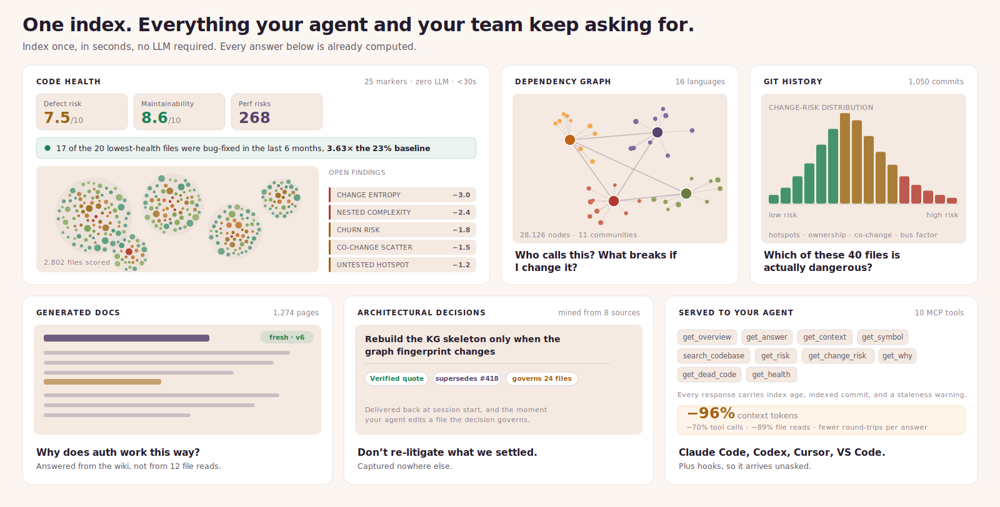
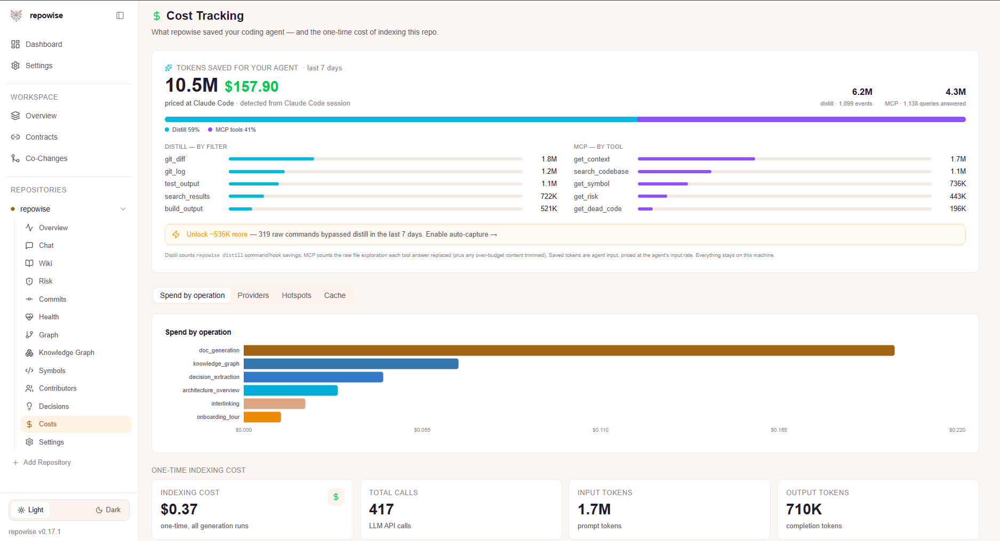
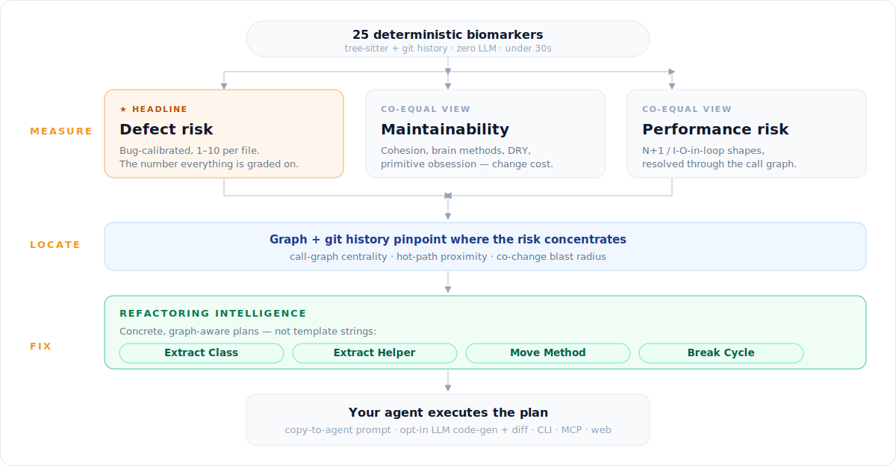

<!-- mcp-name: dev.repowise/repowise -->

<div align="center">

<a href="https://www.repowise.dev"></a>

<p align="center">
  <a href="https://www.repowise.dev"></a>
  <a href="https://github.com/repowise-dev/repowise"></a>
</p>

<p align="center">
  <a href="https://pypi.org/project/repowise/"></a>
  <a href="https://www.gnu.org/licenses/agpl-3.0"></a>
  <a href="https://pypi.org/project/repowise/"></a>
  <a href="https://modelcontextprotocol.io"></a>
  <a href="https://github.com/repowise-dev/repowise/stargazers"></a>
</p>

<p align="center">
  <a href="https://www.repowise.dev/#contact"><strong>Hosted for teams →</strong></a> ·
  <a href="https://docs.repowise.dev"><strong>Docs</strong></a> ·
  <a href="https://discord.gg/cQVpuDB6rh"><strong>Discord</strong></a> ·
  <a href="mailto:hello@repowise.dev"><strong>Contact</strong></a>
</p>

<p align="center"><sub>
  <a href="#your-agent-stops-guessing">For your agent</a> ·
  <a href="#what-one-index-actually-builds">The five layers</a> ·
  <a href="#stop-paying-for-output-nobody-reads">Distill</a> ·
  <a href="#know-whats-dangerous-before-you-merge">Change risk</a> ·
  <a href="#-know-exactly-what-to-fix">Code health</a> ·
  <a href="#see-all-of-it">Dashboard</a> ·
  <a href="#past-one-repo">Workspaces</a> ·
  <a href="#quickstart-under-5-minutes-no-api-key">Quickstart</a> ·
  <a href="#the-ten-mcp-tools">MCP tools</a> ·
  <a href="#how-it-compares">Comparison</a> ·
  <a href="#for-teams--enterprises">Teams</a>
</sub></p>

---

### Your AI agent burns most of its budget rediscovering your codebase. Index it once, and it never has to again.

### up to −96% tokens to load context&nbsp;&nbsp;·&nbsp;&nbsp;−89% file reads&nbsp;&nbsp;·&nbsp;&nbsp;−70% tool calls

<sub>Paired runs, same model, same harness, with and without repowise ([the numbers, and what they do not show →](docs/BENCHMARKS.md)).<br />
Free and self-hosted, runs on your machine, and the first index needs no API key.</sub>

<picture>
  <source media="(prefers-color-scheme: dark)" srcset=".github/assets/one-index-dark.svg" />
  
</picture>

</div>

---

Every question your agent asks about your repo has an answer that could have been
computed ahead of time. *Who calls this function? What breaks if I change it? Why is
it written this way? Which of these files is actually dangerous?* Instead, agents
rediscover it from scratch on every task: grep, read, re-read, forget.

repowise computes those answers once and keeps them current on every commit. Your
agent reads the answer instead of the codebase, and the same index gives your team a
defect-validated health score, change-risk scoring on every PR, and a local dashboard
for all of it. One `pip install`, no cloud, your code never leaves your machine.

---

## Your agent stops guessing

repowise exposes **ten task-shaped MCP tools** to Claude Code, Codex, Cursor, VS Code
and anything else that speaks MCP. Most tools are built around data entities (one
file, one symbol), which forces agents into long chains of sequential calls. These are
built around **tasks**: pass several targets in one call, get complete context back.

<video src="https://raw.githubusercontent.com/repowise-dev/repowise/main/.github/assets/demo.mp4" alt="Claude Code querying the codebase through repowise's MCP tools" autoplay loop muted playsinline width="100%"></video>

Because the exploration work is already done, that phase mostly disappears. Loading
one commit's context through `get_context` costs **2,391 tokens instead of 64,039**
raw. On a long multi-step investigation that compounds to **−41% of the context
re-read across the whole session**.

**And it arrives without being asked.** Optional [hooks](docs/agent/HOOKS.md) push
context into the session at the moment it matters: the governing architectural
decision when your agent edits a file that decision covers, a warning when it touches
a file with a run of recent bug fixes, a compact briefing at session start. repowise
also generates your `CLAUDE.md` and `AGENTS.md` from the real index, so even an agent
with no MCP support starts informed.

**It learns from how you actually work.** repowise reads your own agent transcripts
for the corrections you keep making ("use the shared HTTP client, not raw requests")
and turns the durable ones into tracked decisions it delivers back later. The wiki
generation budget tilts toward the modules you and your agent ask about most. All
local, all deterministic, no extra LLM calls.

---

## What one index actually builds

Five layers, built in a single pass and kept in sync on every commit. Each one is
queryable from the CLI, the MCP tools, and the local dashboard.

| Layer | What it gives you | Edge |
|---|---|---|
| **◈ Graph** | Dependency graph across 16 languages · file + symbol nodes · 3-tier call resolution · Leiden communities · PageRank and execution flows · framework-aware route→handler edges | A real graph most tools never build |
| **◈ Git** | Hotspots (churn × complexity) · ownership % · co-change pairs (hidden coupling) · bus factor · which files actually get bug-fixed, and how recently | Behavioural signals static analysis cannot see |
| **◈ Docs** | A generated wiki page per module and file · rebuilt incrementally every commit · freshness and confidence scoring · hybrid search (full-text + vector) · selectable style and output language | Stays current instead of rotting |
| **◈ Decisions** | Architectural decisions mined from eight sources, evidence-backed, linked to the graph nodes they govern, connected by supersedes / refines / conflicts_with, tracked for staleness | **★ Captured nowhere else** |
| **★ Code health** | **25 deterministic markers**, 1 to 10 per file · three signals: defect risk · maintainability · performance · coverage ingestion · concrete refactoring plans (Extract Class / Helper, Move Method, Break Cycle, Split File) · **zero LLM, under 30s** | **★ Defect-validated, with the fix attached** |

**The whole wiki is generated with no LLM, then upgraded to model-written prose on
demand.** `repowise init --index-only` builds the graph, git, decision and health
layers and renders every wiki page from your code's structure, with no API key and
no spend. Convert any part of it to LLM-written prose whenever you want, one page,
one directory, or a ranked coverage slice at a time, and pay only for what you pick,
from the CLI or right in the dashboard with the cost shown before you confirm.
(Seven of the eight decision sources are deterministic too; only the one harvested
during doc generation needs a provider.)

Full detail on every layer: **[docs/layers/INTELLIGENCE_LAYERS.md →](docs/layers/INTELLIGENCE_LAYERS.md)**

---

## Stop paying for output nobody reads

Most of what an agent reads back from a shell command is noise: 300 lines of passing
tests wrapped around 4 failures, full commit bodies when it asked "what changed
recently". `repowise distill <cmd>` compresses command output **before the agent reads
it**, errors first, exit code preserved.

```bash
repowise distill pytest          # 61% fewer tokens, all 11 failure lines kept
repowise distill git log -50     # 89% fewer tokens
repowise saved                   # what distillation saved you, in tokens and dollars
```

Nothing is lost. Every omission leaves an inline `[repowise#<ref>]` marker that
`repowise expand <ref>` reverses in full, so the agent can always pull the detail back
without re-running the command. Small outputs pass through untouched. An opt-in hook
rewrites noisy commands automatically, shown to you for approval first.

<div align="center">

<p align="center"><sub>The <strong>Costs</strong> dashboard tallies both savings surfaces, priced at your own agent's model. Example from a week of heavy local use.</sub></p>
</div>

Full guide: **[docs/agent/DISTILL.md →](docs/agent/DISTILL.md)**

---

## Know what's dangerous before you merge

Three deterministic signals, all computed from the graph and git history, no LLM:

- **Change risk.** Score any commit or `base..HEAD` range **0-10** from the shape of
  the diff, ranked against your repo's own recent commits. PR mode returns directives
  rather than vibes: `will_break`, `missing_cochanges`, `missing_tests`, `tests_to_run`.
  One command: `repowise risk main..HEAD`. ([reference →](docs/layers/CHANGE_RISK.md))
- **Bug history.** Which files and symbols actually get bug-fixed, and how recently.
  Doc, test and config commits are filtered out so the count means what it says, and a
  file with a run of recent fixes gets flagged as a bug magnet while you edit it.
  ([reference →](docs/layers/BUG_HISTORY.md))
- **Test intelligence.** Ingest coverage, find untested hotspots, and run only the
  tests a diff actually exercises with `repowise impacted-tests HEAD~1`.
  ([reference →](docs/layers/TEST_INTELLIGENCE.md))

Plus the free **[Repowise PR Bot](https://github.com/apps/repowise-bot)**: one
deterministic comment per pull request covering hotspot touches, hidden coupling,
declining health and dead code. Zero LLM calls.

---

## ★ Know exactly what to fix

A score that says *"this file is risky"* is where most tools stop. repowise scores
every file, locates where the risk concentrates, and then names the specific fix.

<div align="center">

</div>

Every file is scored 1-10 from **25 deterministic markers** (McCabe complexity, brain
methods, LCOM4 cohesion, god classes, native Rabin-Karp clone detection, untested
hotspots, change entropy, prior-defect history and more), split into three lenses:
**defect risk**, **maintainability**, and **performance** (static N+1 and I/O-in-loop
risk traced *across* files through the call graph, where file-local linters found 0 of
the cross-function cases repowise surfaced 557 of).

> **Zero LLM calls, zero cloud, zero new runtime dependencies.** Pure Python over
> tree-sitter and git data, **under 30 seconds** on a 3,000-file repo, with marker
> weights **calibrated against a real defect corpus, not hand-tuned**.

**It proves itself on your repo, not just on a benchmark.** After every index,
repowise checks its own flags against your git history and reports what it found:
*"17 of the 20 lowest-health files had a bug fix in the last 6 months, 3.6x the 23%
baseline."* If that number is bad on your codebase, you will see it.

Then it names the fix. Not "this class is too big", but **Extract Class**, **Extract
Helper**, **Move Method**, **Break Cycle**, **Split File**, or **Extract Method**, with
the exact methods, edges and symbols that move, the **blast radius** of callers and
co-changing files that have to move with them, and a graph-aware ranking so a fix on a
central hub outranks the same fix on a leaf. Extract Method goes down to an
intra-procedural dataflow pass that lifts the exact span and infers a
behavior-preserving signature.

```bash
repowise health                        # KPIs and lowest-scoring files
repowise health --refactoring-targets  # ranked, concrete plans
repowise health --trend                # snapshots plus declining-health alerts
```

The dashboard renders each plan as a card with a copy-to-agent button. An optional LLM
step, never in the indexing path and only on request, expands any plan into generated
code and a unified diff.

<sub>Against <strong>CodeScene</strong>, the leading commercial code-health tool, on the
same 2,770 files and the same defect labels, ranking by repowise health surfaces
<strong>2.3x the defects under a fixed review budget</strong> (paired, p = 0.003).
<a href="docs/BENCHMARKS.md">Full head-to-head, methodology and limitations →</a></sub>

Guides: **[code health](docs/layers/CODE_HEALTH.md)** · **[refactoring](docs/layers/REFACTORING.md)**

---

## See all of it

`repowise serve` starts the full web dashboard next to the MCP server. No separate
setup, all local.

<table>
<tr>
<td width="50%"><video src="https://raw.githubusercontent.com/repowise-dev/repowise/main/.github/assets/dashboard/architecture-page.mp4" alt="Architecture view: the dependency graph laid out and explorable, with a context drawer per node" autoplay loop muted playsinline width="100%"></video><br/><sub><b>Architecture</b> · the dependency graph, laid out and explorable, with per-node context and change coupling</sub></td>
<td width="50%"><video src="https://raw.githubusercontent.com/repowise-dev/repowise/main/.github/assets/dashboard/code-health.mp4" alt="Code health map: every file as a bubble, hover to inspect score, coverage and tests" autoplay loop muted playsinline width="100%"></video><br/><sub><b>Code Health</b> · every file as a bubble, hover any one to inspect its score, size, coverage and findings</sub></td>
</tr>
<tr>
<td width="50%"><video src="https://raw.githubusercontent.com/repowise-dev/repowise/main/.github/assets/dashboard/chat-page.mp4" alt="Chat view: ask questions against the indexed repo, with answers that cite the files and pages they came from" autoplay loop muted playsinline width="100%"></video><br/><sub><b>Chat</b> · ask the codebase a question, answers cite the files and pages they came from</sub></td>
<td width="50%"><video src="https://raw.githubusercontent.com/repowise-dev/repowise/main/.github/assets/dashboard/docs-page.mp4" alt="Docs view: auto-generated wiki pages with a tree, mermaid diagrams, and freshness badges" autoplay loop muted playsinline width="100%"></video><br/><sub><b>Docs</b> · auto-generated wiki pages for the whole codebase, with confidence and freshness badges</sub></td>
</tr>
</table>

Also in there: **Chat** (ask the codebase in natural language) · **Docs** (the
generated wiki, with Mermaid and a graph sidebar) · **Architecture** and **C4**
(Context → Containers → Components) · **Knowledge Graph** plus a zoomable canvas map ·
**Risk**, **Hotspots**, **Coupling** and **Blast radius** · **Contributors** ·
**Decisions** (evidence drawer and evolution timeline) · **Symbols** · **Security** ·
**Dead code** · **Stats** · **Costs** · **Workspace**.

Every view and what each one answers: **[docs/start/DASHBOARD.md →](docs/start/DASHBOARD.md)**

---

## Past one repo

Real systems are not one repository, and the interesting failures live in the gaps
between them.

- **Workspaces.** Index many repos as one unit and get what only a cross-repo view can
  show: **contracts** matched between a producer and its consumers, so a breaking API
  change is caught before it ships, plus cross-repo **co-change** pairs, federated MCP
  that answers across the whole estate, and conformance checks.
  ([docs/scale/WORKSPACES.md →](docs/scale/WORKSPACES.md))
- **Worktrees just work.** Run `repowise init` or `repowise update` inside a linked git
  worktree and it detects the base checkout, seeds that worktree's index from it, and
  catches up incrementally. No flags, no second full index.
  ([docs/scale/WORKTREES.md →](docs/scale/WORKTREES.md))
- **Auto-sync.** Keep the index current with a post-commit hook, a file watcher
  (`repowise watch`), a webhook, or polling. An incremental update takes seconds.
  ([docs/scale/AUTO_SYNC.md →](docs/scale/AUTO_SYNC.md))

---

## In your editor

The **Repowise** VS Code extension puts the index where code actually gets written:
know what your change breaks before you push (riskiest files ranked, what is
downstream, forgotten companion files, missing tests, suggested reviewers), health in
the gutter and status bar, callers and ownership on hover, refactoring plans as
CodeLens, and the full dashboards inside the editor. One install also registers the MCP
server with VS Code, so the same local index serves both you and your agent, and
exposes six tools to GitHub Copilot. Quiet by default, everything toggleable, nothing
leaves your machine.

Install from the Marketplace (search **Repowise**) or Open VSX, then run **Repowise:
Set Up This Repository**. Guide: **[docs/agent/VSCODE.md →](docs/agent/VSCODE.md)**

---

## Supported languages

**16 languages parsed to AST · 11 at the Full tier · framework-aware across all of them.**

<p>
  <strong>Full tier &nbsp;</strong>
  
  
  
  
  
  
  
  
  
  
  
</p>
<p>
  <strong>Good tier &nbsp;</strong>
  
  
  
  
  &nbsp;<strong>· Partial &nbsp;</strong>
  
</p>

SQL and dbt projects get real `ref()` / `source()` lineage, shell scripts get
function-level symbols, and OpenAPI, Protobuf, GraphQL, Dockerfile, Terraform and
friends get dedicated handlers. Anything else is still tracked through git history:
blame, hotspots, co-change.

Adding a language takes **one `.scm` query file and one config entry**, with no changes
to the parser core. Full matrix and the contributor recipe:
**[docs/layers/LANGUAGE_SUPPORT.md →](docs/layers/LANGUAGE_SUPPORT.md)**

---

<a id="quickstart"></a>

## Quickstart (under 5 minutes, no API key)

**1. Install**

```bash
pip install repowise          # Windows: python -m pip install repowise
repowise --version
```

**2. Index your repo, with no LLM and no key**

```bash
cd /path/to/your/repo
repowise init --index-only -y
```

That builds the dependency graph, git history, code-health scores and dead-code
findings in seconds, and renders a complete wiki from the code's structure: file,
module, layer and cycle pages, the architecture diagram, the repo overview, API
and infra pages, and the onboarding collection. Every page carries a footer saying
it was derived from structure, and the repo overview describes composition, entry
points, clusters and dependencies rather than what the project does end to end,
because no template can derive that. Full-text search works on this index;
semantic search needs an embedder configured (Ollama is the keyless option).

Want the wiki written by a model? You do not have to decide now. Upgrade the
index-only wiki whenever you like with `repowise generate`, a page, a directory,
or the whole thing at a time, each behind a cost estimate:

```bash
export ANTHROPIC_API_KEY="sk-ant-..."   # or OPENAI_API_KEY / GEMINI_API_KEY
repowise generate                       # interactive chooser: pick a coverage, see the cost
repowise generate --coverage 20         # or write the most important 20%, leave the rest as templates
repowise generate --path src/api        # or just one area first
```

Bare `repowise generate` opens a chooser (wiki state, a coverage menu with cost
per tier, then the confirm), so a big repo is never one keystroke from writing
every page.

Or write the whole wiki as part of the first index with `repowise init --provider
gemini|anthropic|openai`.

**3. Connect your agent.** The MCP server is `repowise mcp`, served from the repo directory.

<details><summary><b>Claude Code</b></summary>

```bash
# Plugin (adds the tools, slash commands and skills):
/plugin marketplace add repowise-dev/repowise
/plugin install repowise@repowise

# ...or wire the MCP server directly:
claude mcp add repowise -- repowise mcp
```
Or commit a project `.mcp.json`:
```json
{ "mcpServers": { "repowise": { "command": "repowise", "args": ["mcp"] } } }
```
</details>

<details><summary><b>Codex CLI</b></summary>

Add to `~/.codex/config.toml`:
```toml
[mcp_servers.repowise]
command = "repowise"
args = ["mcp"]
```
Or: `codex mcp add repowise -- repowise mcp`
</details>

**4. First real call.** Ask your agent: *"Use repowise `get_overview` to summarize this
repo"*, or *"`get_context` for `src/auth.py`"*. You get graph-grounded architecture and
per-file triage instead of a flurry of greps.

> `get_overview` and `get_context` work in index-only mode with no key, synthesized
> from the graph, git and health layers. `search_codebase` and `get_answer` read the
> wiki, which index-only mode does build, but they answer from pages rendered from
> structure rather than model-written prose, and `search_codebase` is full-text only
> until you configure an embedder.

Full walkthrough: **[docs/start/QUICKSTART.md →](docs/start/QUICKSTART.md)**

---

## The ten MCP tools

Every response carries an `_meta` envelope with `index_age_days`, `indexed_commit`, and
a `stale_warning` that fires only when the indexed HEAD diverges from live `.git/HEAD`,
so your agent always knows how much to trust what it just read.

| Tool | What only this tool answers |
|---|---|
| `get_overview()` | Architecture summary, module map, entry points, git health. The first call on any unfamiliar codebase. |
| `get_answer(question)` | Hybrid retrieval (full-text plus vector via RRF), PageRank bias and 1-hop graph expansion into one cited answer with a calibrated `retrieval_quality`. Collapses search → read → reason into a single round-trip. |
| `get_context(targets, include?)` | Triage card for files, modules or symbols: summary, signatures, `hotspot` bit, governing decisions, `symbol_id`s. `include` opens callers, callees, ownership and metrics. Batch many targets in one call. |
| `get_symbol("file.py::Name")` | Source for one indexed symbol with exact line bounds. Cheaper and safer than `Read` plus offset math. |
| `search_codebase(query, kind?)` | Semantic search over the wiki, filterable by kind (implementation / test / config / doc), tagging each result's `search_method`. |
| `get_risk(targets, changed_files?)` | Hotspots, dependents, co-change partners, ownership, test gaps, bug history. Pass `changed_files` for PR mode and get a `directive` block back. |
| `get_change_risk(revspec)` | Pre-merge defect score for a whole commit or range from the shape of the diff, ranked as a percentile against recent commits, plus the tests coverage proves it touches. |
| `get_why(query?, targets?)` | Architectural decisions, their evidence spans and the supersession lineage. Falls back to git archaeology when no decisions exist. |
| `get_dead_code(...)` | Unreachable code by confidence tier with cleanup-impact estimates, and cross-repo consumer detection in workspace mode. |
| `get_health(targets?, include?)` | Per-file marker scores across all three signals. `include` opens coverage, trends, per-file signals, the accuracy self-check, and structured refactoring plans. |

Ten is a deliberate ceiling rather than a limit we ran into: a small, task-shaped
surface is easier for an agent to choose from than a large one. Worked example (*"add
rate limiting to all API endpoints"* in 5 calls instead of ~30 greps and reads), the
opt-in tools, and the full reference: **[docs/agent/MCP_TOOLS.md →](docs/agent/MCP_TOOLS.md)**

---

## How it compares

| | repowise | Google Code Wiki | DeepWiki | Swimm | CodeScene |
|---|---|---|---|---|---|
| Self-hostable, open source | ✅ AGPL-3.0 | ❌ cloud only | ❌ cloud only | ❌ Enterprise only | ✅ Docker |
| Private repo, no cloud | ✅ | ❌ in development | ❌ OSS forks only | ✅ Enterprise tier | ✅ |
| Auto-generated documentation | ✅ | ✅ Gemini | ✅ | ✅ PR2Doc | ❌ |
| MCP server for AI agents | ✅ 10 tools | ❌ | ✅ 3 tools | ✅ | ✅ |
| Proactive agent hooks | ✅ Claude + Codex | ❌ | ❌ | ❌ | ❌ |
| Auto-generated AI instructions (`CLAUDE.md`, `AGENTS.md`) | ✅ | ❌ | ❌ | ❌ | ❌ |
| Command-output distillation | ✅ reversible | ❌ | ❌ | ❌ | ❌ |
| Learns from your usage (session-mined decisions, demand-weighted docs) | ✅ | ❌ | ❌ | ❌ | ❌ |
| Code health score (1-10) | ✅ 25 markers | ❌ | ❌ | ❌ | ✅ 25-30 |
| Brain Method / LCOM4 / god class | ✅ | ❌ | ❌ | ❌ | ✅ |
| Test-coverage intelligence | ✅ LCOV/Cobertura/Clover | ❌ | ❌ | ❌ | ❌ |
| Untested-hotspot detection | ✅ coverage × hotspot | ❌ | ❌ | ❌ | ❌ |
| Health trend + declining alerts | ✅ rolling snapshots | ❌ | ❌ | ❌ | ✅ |
| Concrete cross-file refactoring plans | ✅ graph-aware + blast radius | ❌ | ❌ | ❌ | ⚠️ within-function only |
| Dataflow-verified within-function plans | ✅ CFG + reaching definitions | ❌ | ❌ | ❌ | ⚠️ LLM-generated, unverified |
| Git intelligence (hotspots, ownership, co-change) | ✅ | ❌ | ❌ | ❌ | ✅ |
| Pre-merge change-risk scoring | ✅ 0-10 + directives | ❌ | ❌ | ❌ | ✅ |
| Bus factor analysis | ✅ | ❌ | ❌ | ❌ | ✅ |
| Dead code detection | ✅ | ❌ | ❌ | ❌ | ❌ |
| Architectural decision records | ✅ | ❌ | ❌ | ❌ | ❌ |
| Multi-repo workspace intelligence | ✅ contracts, co-change, federated MCP | ❌ | ❌ | ❌ | ❌ |
| Local dashboard | ✅ | ❌ | ❌ | ❌ IDE only | ✅ |

**repowise is the intersection:** an agent-native context layer *and* behavioral git
intelligence *and* a defect-validated health score with the fix attached, all out of
one index, self-hostable and open source. Full side-by-side comparisons:
**[repowise.dev/compare →](https://www.repowise.dev/compare)**

---

## Who it's for

| | Start here |
|---|---|
| **Individual developers** | `pip install repowise` → `repowise init` → query from Claude Code, Cursor, or any MCP agent. Fully local, bring your own key, free under AGPL-3.0. [For developers →](https://www.repowise.dev/for/developers) |
| **Team leads** | Know which PRs to worry about before you merge: change-risk scoring plus the free [Repowise PR Bot](https://github.com/apps/repowise-bot). [For team leads →](https://www.repowise.dev/for/teams) |
| **Engineering leaders** | See how much of your code AI wrote and whether it is healthy: agent provenance, health trends and bus factor, straight from git history. [For engineering leaders →](https://www.repowise.dev/for/engineering-leaders) |
| **Security & compliance** | Reachability-aware CVE triage, secret detection across full git history, and SBOM, on your real dependency graph. [For security →](https://www.repowise.dev/for/security) · [security review →](docs/business/SECURITY_COMPLIANCE.md) |
| **Enterprises** | On-prem and air-gapped, SSO/SCIM, commercial licensing with no AGPL obligation, IP indemnification. [For enterprise →](https://www.repowise.dev/for/enterprise) · [docs/business/COMMERCIAL.md](docs/business/COMMERCIAL.md) |

---

## For teams & enterprises

[**repowise.dev**](https://www.repowise.dev) is the same engine, fully managed, at
feature parity with self-hosted: every CLI command, every MCP tool, the whole
dashboard. We run it on our own codebase in the open:
[live snapshot →](https://www.repowise.dev/s/5a6b93fa9a69) ·
[explore public repos →](https://www.repowise.dev/explore).

On top of self-hosting: managed deploys and webhooks with auto re-index on every
commit, a hosted MCP endpoint so any client can point at one URL with no local server,
a CVE-aware security layer, cross-repo intelligence at scale, and integrations (Slack,
Jira/Linear, Confluence/Notion, PagerDuty) *(rolling out)*.

What is GA versus in development, on-prem topology, SSO/SCIM/RBAC and pricing:
**[docs/business/COMMERCIAL.md](docs/business/COMMERCIAL.md)** ·
[Get in touch →](https://www.repowise.dev/#contact)

---

## Privacy

- **Self-hosted:** your code never leaves your infrastructure, so no code, file paths
  or repo names are ever sent. The CLI does report **anonymous, opt-out** usage
  telemetry (command names and coarse environment only) to help us prioritize; turn it
  off with `repowise telemetry disable`, `DO_NOT_TRACK=1`, or by running fully offline.
  [What's collected →](docs/reference/TELEMETRY.md)
- **Bring your own key:** we never see your LLM calls. Zero data retention via
  Anthropic's API policy.
- **What's stored:** the graph, embeddings (non-reversible vectors), generated wiki
  pages, git metadata. Raw source is processed transiently and never persisted.
- **Fully offline:** Ollama plus a local embedding model means zero external calls.

Doing a security review? **[docs/business/SECURITY_COMPLIANCE.md →](docs/business/SECURITY_COMPLIANCE.md)**

---

## CLI

```bash
repowise init [PATH]      # index a codebase (one-time; --index-only needs no LLM)
repowise generate [PATH]  # write wiki pages with a model, on demand (upgrade an index-only wiki)
repowise serve [PATH]     # MCP server + local dashboard
repowise update [PATH]    # incremental update (seconds; --workspace for every repo)
repowise watch            # auto-sync daemon, re-index on file change
repowise search "<q>"     # search the wiki (fulltext / semantic / symbol)
repowise health           # code-health KPIs and lowest-scoring files
repowise risk main..HEAD  # score a branch or PR range for defect risk
repowise impacted-tests   # only the tests a diff actually exercises
repowise dead-code        # unreachable-code report
repowise decision list    # architectural decisions
repowise distill pytest   # compact, errors-first, reversible command output
repowise saved            # tokens and dollars saved by distillation
repowise workspace add    # multi-repo workspace management
repowise doctor           # check setup, API keys, index drift
```

Every command and flag: **[docs/reference/CLI_REFERENCE.md](docs/reference/CLI_REFERENCE.md)** ·
config: **[docs/reference/CONFIG.md](docs/reference/CONFIG.md)**

---

## Contributing

```bash
git clone https://github.com/repowise-dev/repowise
cd repowise
uv sync --all-packages
uv run repowise --version
uv run pytest tests/unit/
```

Full guide, including how to add languages and LLM providers:
[CONTRIBUTING.md](.github/CONTRIBUTING.md) · architecture:
[docs/architecture/](docs/architecture/README.md)

---

## License

AGPL-3.0. Free for individuals, teams and companies using repowise internally.

For commercial licensing (the enterprise security and compliance layer, SSO/SCIM, RBAC,
workflow integrations, priority support and SLA, or embedding repowise in a product
without AGPL obligations), see
**[docs/business/COMMERCIAL.md](docs/business/COMMERCIAL.md)** or contact
[hello@repowise.dev](mailto:hello@repowise.dev).

---

<div align="center">

<em>Built for engineers who got tired of watching their AI agent <code>cat</code> the same file for the fourth time.</em>

<p align="center"><sub>⭐ If repowise earns a place in your workflow, <strong>give it a star</strong>. It costs you nothing, and it's the signal that keeps a small team building this in the open.</sub></p>

<p align="center">
  <a href="https://repowise.dev"><strong>repowise.dev</strong></a> ·
  <a href="https://www.repowise.dev/explore"><strong>Explore →</strong></a> ·
  <a href="https://discord.gg/cQVpuDB6rh"><strong>Discord</strong></a> ·
  <a href="https://x.com/repowisedev"><strong>X</strong></a> ·
  <a href="mailto:hello@repowise.dev"><strong>hello@repowise.dev</strong></a>
</p>

</div>
