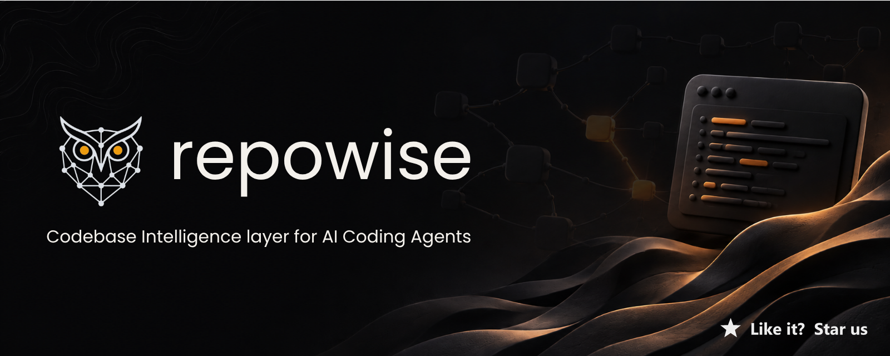

<div align="center">

<a href="https://www.repowise.dev"></a>

<p align="center"><em>The codebase intelligence layer for your AI coding agent.</em></p>

<p align="center"><strong>Five intelligence layers · Nine MCP tools · Multi-repo workspaces · Auto-sync hooks · One <code>pip install</code></strong></p>

<p align="center">
  <a href="https://www.repowise.dev"></a>
</p>

<p align="center">
  <a href="https://pypi.org/project/repowise/"></a>
  <a href="https://www.gnu.org/licenses/agpl-3.0"></a>
  <a href="https://pypi.org/project/repowise/"></a>
  <a href="https://modelcontextprotocol.io"></a>
  <a href="https://github.com/repowise-dev/repowise/stargazers"></a>
</p>

<p align="center">
  <a href="https://www.repowise.dev/#contact"><strong>Hosted for teams →</strong></a> ·
  <a href="https://docs.repowise.dev"><strong>Docs</strong></a> ·
  <a href="https://discord.gg/cQVpuDB6rh"><strong>Discord</strong></a> ·
  <a href="mailto:hello@repowise.dev"><strong>Contact</strong></a>
</p>

<p align="center"><sub>
  <a href="#benchmarks">Benchmarks</a> ·
  <a href="#what-repowise-builds">Intelligence layers</a> ·
  <a href="#quickstart">Quickstart</a> ·
  <a href="#nine-mcp-tools">MCP tools</a> ·
  <a href="#local-dashboard">Dashboard</a> ·
  <a href="#how-it-compares">Comparison</a> ·
  <a href="#hosted-version--for-teams">Hosted</a> ·
  <a href="#license">License</a>
</sub></p>

---


---

</div>

Your AI coding agent reads files. It doesn't know which ones change together, which ones are dead, or why they were built the way they were. It has the source code and no memory of how the codebase got there.

repowise fixes that. It indexes your codebase into five intelligence layers — dependency graph, git history, auto-generated documentation, architectural decisions, and code health — and exposes them to Claude Code (and any MCP-compatible AI agent) through nine precisely designed tools. Multi-repo? Initialize a workspace and get cross-repo co-change detection, API contract extraction, and federated MCP queries across all your services. **The result: fewer tool calls, fewer file reads, and lower cost per query — at comparable answer quality.**

The result: your agent answers *"why does auth work this way?"* instead of *"here is what auth.ts contains."*

---

## Benchmarks

Most of a coding agent's spend goes to *exploration* — greping for symbols, reading candidate files, re-reading them as context grows. repowise does that work once, offline, so the agent skips it on every query. In early paired SWE-QA runs on real repositories (same model, same harness, with and without repowise's MCP tools), that translated into up to **−70% tool calls, −89% file reads, and −36% cost per query at comparable answer quality**.

And the intelligence isn't only for agents — repowise's **code-health score predicts where bugs will land**. Validated across **13 repositories in 5 languages** (Python, TypeScript, JavaScript, Rust, Go), the score reaches **ROC AUC up to 0.90** at identifying the files that go on to receive bug-fixes over the next six months — and the handful it flags unhealthiest concentrate **up to 80% of those future fixes**. The biomarker weights are **learned from real defect history, not hand-tuned**, while the runtime stays fully deterministic and LLM-free. Full methodology and results live at **[repowise-bench →](https://github.com/repowise-dev/repowise-bench)**.

---

## What repowise builds

repowise runs once, builds everything, then keeps it in sync on every commit.

### ◈ Graph Intelligence
tree-sitter parses every file across 14 languages into a two-tier dependency graph — file nodes and symbol nodes (functions, classes, methods). A 3-tier call resolver with confidence scoring handles import aliases, barrel re-exports, and namespace imports. Heritage extraction covers extends, implements, trait impls, derive macros, mixins, and extension conformance. Leiden community detection finds logical modules even when your directory structure doesn't reflect them. PageRank, betweenness centrality, SCC analysis, and execution flow tracing from entry points identify your most central, most coupled, and most traversed code.

### ◈ Git Intelligence
Your git history turned into signals: hotspot files (high churn × high complexity), ownership percentages per author, co-change pairs (files that change together without an import link — hidden coupling), and significant commit messages that explain *why* code evolved. Rolled up into **contributor profiles** (per-author module rollups, top files, co-authors, silo modules, dead-code burden), **module health scorecards** (composite score over churn × ownership × docs × dead code × bus factor), and **reviewer suggestions** for any PR file list, weighted by direct authorship, co-change history, and recency.

### ◈ Documentation Intelligence
An LLM-generated wiki for every module and file, rebuilt incrementally on every commit. Coverage tracking. Freshness scoring per page. Semantic search via RAG. Confidence scores show how current each page is relative to the underlying code.

### ◈ Decision Intelligence
The layer nobody else has. Architectural decisions mined from **eight sources** — ADR files (Nygard/MADR), CHANGELOG entries, PR and squash-commit bodies, inline markers, git archaeology, README/docs, centrality-bounded code comments, and the LLM doc-generation pass itself — linked to the graph nodes they govern and tracked for staleness as code evolves.

```python
# WHY: JWT chosen over sessions — API must be stateless for k8s horizontal scaling
# DECISION: All external API calls wrapped in CircuitBreaker after payment provider outages
# TRADEOFF: Accepted eventual consistency in preferences for write throughput
```

Every decision is **evidence-backed**: each rationale traces to a verbatim source span (ADR quote, commit body, code comment), and an anti-hallucination substring gate stamps each as **verified / fuzzy / unverified** — corroborating sources raise confidence rather than overwrite each other. Decisions form a **graph**: typed edges (`supersedes` / `refines` / `relates_to` / `conflicts_with`) let `get_why()` answer *"why is auth structured this way?"* with a lineage chain (sessions → JWT → OAuth2), auto-detect when a new commit reverses an old decision, and flag two active decisions that contradict each other.

These structured records surface everywhere your agent already looks — `get_why()` for the full archaeology, but also as governing decisions in `get_context()`, a `governance_risk` flag in `get_risk()` PR review, a Key Decisions section in `get_overview()`, and as `ungoverned_hotspot` / `stale_governance` / `contradictory_decision` findings in the code-health layer.

### ◈ Code Health Intelligence
Fifteen deterministic biomarkers compute a 1–10 health score per file — McCabe complexity, deep nesting, brain methods, native Rabin–Karp duplication detection, untested hotspots, primitive obsession, developer congestion, knowledge loss, blame-based function hotspots, code-age volatility, and more. **Zero LLM calls, zero new runtime dependencies** — pure Python over tree-sitter and git data, designed to finish in under 30 seconds on a 3 000-file repo.

Ingest LCOV, Cobertura, or Clover coverage reports to light up the test-coverage biomarkers. Rolling 50-row snapshot history powers `Declining Health` and `Predicted Decline` alerts. Deterministic, rule-based refactoring suggestions surface on the dashboard and via `get_health(include=["refactoring"])`. Per-file overrides via `.repowise/health-rules.json`.

```bash
repowise health                       # KPIs + lowest-scoring files
repowise health --coverage cov.lcov   # ingest coverage, light up untested-hotspot
repowise health --refactoring-targets # ranked by impact / effort
repowise health --trend               # last 10 snapshots + alerts
repowise status                       # one-line summary in the status report
```

See [`docs/CODE_HEALTH.md`](docs/CODE_HEALTH.md) for the user guide and [`docs/architecture/code-health.md`](docs/architecture/code-health.md) for the internals.

---

## Quickstart

```bash
pip install repowise
```

Or install the CLI into an isolated, uv-managed environment:

```bash
uv tool install repowise
```

### Single repo

```bash
cd your-project
repowise init        # builds all five intelligence layers (one-time)
repowise serve       # starts MCP server + local dashboard
```

### Multi-repo workspace

```bash
cd my-workspace/     # parent dir containing backend/, frontend/, shared-libs/
repowise init .      # scans for git repos, indexes each, runs cross-repo analysis
repowise serve       # workspace dashboard + per-repo pages
```

That's it. `repowise init` automatically registers the MCP server, installs PreToolUse/PostToolUse hooks in `~/.claude/settings.json`, generates `.mcp.json` at the project root, and offers to install a post-commit git hook that keeps everything in sync after every commit. See [Auto-Sync](docs/AUTO_SYNC.md) for all sync methods (hooks, file watcher, GitHub/GitLab webhooks, polling).

To manually add the MCP server to another editor:

```json
{
  "mcpServers": {
    "repowise": {
      "command": "repowise",
      "args": ["mcp", "/path/to/your/project"]
    }
  }
}
```

> **Note on init time:** The graph, git, dead-code, and code-health layers build in minutes with **zero LLM calls** — run `repowise init --index-only` and you have a queryable index almost immediately. The one-time cost is the documentation layer: LLM-generated wiki pages, which scale with repo size and run once (and can run in the background). After that, every update following a commit takes **under 30 seconds** and only regenerates the few pages your change touched.

> **Full docs:** [Quickstart](docs/QUICKSTART.md) · [User Guide](docs/USER_GUIDE.md) · [CLI Reference](docs/CLI_REFERENCE.md) · [MCP Tools](docs/MCP_TOOLS.md) · [Workspaces](docs/WORKSPACES.md) · [Computed Glossary](docs/COMPUTED_GLOSSARY.md) · [Auto-Sync](docs/AUTO_SYNC.md)

---

## Workspaces — multi-repo intelligence

Most codebases aren't one repo. repowise workspaces let you index and query multiple repositories together — with cross-repo intelligence that single-repo tools can't provide.

```bash
cd my-workspace/          # backend/, frontend/, shared-libs/ under one parent
repowise init .           # scan, select repos, index each, run cross-repo analysis
```

**What you get on top of per-repo intelligence:**

| Feature | What it does |
|---|---|
| **Cross-repo co-changes** | Finds files across repos that change in the same time window — e.g., `backend/api/routes.py` and `frontend/src/api/client.ts` always move together |
| **API contract extraction** | Scans for HTTP route handlers (Express, FastAPI, Spring, Go), gRPC service defs, and message topic publishers/subscribers — then matches providers with consumers across repos |
| **Package dependency mapping** | Reads `package.json`, `pyproject.toml`, `go.mod`, `pom.xml` to detect when one repo depends on another as a package |
| **Federated MCP queries** | One MCP server serves all repos. Pass `repo="backend"` or `repo="all"` to any tool |
| **Workspace dashboard** | Aggregate stats, repo cards, contract links, co-change pairs — all in the web UI |
| **Workspace CLAUDE.md** | Auto-generated context file covering all repos, their relationships, and cross-repo signals |

**Workspace CLI:**

```bash
repowise workspace list                  # show all repos and their status
repowise workspace add ../new-service    # add a repo (auto-indexes + docs by default)
repowise workspace remove api-gateway    # remove a repo (doesn't delete files)
repowise workspace scan                  # re-scan for new repos
repowise update --workspace              # update all stale repos + first-time index any new ones
repowise update --repo backend           # scope to one repo (auto-detected from cwd too)
repowise watch --workspace               # auto-update all repos on file change
repowise doctor --workspace --repair     # validate every repo; sync state drift; drop dead entries
repowise hook install --workspace        # install post-commit hooks for all repos
```

Most commands also accept `--no-workspace` to force single-repo mode and `--repo <alias>` to scope to one repo. See [CLI Reference](docs/CLI_REFERENCE.md#workspace-auto-detect-cross-cutting).

Full guide: [docs/WORKSPACES.md](docs/WORKSPACES.md)

---

## Nine MCP tools

Most tools are designed around data entities — one module, one file, one symbol — which forces AI agents into long chains of sequential calls. repowise tools are designed around **tasks**. Pass multiple targets in one call. Get complete context back. Every response carries an `_meta` envelope with `index_age_days`, `indexed_commit`, and a `stale_warning` that fires only when the indexed HEAD diverges from live `.git/HEAD` — silence means the index is current. Full reference: [docs/MCP_TOOLS.md](docs/MCP_TOOLS.md)

| Tool | What only this tool answers | When Claude Code calls it |
|---|---|---|
| `get_overview()` | Architecture summary, module map, entry points, git health, community summary | First call on any unfamiliar codebase |
| `get_answer(question)` | Hybrid retrieval (FTS + vector merged via RRF) plus PageRank bias and 1-hop graph expansion, synthesised into a cited answer with a calibrated `retrieval_quality` reported separately from `confidence`. On low confidence returns a structured `best_guesses` list with one-line per-file justifications instead of an empty answer. Decision records are fused in for "why"-shaped questions. | First call on any code question — collapses search → read → reason into one round-trip |
| `get_context(targets, include?)` | Triage card for files / modules / symbols: title, summary, signatures, `hotspot` bit, `governing_decisions` (status + staleness + verified/fuzzy trust badge), and `symbol_id`s the agent pipes into `get_symbol`. NOT source bytes. `include` opens richer data: `"callers"`/`"callees"`, `"ownership"`, `"last_change"`, `"metrics"`, `"community"`, `"decisions"`, `"full_doc"`. Batch multiple targets. | Before reading or modifying code. Pass all relevant targets in one call. |
| `get_symbol("path/to/file.py::Name")` | Raw source bytes for one indexed symbol with exact line bounds — cheaper and safer than `Read` + offset math. Bounded at ~400 lines, normalises `::` / `.` / `/` separators across languages, deterministic resolution on overloads. | When you need the body of one function or class. Use the `symbol_id` returned by `get_context`. |
| `search_codebase(query, kind?)` | Semantic search over the wiki. Each result tags its `search_method` (`"embedding"` vs `"bm25"` fallback) and is filterable by `kind` (`implementation` / `test` / `config` / `doc`). Surfaces a Grep hint when the query is a bareword identifier. | When `get_answer` returned low confidence and you need to discover candidate pages by topic |
| `get_risk(targets, changed_files?)` | Hotspot scores, dependents, co-change partners, ownership, test gaps, security signals. Pass `changed_files` for PR mode → response carries a `directive` block (`will_break`, `missing_cochanges`, `missing_tests`, `governance_risk` — files governed by a stale, superseded, or contradicted decision) for one-glance review plus cross-repo blast radius. | Before modifying files — understand what could break |
| `get_why(query?, targets?)` | Architectural decision records, their status (active / proposed / deprecated / superseded), the evidence spans behind them (verified / fuzzy / unverified), and the supersession **lineage chain** for "why is X like this?" questions. Falls back to git archaeology when no ADRs exist for a file. | Before architectural changes — understand existing intent |
| `get_dead_code(min_confidence?, include_internals?)` | Unreachable code sorted by confidence tier with cleanup impact estimates. In workspace mode, cross-repo consumer detection lowers confidence on findings that other repos import. | Cleanup tasks |
| `get_health(targets?, include?)` | Fifteen deterministic biomarker scores per file. Dashboard mode returns KPIs + the lowest-scoring files + a per-module NLOC-weighted rollup; targeted mode returns per-file findings. `include` flags layer richer data: `"coverage"`, `"refactoring"` (rule-based suggestions), `"trend"` (snapshot diff + declining/predicted-decline alerts). `module:foo` targets expand to a module's file set. | Before refactoring — find the worst-scoring files and what to fix first |

### Tool call comparison — a real task

*"Add rate limiting to all API endpoints."*

| Approach | Tool calls | Time to first change | What it misses |
|---|---|---|---|
| Claude Code alone (no MCP) | grep + read ~30 files | ~8 min | Ownership, prior decisions, hidden coupling |
| **repowise (9 tools)** | **5 calls** | **~2 min** | **Nothing** |

Here are those five calls, and what each one actually returns:

```
User: Implement rate limiting on all API endpoints

Claude Code:
→ get_overview()
  "Express API. Entry points in api/routes/. Middleware in middleware/."

→ get_context(["middleware", "api/routes", "payments"])
  middleware/: existing chain is cors → auth → routes. Owner: @alex.
  api/routes/: 23 route files. No existing rate limiting.
  payments/: Owner @sarah (71%). Decision: all side effects must be idempotent.

→ get_why("rate limiting")
  "No prior decision found. No prior implementation detected."

→ get_risk(["middleware/auth.ts"])
  "47 files import this. Co-changes with all 4 service listeners.
   Risk summary: any interface change here touches 47 dependents."

→ search_codebase("rate limit throttle retry")
  "Found: payments/retry.ts already has RetryQueue class.
   Found: payments/middleware.ts has idempotency key middleware."

Implementing rate-limiting middleware, inserting after cors, before auth.
Will also update tests/middleware.test.ts — detected as historical co-change partner.
Flagging payments/ for @sarah review — hotspot, high ownership concentration.
```

This is what happens when an AI agent has real codebase intelligence.

---

## Local dashboard

`repowise serve` starts a full web UI alongside the MCP server. No separate setup — browse your codebase intelligence directly in the browser.


| View | What it shows |
|---|---|
| **Chat** | Ask anything about your codebase in natural language |
| **Docs** | AI-generated wiki with syntax highlighting, Mermaid diagrams, and a graph intelligence sidebar showing PageRank/betweenness percentiles, community membership, and degree |
| **Graph** | Interactive dependency graph — handles 2,000+ nodes. Community color mode with real labels, community detail panel on click, path finder |
| **C4 Architecture** | C4-model view of the codebase (Context → Containers → Components) with drill-down, URL-synced state, and a per-node detail panel that surfaces module health, top contributors, and the generated wiki page inline |
| **Search** | Full-text and semantic search with global command palette (Ctrl+K) |
| **Symbols** | Searchable index of every function, class, and method, server-ranked by importance (PageRank × visibility × complexity × kind × entry-point). Filter facets for public-only, language, kind, in-hotspot-files, and in-entry-point-files. Click any symbol for graph metrics, callers/callees, class heritage, and a git panel with governing decisions |
| **Coverage** | Doc freshness per file with one-click regeneration |
| **Risk** | One page, six tabs: Hotspots (with inline drill-down to the top importance-ranked symbols in each file), Heatmap (ownership treemap with bus-factor borders and silo overlay), Module Health, Dead Code, Impact (blast radius), and the always-visible risk strip linking to each |
| **Contributors** | Paginated contributor directory and per-author profile pages — modules they own, top files, co-authors, commit category mix, silo modules, bus-factor risk files, and dead-code burden. Click any owner anywhere in the dashboard to drill in |
| **Module Health** | Per-module rollup with a composite health score (churn / ownership / docs / dead code / bus factor), sortable list, and a per-module detail page showing owners, top hotspots, and governing decisions |
| **Hotspots** | Ranked by trend-weighted score (180-day decay) and churn. Paginated load-more; each row expands inline to the most important symbols in that file |
| **Dead Code** | Unused code with confidence scores, owner leaderboard, and bulk actions |
| **Decisions** | Architectural decisions with staleness monitoring and verified/fuzzy/unverified trust badges. Decision detail shows the **evidence drawer** (every source span behind a decision), the **evolution timeline** (supersession lineage, root → current), and a writable module-linkage editor; a **decision-graph view** renders decision→decision and decision→code edges with conflicts highlighted |
| **Costs** | LLM spend by day, model, or operation, with running session totals |
| **Blast Radius** | Paste a PR file list, see transitive impact, test gaps, and a ranked reviewer-suggestions panel weighted by direct authorship, co-change history, and recency |
| **Security** | Local regex-based scan for dangerous patterns — `eval`/`exec`/`pickle.loads`/`shell=True`/`os.system`, hardcoded secrets, f-string and concat SQL, `verify=False`, weak hashes — surfaced with severity and grouped by directory. Runs in seconds, no LLM, no network |
| **Knowledge Map** | Top owners, bus-factor silos, and onboarding targets on the dashboard |
| **Graph Intelligence** | Architecture communities with expandable detail, execution flows with call traces, community coupling analysis — all on the overview dashboard |
| **Workspace Dashboard** | Aggregate stats across repos, repo cards, cross-repo intelligence summary (workspace mode) |
| **Workspace Contracts** | Detected API contracts (HTTP, gRPC, topics) with provider/consumer matching across repos |
| **Workspace Co-Changes** | Cross-repo file pairs ranked by co-change strength |
| **System Health** | SQL/vector/graph drift status from the atomic store coordinator |

---

## Proactive context enrichment — hooks

Most MCP tools are passive — the agent has to know to call them. repowise hooks are **active**. They inject graph context into every search automatically, so agents are smarter even when they don't explicitly ask for help.

### PreToolUse — every search gets graph context

When your AI agent runs `Grep` or `Glob`, repowise intercepts the call and enriches it with the top 3 related files — found via multi-signal search (symbol name match, file path match, and full-text search on wiki content), ranked by relevance then PageRank:

- **Symbols** — top functions, classes, and methods in each file
- **Imported by** — who depends on this file
- **Uses** — what this file depends on

No LLM calls. No network. Pure local SQLite queries.

```
[repowise] 3 related file(s) found:

  src/core/ingestion/graph.py
    Symbols: class:GraphBuilder, method:__init__, method:build
    Imported by: src/core/ingestion/__init__.py
    Uses: src/core/analysis/communities.py, src/core/analysis/execution_flows.py

  src/core/ingestion/__init__.py
    Imported by: src/cli/commands/update_cmd.py, src/core/pipeline/orchestrator.py
    Uses: src/core/ingestion/graph.py
```

### PostToolUse — auto-detect stale wiki

After a successful `git commit`, repowise checks whether the wiki is out of date and notifies the agent:

```
[repowise] Wiki is stale — last indexed at commit a1b2c3d4, HEAD is now f9a0499b.
Run `repowise update` to refresh documentation and graph context.
```

Hooks are installed automatically during `repowise init`. No manual configuration needed. Full details: [docs/AUTO_SYNC.md](docs/AUTO_SYNC.md)

---

## Auto-sync — five ways to keep your wiki current

repowise keeps your intelligence layers in sync with your code. Pick the method that fits your workflow:

| Method | Command | Best for |
|--------|---------|----------|
| **Post-commit hook** | `repowise hook install` | Set-and-forget local development |
| **File watcher** | `repowise watch` | Active development without committing |
| **GitHub webhook** | Configure in repo settings | Teams, CI/CD |
| **GitLab webhook** | Configure in project settings | Teams, CI/CD |
| **Polling fallback** | Automatic with `repowise serve` | Safety net for missed webhooks |

```bash
# Install post-commit hook for one repo
repowise hook install

# Install for all repos in a workspace
repowise hook install --workspace

# Check hook status
repowise hook status

# Or use the file watcher
repowise watch                    # single repo
repowise watch --workspace        # all workspace repos
```

A typical single-commit update touches 3–10 pages and completes in under 30 seconds. Full guide: [docs/AUTO_SYNC.md](docs/AUTO_SYNC.md)

---

## Auto-generated CLAUDE.md

After every `repowise init` and `repowise update`, repowise regenerates your `CLAUDE.md` from actual codebase intelligence — not a template. No LLM calls. Under 5 seconds.

```bash
repowise generate-claude-md
```

The generated section includes: architecture summary, module map, hotspot warnings, ownership map, hidden coupling pairs, active architectural decisions, and dead code candidates. A user-owned section at the top is never touched.

```markdown
<!-- REPOWISE:START — managed automatically, do not edit -->
## Architecture
Monorepo with 4 packages. Entry points: api/server.ts, cli/index.ts.

## Hotspots — handle with care
- payments/processor.ts — 47 commits/month, high complexity, primary owner: @sarah
- shared/events/EventBus.ts — 23 dependents, co-changes with all service listeners

## Active architectural decisions
- JWT over sessions (auth/service.ts) — stateless required for k8s horizontal scaling
- CircuitBreaker on all external calls — after payment provider outages in Q3 2024

## Hidden coupling (no import link, but change together)
- auth.ts ↔ middleware/session.ts — co-changed 31 times
<!-- REPOWISE:END -->
```

---

## Git intelligence

repowise mines your git history (per-file, configurable depth) to produce signals no static analysis can find.

**Hotspots** — files in the top 25% of both churn and complexity. These are where bugs live. Flagged in the dashboard, in CLAUDE.md, and surfaced by `get_risk()` before Claude Code touches them.

**Ownership** — `git blame` aggregated into ownership percentages per author. Know who to ping. Know where knowledge silos exist.

**Co-change pairs** — files that change together in the same commit without an import link. Hidden coupling that AST parsing cannot detect. `get_context()` surfaces co-change partners alongside direct dependencies.

**Bus factor** — files owned >80% by a single author. Shown in the ownership view. Surfaced in CLAUDE.md as knowledge risk.

**Significant commits** — the last 10 meaningful commit messages per file (filtered: no merges, no dependency bumps, no lint) are included in generation prompts. The LLM explains *why* code is structured the way it is.

**Contributor profiles** — every author with commits gets a profile page: modules they own, top files, co-authors, commit category mix (feat / fix / refactor / docs / test / chore / perf), silo modules they're solely on, bus-factor risk files, and dead-code burden. Surfaced via `/repos/<id>/owners` in the dashboard and linked from every owner reference.

**Module health** — composite 0–100 score per top-level module derived from silo penalty, hotspot density, dead-code percentage, average churn, doc coverage, and median bus factor. Surfaced on the Risk page and the per-module detail page, with cross-links to owners, hotspots, and governing decisions.

**Reviewer suggestions** — paste a PR file list into Blast Radius and get a ranked list of likely reviewers, scored by direct authorship (×1.0), co-change partners (×0.5), and recency (×0.4), capped at the 5 strongest co-change signals per file.

---

## Dead code detection

Pure graph traversal and SQL. No LLM calls. Completes in under 10 seconds for any repo size.

```
repowise dead-code

  23 findings · 4 safe to delete

  ✓ utils/legacy_parser.ts          file      1.00   safe to delete
  ✓ auth/session.ts                 file      0.92   safe to delete
  ✓ helpers/formatDate              export    0.71   safe to delete
  ✓ types/OldUser                   export    0.68   safe to delete
  ✗ analytics/v1/tracker.ts         file      0.41   recent activity — review first
```

Conservative by design. `safe_to_delete` requires confidence ≥ 0.70 and excludes dynamically-loaded patterns (`*Plugin`, `*Handler`, `*Adapter`, `*Middleware`). Dynamic import detection (`importlib.import_module()`, `__import__()`) and framework awareness (Flask/FastAPI/Django/Rails/Laravel/TYPO3 routes and convention files) further reduce false positives. repowise surfaces candidates. Engineers decide.

---

## Architectural decisions

```bash
repowise decision add              # guided interactive capture (~90 seconds)
repowise decision confirm          # review auto-proposed decisions from git history
repowise decision health           # stale, conflicting, ungoverned hotspots
```

```
repowise decision health

  2 stale decisions
    → "JWT over sessions" — auth/service.ts rewritten 3 months ago, decision may be outdated
    → "EventBus in-process only" — 8 of 14 governed files changed since recorded

  1 conflict
    → payments/: two decisions with overlapping scope and contradictory rationale

  1 ungoverned hotspot
    → payments/processor.ts — 47 commits/month, no architectural decisions recorded
```

Decisions are linked to graph nodes, tracked for staleness as code evolves, connected by typed `supersedes` / `refines` / `conflicts_with` edges, and surfaced by `get_why()` (with the full lineage chain) whenever Claude Code touches governed files. An incremental `repowise update` re-checks decisions against the diff: a commit that reverses one auto-records a supersession edge and re-renders the pages it governed in the same run.

The "why" usually walks out the door — when a teammate leaves, or when you reopen your own repo six months later. Decision intelligence keeps it in the codebase.

---

## How it compares

| | repowise | Google Code Wiki | DeepWiki | Swimm | CodeScene |
|---|---|---|---|---|---|
| Self-hostable, open source | ✅ AGPL-3.0 | ❌ cloud only | ❌ cloud only | ❌ Enterprise only | ✅ Docker |
| Auto-generated documentation | ✅ | ✅ Gemini | ✅ | ✅ PR2Doc | ❌ |
| Private repo — no cloud | ✅ | ❌ in development | ❌ OSS forks only | ✅ Enterprise tier | ✅ |
| Dead code detection | ✅ | ❌ | ❌ | ❌ | ❌ |
| Code health score (1–10) | ✅ 15 biomarkers | ❌ | ❌ | ❌ | ✅ 25–30 |
| Brain Method detection | ✅ | ❌ | ❌ | ❌ | ✅ |
| Complexity biomarkers | ✅ native tree-sitter | ❌ | ❌ | ❌ | ✅ |
| Test coverage intelligence | ✅ LCOV/Cobertura/Clover | ❌ | ❌ | ❌ | ❌ |
| Untested hotspot detection | ✅ coverage × hotspot | ❌ | ❌ | ❌ | ❌ |
| DRY violation detection | ✅ native (no npm) | ❌ | ❌ | ❌ | ✅ |
| Health trend tracking | ✅ rolling 50 snapshots | ❌ | ❌ | ❌ | ✅ |
| Declining health alerts | ✅ | ❌ | ❌ | ❌ | ✅ |
| Refactoring recommendations | ✅ deterministic | ❌ | ❌ | ❌ | ✅ |
| Git intelligence (hotspots, ownership, co-changes) | ✅ | ❌ | ❌ | ❌ | ✅ |
| Bus factor analysis | ✅ | ❌ | ❌ | ❌ | ✅ |
| Architectural decision records | ✅ | ❌ | ❌ | ❌ | ❌ |
| Multi-repo workspace intelligence | ✅ co-changes, contracts, federated MCP | ❌ | ❌ | ❌ | ❌ |
| MCP server for AI agents | ✅ 9 tools | ❌ | ✅ 3 tools | ✅ | ✅ |
| Proactive agent hooks | ✅ PreToolUse + PostToolUse | ❌ | ❌ | ❌ | ❌ |
| Auto-generated CLAUDE.md | ✅ | ❌ | ❌ | ❌ | ❌ |
| Doc freshness scoring | ✅ | ❌ | ❌ | ⚠️ staleness only | ❌ |
| Incremental updates on commit | ✅ <30s | ✅ | ❌ | ✅ | ✅ |
| Local dashboard / frontend | ✅ | ❌ | ❌ | ❌ IDE only | ✅ |
| Free for internal use | ✅ | ✅ public repos | ✅ public repos | ❌ | ❌ |

**The honest summary:**

- **vs Google Code Wiki** — Google's offering (launched Nov 2025) is cloud-only with no private repo support yet. Gemini-powered docs are strong, but there's no git behavioral intelligence, no dead code detection, no MCP server, and no architectural decisions.
- **vs DeepWiki** — Cloud-only, closed source (community self-hostable forks exist). Strong docs and Q&A, with a basic 3-tool MCP server. No git analytics, no dead code, no decisions.
- **vs Swimm** — Swimm's strength is keeping manually-written docs linked to code snippets with staleness detection. No graph, no git behavioral analytics, no dead code, no MCP by default. Enterprise pricing for private hosting.
- **vs CodeScene** — CodeScene has excellent git intelligence (hotspots, co-changes, ownership, bus factor). No documentation generation, no RAG, no architectural decisions. Closed source, per-author pricing.

repowise is the intersection: CodeScene-level git intelligence + auto-generated documentation + agent-native MCP + architectural decisions + multi-repo workspace intelligence, self-hostable and open source.

---

## Hosted version — for teams

[**repowise.dev**](https://www.repowise.dev) is the same engine, fully managed. Now at feature parity with self-hosted: every CLI command, every MCP tool, the full dashboard. Connect your IDE to the hosted MCP endpoint and skip the install entirely.

We use it on our own codebase — see the live snapshot of repowise indexing itself: [**dogfood example →**](https://www.repowise.dev/s/5a6b93fa9a69). More public repos indexed on the [**explore page →**](https://www.repowise.dev/explore).

**What you get on top of self-hosting:**
- **Zero ops** — managed deploys, managed webhooks, auto re-index on every commit, no infrastructure
- **Hosted MCP endpoint** — point Claude Code (or any MCP client) at one URL, no local server to run
- **Repowise PR Bot** — free GitHub App that posts one deterministic comment per pull request (hotspot touches, hidden coupling, declining health, dead code). Zero LLM calls — same engine, just running on your PRs. [Install →](https://github.com/apps/repowise-bot) · [Learn more →](https://www.repowise.dev/bot)
- **CVE-aware security layer** — on top of the local pattern scan, the hosted version adds CVE-aware vulnerability detection, dependency risk surfacing, and cross-repo security anti-pattern analysis
- **Cross-repo intelligence at scale** — federated hotspots, dead code, and ownership across all your repos in one dashboard
- **Integrations** *(rolling out)* — Slack alerts, Jira/Linear decision linking, Confluence/Notion doc sync, PagerDuty escalation

Full breakdown of what's GA, in development, and planned — plus on-prem topology and pricing models: **[docs/COMMERCIAL.md](docs/COMMERCIAL.md)**

[Get in touch →](https://www.repowise.dev/#contact) · [hello@repowise.dev](mailto:hello@repowise.dev)

---

## CLI reference

```bash
# Core
repowise init [PATH]              # index codebase (one-time, offers hook setup)
repowise init --index-only        # graph + git + dead code, no LLM, no cost
repowise init -x vendor/ -x proto/  # exclude patterns (gitignore syntax)
repowise init --include-submodules   # include git submodule directories
repowise update [PATH]            # incremental update (<30 seconds)
repowise update --workspace       # update all stale repos in workspace
repowise update --repo backend    # update a specific workspace repo
repowise serve [PATH]             # MCP server + local dashboard
repowise watch [PATH]             # auto-update on file save
repowise watch --workspace        # auto-update all workspace repos

# Auto-sync hooks
repowise hook install             # install post-commit hook (current repo)
repowise hook install --workspace # install for all workspace repos
repowise hook status              # check if hooks are installed
repowise hook uninstall           # remove hooks

# Query
repowise query "<question>"       # ask anything from the terminal
repowise search "<query>"         # semantic search over the wiki
repowise status                   # coverage, freshness, dead code summary

# Code health
repowise health                             # KPIs + lowest-scoring files
repowise health --coverage cov.lcov         # ingest coverage, light up untested-hotspot
repowise health --refactoring-targets       # ranked by impact / effort
repowise health --trend                     # last 10 snapshots + declining/predicted-decline alerts

# Change risk
repowise risk                               # score HEAD's defect risk (0-10)
repowise risk main..HEAD                    # score a branch / PR range as one change

# Dead code
repowise dead-code                          # full report
repowise dead-code --safe-only              # only safe-to-delete findings
repowise dead-code --min-confidence 0.8     # raise the confidence threshold
repowise dead-code --include-internals      # include private/underscore symbols
repowise dead-code --include-zombie-packages  # include unused declared packages
repowise dead-code resolve <id>             # mark resolved / false positive

# Cost tracking
repowise costs                    # total LLM spend to date
repowise costs --by operation     # grouped by operation type
repowise costs --by model         # grouped by model
repowise costs --by day           # grouped by day

# Decisions
repowise decision add             # record a decision (interactive)
repowise decision list            # all decisions, filterable
repowise decision confirm <id>    # confirm a proposed decision
repowise decision health          # stale, conflicts, ungoverned hotspots

# Editor files
repowise generate-claude-md       # regenerate CLAUDE.md

# Proactive hooks (auto-installed by init — not called manually)
repowise augment                  # enriches agent tool calls with graph context

# Utilities
repowise export [PATH]            # export wiki as markdown files
repowise export --full --format json  # full export with decisions, dead code, hotspots
repowise doctor                   # check setup, API keys, store drift
repowise doctor --repair          # check and fix detected store mismatches
repowise reindex                  # rebuild vector store (no LLM calls)
```

---

## Supported languages

| Tier | Languages | What works |
|------|-----------|------------|
| **Full** | Python · TypeScript · JavaScript · Java · Go · Rust · C++ · C# | AST parsing, import resolution, named bindings, call resolution, heritage extraction, docstrings; multi-project workspace resolvers (`.csproj`/`.sln` for C#, `Cargo.toml [workspace]` for Rust, `go.mod` multi-module, `package.json` workspaces, etc.); framework-aware edges (Django, FastAPI, Flask, ASP.NET, Spring Boot, Express/NestJS, Gin/Echo/Chi, Axum/Actix); per-language dynamic-hint extractors for runtime-resolved DI / reflection / plugins |
| **Good** | C · Kotlin · Ruby · Swift · Scala · PHP | AST parsing, import resolution, named bindings, call resolution, heritage (mixins, derive, extensions, traits), docstrings, dedicated workspace-aware resolvers (Gradle subprojects, Rails / Zeitwerk, SPM, SBT/Mill, composer PSR-4); Rails / Laravel / TYPO3 framework edges for Ruby and PHP; per-language dynamic-hint extractors |
| **Config / data** | OpenAPI · Protobuf · GraphQL · Dockerfile · Makefile · YAML · JSON · TOML · SQL · Terraform | Included in the file tree; special handlers extract endpoints/targets where applicable |

14 languages with full AST support, 8 of them at the Full tier. Adding a new language requires one `.scm` tree-sitter query file and one config entry. No changes to the parser core. See [Language Support](docs/LANGUAGE_SUPPORT.md) for details.

---

## Privacy

**Self-hosted:** Your code never leaves your infrastructure. No telemetry. No analytics. Zero.

**BYOK:** Bring your own Anthropic or OpenAI API key. We never see your LLM calls. Zero data retention via Anthropic's API policy — your code is never used to train any model.

**What is stored:** NetworkX graph (file and symbol relationships, communities, call edges with confidence), LanceDB embeddings (non-reversible vectors), generated wiki pages, git metadata. Raw source code is processed transiently and never persisted.

**Fully offline:** Ollama for LLM + local embedding models = zero external API calls.

---

## Configuration

`repowise init` generates `.repowise/config.yaml`. Key options:

```yaml
provider: anthropic               # anthropic | openai | openrouter | gemini | deepseek | ollama | litellm | mock
model: claude-sonnet-4-5
embedding_model: voyage-3
reasoning: auto                   # auto | off | minimal

git:
  co_change_commit_limit: 500
  blame_enabled: true

dead_code:
  enabled: true
  safe_to_delete_threshold: 0.7

maintenance:
  cascade_budget: 30              # max pages fully regenerated per commit
  background_regen_schedule: "0 2 * * *"
```

`reasoning` applies to documentation generation. `auto` preserves provider
defaults; explicit `off` / `minimal` modes are translated only by providers and
models that support them, otherwise repowise fails before making an API call.

Full configuration reference: [docs/CONFIG.md](docs/CONFIG.md)

---

## Contributing

```bash
git clone https://github.com/repowise-dev/repowise
cd repowise
uv sync --all-packages
uv run repowise --version
uv run pytest tests/unit/
```

Run commands through uv without activating the environment:

```bash
uv run repowise --help
```

Or activate the local environment created by `uv sync`:

```bash
source .venv/bin/activate
repowise --help
```

Full guide including how to add languages and LLM providers: [CONTRIBUTING.md](CONTRIBUTING.md)

---

## License

AGPL-3.0. Free for individuals, teams, and companies using repowise internally.

For commercial licensing — the enterprise security & compliance layer, SSO/SCIM, RBAC, workflow integrations, priority support and SLA, or embedding repowise in a product without AGPL obligations — see **[docs/COMMERCIAL.md](docs/COMMERCIAL.md)** or contact [hello@repowise.dev](mailto:hello@repowise.dev).

---

<div align="center">

<em>Built for engineers who got tired of watching their AI agent <code>cat</code> the same file for the fourth time.</em>

<p align="center">
  <a href="https://repowise.dev"><strong>repowise.dev</strong></a> ·
  <a href="https://www.repowise.dev/explore"><strong>Explore →</strong></a> ·
  <a href="https://discord.gg/cQVpuDB6rh"><strong>Discord</strong></a> ·
  <a href="https://x.com/repowisedev"><strong>X</strong></a> ·
  <a href="mailto:hello@repowise.dev"><strong>hello@repowise.dev</strong></a>
</p>

</div>
