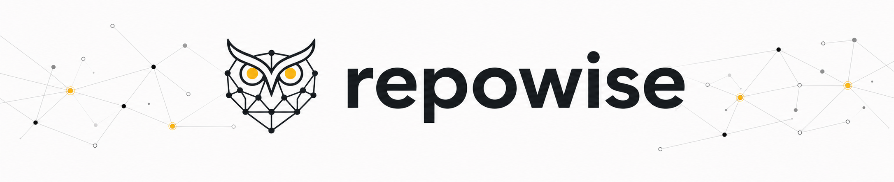
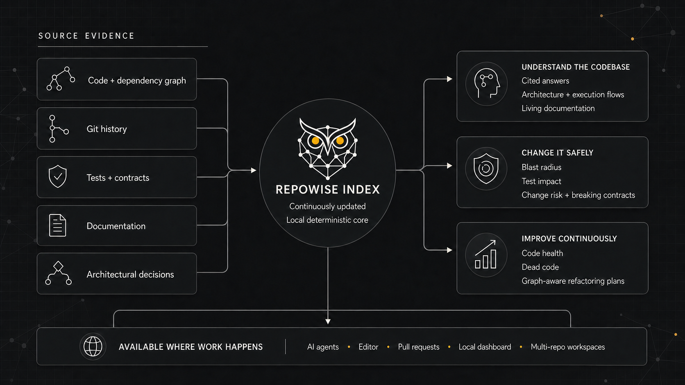
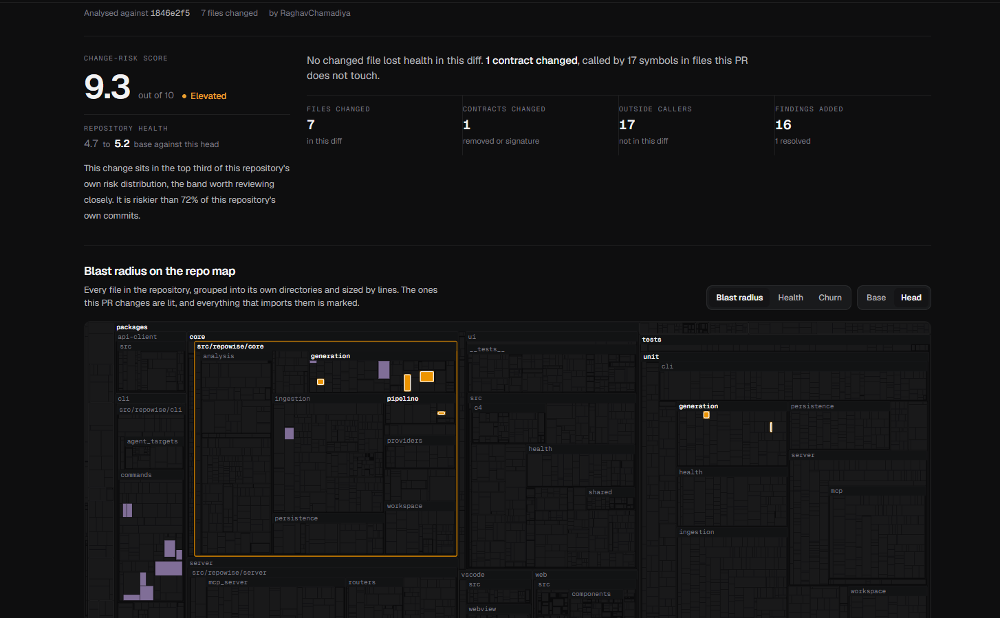

<!-- mcp-name: dev.repowise/repowise -->

<div align="center">

<a href="https://www.repowise.dev"></a>

<h1 align="center">Understand your codebase without paying your agent to rediscover it.</h1>

<p align="center">Repowise indexes your code, dependency graph, git history, tests,<br />
documentation, and decisions once, then gives agents and developers cited answers,<br />
change impact, and concrete code-health fixes.</p>

<p align="center">
  <a href="https://www.repowise.dev"></a>
</p>



<table align="center">
<tr>
<td align="center" width="250"><h2>−31.6%</h2></td>
<td align="center" width="250"><h2>97.2%</h2></td>
<td align="center" width="250"><h2>2.3×</h2></td>
</tr>
<tr>
<td align="center" valign="top"><sub><strong>less agent output</strong><br />3.8 vs 7.2 tool calls<br /><em>n=43 · p&lt;0.0001</em></sub></td>
<td align="center" valign="top"><sub><strong>smaller context payload</strong><br />393 vs 13,984 tokens<br /><em>30 Flask commits</em></sub></td>
<td align="center" valign="top"><sub><strong>more defects surfaced</strong><br />same 20%-of-lines budget<br /><em>2,770 files · p=0.003</em></sub></td>
</tr>
</table>

<p align="center"><sub><strong>Graph accuracy leader at matched coverage.</strong><br />
No tool finding as much was more precise in all 7 compiler-graded cells.<br />
<em>5 tools · 37,853 oracle edges</em></sub></p>

<p align="center"><sub><strong>Zero LLM calls</strong> for graph, risk, health, tests,
dead code, and PR review. Generated prose is optional. Every benchmark publishes its
sample, method, limitations, and losing rows.</sub></p>

<p align="center"><sub>
Free and self-hosted · core analysis stays on your infrastructure · no API key needed ·
AGPL-3.0 or commercial
</sub></p>

<p align="center">
  <a href="https://repowise.dev/repo/repowise-dev/repowise"></a>
  <a href="https://repowise.dev/repo/repowise-dev/repowise/code-health"></a>
  <a href="https://pypi.org/project/repowise/"></a>
  <a href="https://www.gnu.org/licenses/agpl-3.0"></a>
</p>

<p align="center">
  <a href="#why-repowise"><strong>Why Repowise</strong></a> ·
  <a href="#your-agent-stops-guessing"><strong>Agents</strong></a> ·
  <a href="#know-whats-dangerous-before-you-merge"><strong>Changes</strong></a> ·
  <a href="#code-health"><strong>Code health</strong></a> ·
  <a href="#past-one-repo"><strong>Workspaces</strong></a> ·
  <a href="#measured-against-the-field"><strong>Evidence</strong></a> ·
  <a href="#for-teams-and-enterprises"><strong>Enterprise</strong></a> ·
  <a href="https://docs.repowise.dev"><strong>Docs</strong></a>
</p>

</div>

---

<a id="why-repowise"></a>

## One index. Three ways to use it.

| **Understand the code** | **Change it safely** | **Improve it continuously** |
|---|---|---|
| Ask cited questions · explore architecture and execution flows · read always-current docs · recover the decisions behind the code | See symbol-level blast radius · run only the tests a diff exercises · catch missing companion files · detect breaking contracts before merge | Find defect-prone files · separate maintainability from performance risk · remove dead code · hand concrete, graph-aware refactoring plans to an agent |

These are not disconnected scanners. The graph locates what git history flags; code
health measures it; tests show what guards it; decisions explain why it exists; and
the same evidence reaches your agent, editor, pull request, local dashboard, and
cross-repository system map.

<div align="center">

<p><sub>A dashboard tour recorded on this repository. The same local index powers the UI,
MCP tools, editor views, and PR analysis. No API key and nothing uploaded.</sub></p>
</div>

### Pick your front door

| If you care about… | Start here |
|---|---|
| **A coding agent that understands the repository** | Repowise finds the right files, returns task-shaped context in fewer calls, and proactively supplies decisions and risk. [For agents ↓](#your-agent-stops-guessing) |
| **Safer pull requests and faster test feedback** | Get change risk, symbol-level callers, co-change partners, and a measured or graph-inferred test run list before merge. [Change intelligence ↓](#know-whats-dangerous-before-you-merge) |
| **Finding and fixing the code most likely to hurt you** | A defect-validated 1–10 health score across defect risk, maintainability, and performance, followed by the concrete refactoring plan. [Code health ↓](#code-health) |
| **Understanding an estate, not one repository** | Match backend and frontend contracts, catch breaking providers, map downstream services, enforce architecture rules, and query every repo through one MCP endpoint. [Workspaces ↓](#past-one-repo) |
| **Rolling this out across an engineering organization** | Keep analysis on your infrastructure, give agents and reviewers the same evidence, and add commercial licensing, security controls, custom extensions, and SLA-backed support. [Teams and enterprise ↓](#for-teams-and-enterprises) |

<a id="quickstart"></a>

## Start in minutes (no API key)

```bash
pip install repowise
cd /path/to/your/repo
repowise init --no-prose -y
repowise serve
```

That builds the graph, git, decisions, health, dead-code and structural-wiki layers
locally. Connect Claude Code, Codex, Cursor or any MCP host, or open the dashboard.
`init` wires Claude Code automatically. Then ask your agent: *"Use Repowise
`get_overview` to summarize this repository"* or *"What breaks if I change
`src/auth.py`?"*

[Full setup, every agent, and optional model-written prose →](docs/start/QUICKSTART.md)

---

## Your agent stops guessing

Every question your agent asks about a repository has an answer that could have been
computed ahead of time. *Who calls this function? What breaks if I change it? Why is
it written this way? Which files are actually dangerous?* Without an index, the agent
rediscovers that answer on every task: grep, read, re-read, forget.

Repowise exposes **ten task-shaped MCP tools** to Claude Code, Codex, Cursor, VS Code
and anything else that speaks MCP: graph, git, docs, decisions, and ten MCP tools
behind one index. See [the canonical surface](#the-ten-mcp-tools). Most tools are built around data entities (one
file, one symbol), which forces agents into long chains of sequential calls. These are
built around **tasks**: pass several targets in one call, get complete context back.

Because the exploration work is already done, that phase mostly disappears. In a
measured agent loop across 43 questions on `django/django`, Repowise cut the agent's
own output by **31.6%** (p&lt;0.0001) and reached the answer in **3.8 tool calls
instead of 7.2**. That is the end-to-end result.

One mechanism is much larger but narrower: loading a commit's context through
`get_context` costs **393 tokens instead of 13,984**, or 97.2% less. That is one
retrieval payload, not a claim of 97.2% total agent savings. Both measurements and
every competitor row are published in [the benchmark report](docs/BENCHMARKS.md).

**And it arrives without being asked.** Optional [hooks](docs/agent/HOOKS.md) push
context into the session at the moment it matters: the governing architectural
decision when your agent edits a file that decision covers, a warning when it touches
a file with a run of recent bug fixes, a compact briefing at session start. Repowise
also generates your `CLAUDE.md` and `AGENTS.md` from the real index, so even an agent
with no MCP support starts informed.

**It learns from how you actually work.** Repowise reads your own agent transcripts
for the corrections you keep making ("use the shared HTTP client, not raw requests")
and turns the durable ones into tracked decisions it delivers back later. The wiki
generation budget tilts toward the modules you and your agent ask about most. All
local, all deterministic, no extra LLM calls.

<details>
<summary><strong>What the index builds</strong></summary>

| Foundation | What it contributes |
|---|---|
| **Graph** | File + symbol dependencies across 19 AST-parsed languages, confidence-stamped call resolution, communities, centrality, cycles, and execution flows |
| **Git** | Hotspots, ownership, co-change, bus factor, and bug-fix history: behavioral signals static analysis cannot see |
| **Docs** | A wiki for every module and file, rebuilt incrementally with freshness and confidence scoring plus hybrid search |
| **Decisions** | Architectural rationale mined from five index-time sources plus human and agent capture, each claim traced to evidence |
| **Code health** | 49 deterministic detectors across defect risk, maintainability, and performance, followed by concrete refactoring plans |

The structural wiki needs no model. Model-written prose is an optional upgrade, one
page or directory at a time. Six of the seven decision sources are deterministic too;
only comment archaeology needs a provider.

[The intelligence layers →](docs/layers/INTELLIGENCE_LAYERS.md) ·
[How the graph earns trust →](docs/layers/GRAPH.md)

</details>

### Also: stop paying for output nobody reads

Most of what an agent reads back from a shell command is noise: 300 lines of passing
tests wrapped around 4 failures, full commit bodies when it asked "what changed
recently". `repowise distill <cmd>` compresses command output **before the agent reads
it**, errors first, exit code preserved.

```bash
repowise distill pytest          # 61% fewer tokens, all 11 failure lines kept
repowise distill git log -50     # 89% fewer tokens
repowise saved                   # what distillation saved you, in tokens and dollars
```

Nothing is lost. Every omission leaves an inline `[repowise#<ref>]` marker that
`repowise expand <ref>` reverses in full, so the agent can always pull the detail back
without re-running the command. Small outputs pass through untouched. An opt-in hook
rewrites noisy commands automatically, shown to you for approval first.

<div align="center">

<p align="center"><sub>The <strong>Costs</strong> dashboard tallies both savings surfaces, priced at your own agent's model. Example from a week of heavy local use.</sub></p>
</div>

Full guide: **[docs/agent/DISTILL.md →](docs/agent/DISTILL.md)**

---

## Know what's dangerous before you merge

Four deterministic signals, all computed from the graph and git history, no LLM:

- **Change risk.** Score any commit or `base..HEAD` range **0-10** from the shape of
  the diff, ranked against your repo's own recent commits. PR mode returns directives
  rather than vibes: `may_break`, `missing_cochanges`, `missing_tests`, `tests_to_run`.
  One command: `repowise risk main..HEAD`. ([reference →](docs/layers/CHANGE_RISK.md))
- **Bug history.** Which files and symbols actually get bug-fixed, and how recently.
  Doc, test and config commits are filtered out so the count means what it says, and a
  file with a run of recent fixes gets flagged as a bug magnet while you edit it.
  ([reference →](docs/layers/BUG_HISTORY.md))
- **[Test intelligence](#which-tests-cover-this-file-without-a-coverage-report).** Which
  tests reach a file and which ones a diff actually exercises, from the call graph,
  with or without a coverage report.
  ([reference →](docs/layers/TEST_INTELLIGENCE.md))
- **Change coordination.** Which other open branches edit the files you are editing,
  every row saying why it is listed (`same file`, or a co-change pair with the commit
  counts behind it), and whether the diff in front of you is one change or several
  groups the index links nothing between. Both stay quiet when there is nothing to
  report. `repowise overlap` and `repowise risk`.
  ([reference →](docs/layers/CHANGE_RISK.md#branch-overlap))

Plus the free **[Repowise PR Bot](#the-pr-bot)**, which puts all of it on every pull
request. Zero LLM calls.

---

## Which tests cover this file, without a coverage report

Ingest LCOV, Cobertura or Clover and you get the measured answer. **Most
repositories never produce one**, so the graph answers instead: a test file that
imports a source file *reaches* it, which is a recorded edge rather than the
name-shaped guess everything else falls back to.

That fallback fails in both directions, and this repo is the proof. Five of its
six worst bug-magnet files have no test named for them and read as untested while
the graph names 3 to 23 test files each. The sixth is worse: matching on basename
paired the *health* engine with the *distill* engine's tests and called it tested.

```bash
repowise impacted-tests main..HEAD   # only the tests this diff actually exercises
repowise health                      # untested hotspots, now graph-aware
```

<sub>Dogfooded against a real <code>coverage run --contexts=test</code>:
<strong>95.7% precision</strong> on what reaches a file and <strong>97.5% on the
run list</strong>, at a 100% hit rate, against 72.1% and 94.8% for the one-hop
import walk this replaced. The two tiers are never averaged: rows are stamped
<code>basis: "measured"</code> or <code>"inferred"</code>, measured wins outright
where both can answer, and the inferred tier may never produce a percentage.
Sound as a floor, unsound as a quantity, and labelled so.
<a href="docs/layers/TEST_INTELLIGENCE.md"><strong>Test intelligence →</strong></a></sub>

---

## The PR bot

Install the [GitHub App](https://github.com/apps/repowise-bot) and the index shows up
where the decision actually gets made. One comment per pull request, edited in place on
every push rather than reposted, and **a green PR gets no comment at all**.

<sub>See a real comment on a real PR, not a mockup:
[repowise-dev/repowise#1204](https://github.com/repowise-dev/repowise/pull/1204).</sub>

What decides a review is inline. What is context sits behind one fold, so the comment
stays about seventeen rows whatever it finds.

- **Blast radius, at symbol level.** The contracts this PR changed and every caller of
  them in a file the PR does not touch. Importing a module says nothing about whether
  the function you changed is the one being called, so file-level impact is the wrong
  altitude for the question a reviewer actually has.
- **Before you merge.** The tests that import your changed files, and the files that
  changed alongside them in past commits but are missing here.
- **A Check Run that can gate the merge**, with annotations on the specific lines the
  PR added. Advisory by default.
- **Change risk**, scored against the repository's own commit distribution rather than
  an absolute scale, so it stays meaningful on a repo whose typical commit is large.
- **AI vs human authorship** of the changed files, with the average health of each.
- Then hotspots, hidden coupling, declining health, dead code and the change map, one
  fold down.

### And a page the comment links to

Markdown runs out. The comment shows three callers and says "+6 more"; the page shows
all nine. Public, no sign-in, on a repository the reader has never seen.



<sub>The page leads with change risk and newly introduced findings, then maps every
changed file and outside caller across the repository.
[See it live →](https://repowise.dev/pr/repowise-dev/repowise/1204)</sub>

**[Install the PR bot →](https://github.com/apps/repowise-bot)** ·
[how it works →](https://www.repowise.dev/bot)

---

<a id="code-health"></a>

## ★ Know exactly what to fix

A score that says *"this file is risky"* is where most tools stop. Repowise scores
every file, locates where the risk concentrates, and then names the specific fix.

<div align="center">

</div>

Every file is scored 1-10 by **49 deterministic detectors** (McCabe complexity, brain
methods, LCOM4 cohesion, god classes, native Rabin-Karp clone detection, untested
hotspots, change entropy, prior-defect history and more), split into three lenses:
**defect risk**, **maintainability**, and **performance**: static N+1 and I/O-in-loop
risk traced *across* files through the call graph, where file-local linters found **0**
of the cross-function cases and repowise surfaced ~90. Only **26** of the 49 are
permitted to move the defect number, because that is the number carrying published
accuracy claims.

> **Zero LLM calls, zero cloud, zero new runtime dependencies.** Pure Python over
> tree-sitter and git data, **under 30 seconds** on a 3,000-file repo, a budget
> enforced by a CI test, not an estimate. Marker weights are **calibrated against a
> real defect corpus, not hand-tuned**: every file scored at a commit preceding the
> bug window so nothing leaks backward, and an L2-logistic fit with file size as an
> explicit control, so a marker only earns weight for defect lift *beyond* being big.
> Only the learned constants ship.

**It proves itself on your repo, not just on a benchmark.** After every index,
Repowise checks its own flags against your git history and reports what it found:
*"16 of the 20 lowest-health files had a bug fix in the last 6 months, 3.3x the 24%
baseline."* If that number is bad on your codebase, you will see it. (It is an
association on your indexed history, not a forward prediction, the leakage-free
version is [in the benchmarks](docs/BENCHMARKS.md#5-code-health-predicts-defects).)

Then it names the fix. Not "this class is too big", but **Extract Class**, **Extract
Helper**, **Move Method**, **Break Cycle**, **Split File**, or **Extract Method**, with
the exact methods, edges and symbols that move, the **blast radius** of callers and
co-changing files that have to move with them, and a graph-aware ranking so a fix on a
central hub outranks the same fix on a leaf. Extract Method goes down to an
intra-procedural dataflow pass that lifts the exact span and infers a
behavior-preserving signature.

```bash
repowise health                        # KPIs and lowest-scoring files
repowise health --refactoring-targets  # ranked, concrete plans
repowise health --trend                # snapshots plus declining-health alerts
```

The dashboard renders each plan as a card with a copy-to-agent button. An optional LLM
step, never in the indexing path and only on request, expands any plan into generated
code and a unified diff.

<sub>Validated on <strong>21 open-source repos across 9 languages</strong> (2,826 files,
scored at a fixed point and checked against the following 6 months of bug fixes,
keyword-labelled): <strong>ROC AUC 0.737</strong> [0.683, 0.787]. The signal is
correlated with file size and weakens sharply within a fixed size band, which we report
rather than bury. Independently recomputed from the raw data.</sub>

<sub>Against <strong>CodeScene</strong>, the leading commercial code-health tool, on the
same 2,770 files and the same defect labels, ranking by repowise health surfaces
<strong>2.3x the defects under a fixed review budget</strong> (paired, p = 0.003).
<a href="docs/BENCHMARKS.md">Full head-to-head, methodology and limitations →</a></sub>

Guides: **[code health](docs/layers/CODE_HEALTH.md)** · **[refactoring](docs/layers/REFACTORING.md)**

---

## See all of it

`repowise serve` starts the full web dashboard next to the MCP server. No separate
setup, all local.

<table>
<tr>
<td width="50%"><br/><sub><b>Architecture</b> · the dependency graph, laid out and explorable, with per-node context and change coupling</sub></td>
<td width="50%"><br/><sub><b>Code Health</b> · every file as a bubble, hover any one to inspect its score, size, coverage and findings</sub></td>
</tr>
<tr>
<td width="50%"><br/><sub><b>Chat</b> · ask the codebase a question, answers cite the files and pages they came from</sub></td>
<td width="50%"><br/><sub><b>Docs</b> · auto-generated wiki pages for the whole codebase, with confidence and freshness badges</sub></td>
</tr>
</table>

Also in there: **Chat** (ask the codebase in natural language) · **Docs** (the
generated wiki, with Mermaid and a graph sidebar) · **Architecture** and **C4**
(Context → Containers → Components) · **Knowledge Graph** plus a zoomable canvas map ·
**Risk**, **Hotspots**, **Coupling** and **Blast radius** · **Contributors** ·
**Decisions** (evidence drawer and evolution timeline) · **Symbols** · **Security** ·
**Dead code** · **Stats** · **Costs** · **Workspace**.

Every view and what each one answers: **[docs/start/DASHBOARD.md →](docs/start/DASHBOARD.md)**

---

<a id="past-one-repo"></a>

## One intelligence layer across your software estate

Real systems are not one repository, and the expensive failures live in the gaps
between them. Change a backend contract and Repowise can name the frontend calls that
consume it, the services downstream, the historical companion files missing from the
change, and the architecture rule the new dependency violates before it ships.

| Workspace intelligence | What it answers |
|---|---|
| **Contract map** | Which services provide and consume each HTTP, gRPC, event, socket, and data contract? Links retain exact/candidate confidence and the source evidence. |
| **Cross-repo blast radius** | If this provider changes, which downstream services **will break** through structural dependencies, and which ones **may drift** through historical co-change? |
| **Breaking-change guard** | Was an endpoint removed or a typed contract changed incompatibly, and which exact consumer files call it? |
| **Test impact** | Which tests in the consumer repos should run for this provider change, measured from coverage or inferred from the call graph, and which links could not be determined? |
| **Architecture as code** | Does the live system graph violate declared dependency rules or contain cycles? `repowise workspace check` gates CI. |
| **Architecture health** | How coupled is the estate? Track propagation cost, the cyclic core, service roles, and a deterministic 1–10 architecture score. |
| **Federated context** | One dashboard and one MCP server answer across every repository while preserving repo-level evidence. |

The system map models **services**, not merely repository boxes, and never conflates a
real contract with “these files often changed together.” Field-level breaking diffs
currently require a gRPC schema; HTTP supports endpoint-level removal detection.

**[Workspace guide and exact support matrix →](docs/scale/WORKSPACES.md)**

Worktrees and updates stay lightweight: a linked worktree seeds its index from the base
checkout automatically, and post-commit hooks, file watching, webhooks, or polling keep
each repository and the cross-repo graph current.

---

## In your editor

The **Repowise** VS Code extension puts the index where code actually gets written:
know what your change breaks before you push (riskiest files ranked, what is
downstream, forgotten companion files, missing tests, suggested reviewers), health in
the gutter and status bar, callers and ownership on hover, refactoring plans as
CodeLens, and the full dashboards inside the editor. One install also registers the MCP
server with VS Code, so the same local index serves both you and your agent, and
exposes six tools to GitHub Copilot. Quiet by default, everything toggleable, nothing
leaves your machine.

Install from the Marketplace (search **Repowise**) or Open VSX, then run **Repowise:
Set Up This Repository**. Guide: **[docs/agent/VSCODE.md →](docs/agent/VSCODE.md)**

---

## Supported agents

**Six agents wired end to end · two at the Full tier · every other MCP host one
paste away.**

<details>
<summary><strong>See integration tiers and supported agents</strong></summary>

<p>
  <strong>Full tier &nbsp;</strong>
  
  
</p>
<p>
  <strong>Good tier &nbsp;</strong>
  
  
  
  
</p>

**Full** is every surface repowise has: MCP tools, skills, slash commands, a managed
instructions file, hook-level interception of tool calls, and transcript mining after
the session. **Good** is the honest half of that: MCP tools and the config to reach
them, but no hook-level interception and no transcript mining. A Good-tier agent can
ask repowise anything; repowise never sees the tool calls in between. The tier is
computed from what each integration actually wires, so this list cannot claim a depth
the code does not have.

Everything else that speaks MCP is one snippet away. `repowise agents print-config
claude-code` prints a stdio server entry to paste into Cline, Windsurf, Zed, Gemini
CLI or any other host that keys on `mcpServers`, and repowise writes nothing.

Adding an agent takes **one descriptor file and one registry line**, with no changes to
the orchestrators. Full matrix and the contributor recipe:
**[docs/agent/INTEGRATIONS.md →](docs/agent/INTEGRATIONS.md)**

</details>

---

## Supported languages

**25 languages parsed to AST · 39 on a five-rung ladder · framework-aware across
all of them.**

"Do you support X" has five useful answers, not two, so languages land on a
ladder and every rung says what it buys you.

<details>
<summary><strong>See the complete language ladder</strong></summary>

<p>
  <strong>Full tier &nbsp;</strong>
  
  
  
  
  
  
  
  
  
  
  
  
  
</p>
<p>
  <strong>Good tier &nbsp;</strong>
  
  
  
  
  
  
  
  
  
  
  &nbsp;<strong>· Partial &nbsp;</strong>
  
  
</p>

Below those two rungs the ladder keeps going, and a language on a lower rung is
still doing real work rather than being ignored:

| Rung | Languages | What you get |
|---|---|---|
| **Full** (13) | Python · TypeScript · JavaScript · Svelte · Vue · Java · Kotlin · Go · Rust · C++ · C# · Scala · Ruby | The whole pipeline: AST symbols, import resolution, a resolved call graph, heritage, docstrings, framework edges, **and code-health markers** |
| **Good** (10) | C · Swift · PHP · Dart · Object Pascal · GDScript · VB.NET · Elixir · F# · Objective-C | All of the above except the full health suite |
| **Partial** (2) | Luau / Roblox · Razor / Blazor | Luau: AST symbols and `require()` resolution, Rojo and `.luaurc` aware. Razor: component symbols, `@code` and component-tag call edges, C# health markers; no import resolution yet |
| | | ⎯⎯ *tree-sitter parsing stops here; the rungs below come from git and imports* ⎯⎯ |
| **Lightweight** (6) | Clojure · Haskell · Lean 4 · Erlang · HTML · QML | A real file-to-file import graph, and no symbol-level claims |
| **Structural** (8) | R · Zig · Julia · Elm · OCaml · Crystal · Nim · D | Git history: blame, hotspots, co-change, ownership, bug history |

**Every language ships in the open-source distribution.** None is gated behind
the commercial licence, and none will be. Languages on the way up the ladder,
including **COBOL**, are on the
**[roadmap →](ROADMAP.md#languages)**.

SQL and dbt projects get real `ref()` / `source()` lineage, shell scripts get
function-level symbols, HTML pages contribute their `<script src>` / `<link href>`
dependencies (including `index.html` → `src/main.ts`), and OpenAPI, Protobuf,
GraphQL, Dockerfile, Terraform and friends get dedicated handlers. Anything else is
still tracked through git history: blame, hotspots, co-change.

Every call edge is stamped with **how it was resolved and how much to trust it**, from
`same_file` at 0.95 down to a repo-wide name match at 0.50, labelled as the guess it is
([how that works](docs/layers/GRAPH.md)).
Adding a language takes five small steps and **no changes to the parser core**.

Full matrix: **[docs/layers/LANGUAGE_SUPPORT.md →](docs/layers/LANGUAGE_SUPPORT.md)** ·
The graph itself: **[docs/layers/GRAPH.md →](docs/layers/GRAPH.md)** ·
Contributor recipe and internals:
**[docs/architecture/language-support.md →](docs/architecture/language-support.md)**

</details>

---

<details>
<summary><strong>Agent setup and optional model-written prose</strong></summary>

**1. Install**

```bash
pip install repowise          # Windows: python -m pip install repowise
repowise --version
```

**2. Index your repo**

```bash
cd /path/to/your/repo
repowise init
```

Bare `init` asks. It scans the repo first, then offers three ways to index it:
everything (the wiki written by a model), no prose (the same wiki rendered from
your code's structure, no key and no spend), or advanced, which walks through the
indexing and generation knobs. Nothing is spent before you see an estimate and
confirm it.

If you would rather not answer questions, or you are scripting this, name the
mode and add `-y`:

```bash
repowise init --no-prose -y    # free, no key, no questions
repowise init --prose -y       # model-written subsystem pages, cost pre-approved
```

Either way you get the dependency graph, git history, code-health scores and
dead-code findings in seconds, plus a complete wiki: file, module, layer and cycle
pages, the architecture diagram, the repo overview, API and infra pages, and the
onboarding collection. On the keyless path every page carries a footer saying it
was derived from structure, and the repo overview describes composition, entry
points, clusters and dependencies rather than what the project does end to end,
because no template can derive that. Full-text search works on this index;
semantic search needs an embedder configured (Ollama is the keyless option).

Went keyless and want the wiki written by a model later? You do not have to decide
now. Upgrade it whenever you like with `repowise generate`, a page, a directory,
or the whole thing at a time, each behind a cost estimate:

```bash
export ANTHROPIC_API_KEY="sk-ant-..."   # or OPENAI_API_KEY / GEMINI_API_KEY
repowise generate                       # write the unwritten subsystem pages, behind one cost estimate
repowise generate --path src/api        # or just one area first
repowise generate --all                 # or rewrite the prose on every subsystem page
```

Bare `repowise generate` prints the wiki's state and writes the unwritten
subsystem (concept) pages behind a single cost estimate. Every other page was
already rendered from structure at index time.

Or pick the provider for the first index directly with `repowise init --provider
gemini|anthropic|openai`.

**Resuming an interrupted index.** If `init` is interrupted (timeout, crash,
Ctrl+C), re-run it with `--resume` and it continues from where it stopped —
pages already written to the vector store are skipped, and only the missing
ones are generated:

```bash
repowise init . --resume
```

`--resume` is a safe no-op on a fully indexed repo, so it is the right thing to
reach for whenever a long run is cut short. It works because pages are written
to LanceDB incrementally, while the SQL `generation_jobs` row only finalizes at
the end — a hard interrupt can leave LanceDB ahead of SQL, and `--resume` is
the supported recovery path (`repowise doctor` flags the drift).

**3. Connect your agent.** Step 2 already did this for Claude Code: `init`
writes a repo-root `.mcp.json` unconditionally and, unless you passed
`--no-editor-setup`, also registers repowise with `~/.claude/settings.json`.
Open a session in this repo and it is already wired; check with `repowise
agents`.

<details><summary><b>Claude Code</b></summary>

Skipped editor setup, or setting up another machine?

```bash
repowise agents add --target=claude-code
```

The plugin additionally adds slash commands and skills, which `init` does not
install:

```bash
/plugin marketplace add repowise-dev/repowise
/plugin install repowise@repowise
```

Or wire the MCP server by hand:

```bash
claude mcp add repowise -- repowise mcp
```
Or edit the project `.mcp.json` `init` already wrote:
```json
{ "mcpServers": { "repowise": { "command": "repowise", "args": ["mcp"] } } }
```
</details>

<details><summary><b>Codex CLI</b></summary>

Add to `~/.codex/config.toml`:
```toml
[mcp_servers.repowise]
command = "repowise"
args = ["mcp"]
```
Or: `codex mcp add repowise -- repowise mcp`
</details>

**4. First real call.** Ask your agent: *"Use repowise `get_overview` to summarize this
repo"*, or *"`get_context` for `src/auth.py`"*. You get graph-grounded architecture and
per-file triage instead of a flurry of greps.

> `get_overview` and `get_context` work in index-only mode with no key, synthesized
> from the graph, git and health layers. `search_codebase` and `get_answer` read the
> wiki, which index-only mode does build, but they answer from pages rendered from
> structure rather than model-written prose, and `search_codebase` is full-text only
> until you configure an embedder.

Full walkthrough: **[docs/start/QUICKSTART.md →](docs/start/QUICKSTART.md)**

</details>

---

## The ten MCP tools

Every response carries an `_meta` envelope with `index_age_days`, `indexed_commit`, and
a `stale_warning` that fires only when the indexed HEAD diverges from live `.git/HEAD`,
so your agent always knows how much to trust what it just read.

<details>
<summary><strong>See the complete MCP tool surface</strong></summary>

| Tool | What only this tool answers |
|---|---|
| `get_overview()` | Architecture summary, module map, entry points, git health. The first call on any unfamiliar codebase. |
| `get_answer(question)` | Hybrid retrieval (full-text plus vector via RRF), PageRank bias and 1-hop graph expansion into one cited answer with a calibrated `retrieval_quality`. Collapses search → read → reason into a single round-trip. |
| `get_context(targets, include?)` | Triage card for files, modules or symbols: summary, signatures, `hotspot` bit, governing decisions, `symbol_id`s. `include` opens callers, callees, ownership and metrics. Batch many targets in one call. |
| `get_symbol("file.py::Name")` | Source for one indexed symbol with exact line bounds. Cheaper and safer than `Read` plus offset math. |
| `search_codebase(query, kind?)` | Semantic search over the wiki, filterable by kind (implementation / test / config / doc), tagging each result's `search_method`. |
| `get_risk(targets, changed_files?)` | Hotspots, dependents, co-change partners, ownership, test gaps, bug history. Pass `changed_files` for PR mode and get a `directive` block back. |
| `get_change_risk(revspec)` | What a commit, range or uncommitted change newly made worse across defect, maintainability and performance, why each finding is attributable to it, the tests coverage proves it touches, and how the diff's shape ranks against recent commits. |
| `get_why(query?, targets?)` | Architectural decisions and their verbatim evidence spans, stamped exact / fuzzy / unverified. Falls back to git archaeology when no decisions exist. |
| `get_dead_code(...)` | Unreachable code by confidence tier with cleanup-impact estimates, and cross-repo consumer detection in workspace mode. |
| `get_health(targets?, include?)` | Per-file marker scores across all three signals. `include` opens coverage, trends, per-file signals, the accuracy self-check, and structured refactoring plans. |

Ten is a deliberate ceiling rather than a limit we ran into: a small, task-shaped
surface is easier for an agent to choose from than a large one. Worked example (*"add
rate limiting to all API endpoints"* in 5 calls instead of ~30 greps and reads), the
opt-in tools, and the full reference: **[docs/agent/MCP_TOOLS.md →](docs/agent/MCP_TOOLS.md)**

</details>

---

## Measured against the field

Six open-source agent-context tools, the same repositories, the same pinned
commits, the same questions, each one given its own full advertised tool surface.
The full page carries the rows we lose beside the rows we win.

**Token reduction needs a denominator.** If the comparison is one context payload,
Repowise reduces 13,984 naive-read tokens to 393, a **97.2% reduction**. If the
comparison is the agent's complete output across a real task loop, the reduction is
**31.6%**. Competitor pages often publish the first kind as "token savings"; we
publish both and call only the second one agent savings.

The same rule applies to graphs: coverage without correctness rewards fake edges,
while precision without recall rewards drawing almost nothing. Our compiler-graded
claim is therefore the pair: in all seven comparisons, no tool that recovers as much
of the call graph gets more of it right.

<div align="center">
<picture>
  <source media="(prefers-color-scheme: dark)" srcset=".github/assets/bench/file-coverage-dark.svg" />
  
</picture>
<picture>
  <source media="(prefers-color-scheme: dark)" srcset=".github/assets/bench/agent-output-tokens-dark.svg" />
  
</picture>
</div>

- **Finds the right files.** 0.876 file coverage against CodeGraph's 0.610 on a
  **sealed** 42-instance split, held out from every improvement round. 19 wins,
  1 loss per instance. Deterministic grading, no LLM judge. *n=42, sign test
  p=0.00004.* CodeGraph scores the same on both halves to three decimals, so
  neither half is the easy one.
- **Less work in a real agent loop.** -31.6% output tokens against a bare agent,
  leaner on 37 of 44 questions. *n=43, p&lt;0.0001.* CodeGraph is a genuine second
  at -24.4%: more than one tool here works, and we lead the field rather than
  being alone in it.
- **Fewer steps to get there.** 3.8 tool calls where the bare agent needed 7.2,
  and 3.0 files opened instead of 7.2, the mechanism behind the token saving,
  visible directly rather than inferred.

**[The full results, the methodology, and the rows we lose →](docs/BENCHMARKS.md)**

---

## How it compares on capability

No single product competes with all of this, so there is no single table. Three
axes, three sets of real peers. Rows marked *measured* are head-to-head numbers,
and they link to **[docs/BENCHMARKS.md](docs/BENCHMARKS.md)** where the sample
sizes, the tests and the rows we lose all live.

<details>
<summary><strong>Open the complete capability comparisons</strong></summary>

### As an agent context layer

Against the tools doing the same job: index a repository, serve it to a coding
agent over MCP.

| | repowise | CodeGraph | Serena | DeepWiki |
|---|---|---|---|---|
| Self-hostable, open source | ✅ AGPL-3.0 | ✅ | ✅ | ❌ cloud only |
| Private repo, no cloud | ✅ | ✅ | ✅ | ❌ OSS forks only |
| MCP tools served | 10 core + workspace tools | 1 | 29 | 3 |
| **Finds the gold files** *([measured](docs/BENCHMARKS.md#1-finding-the-right-files), n=42 sealed)* | ✅ **0.876** | 0.610 | not in this run | not measured |
| **Output tokens vs a bare agent** *([measured](docs/BENCHMARKS.md#2-what-changes-in-a-real-agent-loop), n=43)* | ✅ **-31.6%** | -24.4% | -14.8% | not measured |
| **Memory to build the graph** *([measured](docs/BENCHMARKS.md#what-it-costs-to-run), 5 tools, 35 repos)* | ✅ **75 MB**, lowest on 35 of 35 | 757 MB | not measured | n/a, cloud |
| **Time to build the graph** *([measured](docs/BENCHMARKS.md#what-it-costs-to-run), same run)* | **2.77s**, fastest on 14 of 35 | **3.65s**, fastest on 16 | not measured | n/a, cloud |
| **Time to build the full index, django** *([measured](docs/BENCHMARKS.md#what-it-costs-to-run))* | ⚠️ **366.8s**, slowest here | ✅ **16.4s** | not measured | n/a, cloud |
| | *five layers against their one; one-time, updates after it are incremental* | | | |
| **Call-edge precision** *([measured](docs/BENCHMARKS.md#7-edge-precision), 540 rows hand-graded from source)* | ✅ **84.8%** | 57.0% | not measured | not measured |
| **Call-edge precision, judged by a compiler** *([measured](docs/BENCHMARKS.md#8-the-same-question-against-an-answer-key-we-do-not-control), 5 tools, 7 cells, 37,853 edges)* | ✅ **nothing that finds as much gets more of it right**, 7 of 7 | lower precision in 7, and lower recall in 5 | not measured | not measured |
| Generated documentation | ✅ | ❌ | ❌ | ✅ |
| Proactive agent hooks | ✅ Claude + Codex | ❌ | ❌ | ❌ |
| Auto-generated AI instructions (`CLAUDE.md`, `AGENTS.md`) | ✅ | ❌ | ❌ | ❌ |
| Command-output distillation | ✅ reversible | ❌ | ❌ | ❌ |
| Learns from your usage (session-mined decisions, demand-weighted docs) | ✅ | ❌ | ❌ | ❌ |
| Architectural decision records | ✅ | ❌ | ❌ | ❌ |
| Multi-repo workspace intelligence | ✅ contracts, co-change, federated MCP | ❌ | ❌ | ❌ |

**The two cost rows answer different questions.** Building the call graph, we are
the lightest tool measured, about ten times lighter than the next, and roughly as
fast as the fastest. Building the *whole* index, CodeGraph is **22x faster than we
are**, because by then we have also built the git-history layer, the wiki, the
decisions and the health pass. If a call graph is all you need, that is the right
trade and you should take it. With prose generation on, which is what a default
`repowise init` costs, it is **135x**. Graphify and
code-review-graph were in the same measured field and are on the benchmarks page.

The precision row cuts the other way and is worth stating as plainly: of the call
edges we draw, **about fifteen percent are wrong**, and on `seastar` CodeGraph
grades better than we do. Nine languages were read on both sides, four separate,
five are statistical ties.

The compiler row exists because we graded the hand-read one ourselves. On Go and
TypeScript the answer key is the Go team's own RTA call graph and the `tsc`
checker's own resolution, which we neither wrote nor can tune.

**Read that row carefully, because it is a claim about two numbers.** Precision
alone is easy to win by drawing almost nothing, and two of the five tools score
above us that way, one of them at 0.997 from a graph holding 17% of the calls in
the repository. Recall alone is easy to win by drawing everything, and the tool
that leads it emits, on the largest repository measured, more than a third of its
edges as calls that do not exist. What we claim is the pair: **in all seven cells,
no tool that recovers as much of the call graph as we do gets more of it right.**
The column we lose is still there and is still ours to lose: **the tool with the
highest recall in every Go cell is not us.**

<sub>Measured against CodeGraph 1.5.0, Graphify 0.9.31, Serena 1.6.2.dev0,
code-review-graph 2.3.7, on repowise `081a59fa` (between v0.37.0 and v0.38.0),
August 2026. Unmarked rows are capability presence, not measurements.</sub>

### As a code health tool

| | repowise | CodeScene |
|---|---|---|
| Self-hostable, open source | ✅ AGPL-3.0 | ⚠️ on-prem Docker, proprietary |
| Code health score (1-10) | ✅ 49 detectors, 26 scoring | ✅ 25-30 |
| Brain Method / LCOM4 / god class | ✅ | ✅ |
| **Defects found at a 20% review budget** *([measured](docs/BENCHMARKS.md#5-code-health-predicts-defects), 2,770 files)* | ✅ **0.173** | 0.074 |
| **Effort-aware ranking, Popt** *(measured, p=0.003)* | ✅ **0.607** | 0.462 |
| **Precision at that budget** *(measured)* | 0.580 | ✅ **0.636**, a shorter list |
| **Discrimination, ROC AUC** *(measured, paired)* | 0.731 | 0.705, *p=0.054, not significant* |
| Defect-prediction AUC, published and reproducible | ✅ 0.737 over 21 repos, held-out 0.76-0.78 | ✅ Code Red study |
| Business impact (resolution time) | ❌ *we could not replicate this on open data* | ✅ Code Red study |
| Git intelligence (hotspots, ownership, co-change) | ✅ | ✅ |
| Pre-merge change-risk scoring | ✅ 0-10 + directives | ✅ |
| Health trend + declining alerts | ✅ rolling snapshots | ✅ |
| Bus factor analysis | ✅ | ✅ |
| Concrete cross-file refactoring plans | ✅ graph-aware + blast radius | ⚠️ within-function only |
| Dataflow-verified within-function plans | ✅ CFG + reaching definitions | ⚠️ LLM-generated, unverified |
| Test-coverage intelligence | ✅ LCOV/Cobertura/Clover | ❌ |
| Untested-hotspot detection | ✅ coverage × hotspot | ❌ |
| Dead code detection | ✅ | ❌ |
| Serves it to an AI agent over MCP | ✅ | ✅ |
| Local dashboard | ✅ | ✅ |

CodeScene is the only other vendor in this category with a published empirical
defect study, which is why it is the one we ran head to head against. It flags
about 27 files where we flag 132, so if you want a short list to action rather
than the ranking that catches the most defects, its threshold is the better fit.

### Documentation generators

DeepWiki, Google Code Wiki and Swimm generate documentation from a repository,
which overlaps one of our five layers. **We have not measured against them**, so
there is no table here rather than a table of checkmarks. DeepWiki appears above
because it also serves an agent over MCP, which is a job we can be measured on.

### The PR bot, against the LLM review bots

| | Repowise PR Bot | CodeRabbit | Greptile |
|---|---|---|---|
| LLM calls per PR | ✅ **zero** | ❌ every review | ❌ every review |
| Same diff, same review | ✅ deterministic | ❌ sampled output | ❌ sampled output |
| Your code sent to a model provider | ✅ never | ❌ yes | ❌ yes |
| Symbol-level blast radius (changed contracts → their callers) | ✅ call graph | ❌ | ⚠️ prose, from context |
| Co-change partners missing from the PR | ✅ git history | ❌ | ❌ |
| Change risk vs the repo's own distribution | ✅ 0-10 + percentile | ❌ | ❌ |
| Public analysis page per PR, no sign-in | ✅ | ❌ | ❌ |
| Silent on a clean PR | ✅ by default | ⚠️ configurable | ⚠️ configurable |
| Cost on public repos | ✅ free, uncapped | ⚠️ free tier | ⚠️ free tier |
| Self-hostable | ✅ AGPL-3.0 | ❌ | ❌ |

The axis where this is not close is the first two rows. An LLM reviewer is a different
product with a different failure mode: it can read intent, and it can also be wrong in a
new way on every run. This one does set arithmetic over a call graph and a git history,
so there is nothing to hallucinate and nothing to prompt-inject, and pushing the same
diff twice produces the same review twice.

**Repowise is the intersection:** an agent-native context layer *and* behavioral git
intelligence *and* a defect-validated health score with the fix attached, all out of
one index, self-hostable and open source. Full side-by-side comparisons:
**[repowise.dev/compare →](https://www.repowise.dev/compare)**

</details>

---

<a id="for-teams-and-enterprises"></a>

## For teams and enterprises

AI makes producing a change cheaper; it does not make understanding its consequences
cheaper. In a large estate, the answer crosses repositories, ownership boundaries,
service contracts, test suites, and years of architectural history. Repowise gives
developers, agents, reviewers, and platform teams the same evidence about what exists,
what depends on it, what is risky, and what will break.

That is the engineering reason to deploy it. The security reason is structural:
**graph, git, health, change risk, tests, dead code, and PR review make zero LLM
calls.** Documentation prose is optional and can use your provider contract or run
fully offline through Ollama.

| Status | Enterprise capability |
|---|---|
| **Shipping now** | Five deterministic intelligence layers, ten MCP tools, multi-repo workspaces, contract extraction and blast radius, test intelligence, architecture conformance, local dashboard, auto-sync, and full-history secret scanning. |
| **GA commercially** | Hosted graph-aware security, CVE prioritization, CycloneDX SBOM and VEX, PCI-DSS and SOC 2 evidence reports, audit exports and webhook stream, Jira and Confluence, customer-infrastructure HA topology, custom extensions, SLA support, and IP indemnification. |
| **Rolling out** | GitHub Enterprise, Azure DevOps, GitLab and Bitbucket integrations; SAML/OIDC SSO and SCIM; engineering-leader dashboards. |
| **Planned** | RBAC and multi-tenancy, packaged air-gap install bundle, and the Helm chart. |

Self-host with `pip install` or run the API, workers, dashboard, Postgres, and
LanceDB/pgvector containers on your infrastructure. Deterministic analysis needs no
provider. When optional prose is enabled, provider choice is per repository. Stored
data includes the graph, embeddings, wiki pages, and git metadata; raw source is
processed transiently and is not persisted.

**Past one repository.** Workspaces index an estate as one unit: API contracts
matched producer to consumer so a breaking change is caught before it ships,
cross-repo co-change, and one federated MCP endpoint that answers across all of
it. *(Estate-scale dashboards: [in development](ROADMAP.md#multi-repo-and-workspace).)*

**Not on git?** Only the history layer needs a commit log. Point `repowise init`
at a plain directory, an export, or a Perforce or SVN workspace and the graph,
documentation, decisions and code-health layers all build normally; what is
missing is hotspots, ownership, co-change and bug history until the history layer
learns to read your system.
*([Perforce, SVN, Endevor and ChangeMan on the roadmap →](ROADMAP.md#source-control-beyond-git))*

The complete capability matrix is maintained in
[COMMERCIAL.md](docs/business/COMMERCIAL.md#4-commercial-capabilities-at-a-glance),
with every item labelled GA, rolling out, in development, or planned.

[**repowise.dev**](https://www.repowise.dev) runs the same engine fully managed, at
feature parity with self-hosted. We run it on our own codebase in the open:
[live snapshot →](https://www.repowise.dev/s/5a6b93fa9a69) ·
[explore public repos →](https://www.repowise.dev/explore).

**[Commercial detail and pricing models →](docs/business/COMMERCIAL.md)** ·
**[Security review pack →](docs/business/SECURITY_COMPLIANCE.md)** ·
**[Roadmap →](ROADMAP.md)** ·
[hello@repowise.dev](mailto:hello@repowise.dev) ·
[security@repowise.dev](mailto:security@repowise.dev)

---

## Privacy

- **Deterministic or offline mode:** with `--no-prose`, code-derived content stays on
  your infrastructure. The CLI reports **anonymous, opt-out** usage telemetry
  (command names and coarse environment only); disable it with `repowise telemetry
  disable`, `DO_NOT_TRACK=1`, or by running fully offline.
  [What's collected →](docs/reference/TELEMETRY.md)
- **Optional LLM features:** generated prose, decision extraction and code-generating
  refactoring can send code-derived prompts directly to the provider configured with
  your own key. Repowise does not proxy those calls; provider handling and retention
  follow your account and provider terms.
- **What's stored:** the graph, embeddings, generated wiki pages, and git metadata.
  Raw source is processed transiently and never persisted. See the
  [security review pack](docs/business/SECURITY_COMPLIANCE.md) for the threat model
  and data-flow boundaries.
- **Fully offline:** Ollama plus a local embedding model means zero external calls.

Doing a security review? **[docs/business/SECURITY_COMPLIANCE.md →](docs/business/SECURITY_COMPLIANCE.md)**

---

## CLI

```bash
repowise init [PATH]      # index a codebase (one-time; asks, or --no-prose -y needs no LLM)
repowise generate [PATH]  # write wiki pages with a model, on demand (upgrade a keyless wiki)
repowise serve [PATH]     # MCP server + local dashboard
repowise update [PATH]    # incremental update (seconds; --workspace for every repo)
repowise watch            # auto-sync daemon, re-index on file change
repowise search "<q>"     # hybrid search (fulltext / semantic / symbol / path)
repowise ask "<q>"        # a synthesized answer with citations
repowise context <files>  # triage card: layer, hotspot, fix history, freshness
repowise symbol <id>      # one symbol's body, with verified line bounds
repowise why <q|path>     # decisions, rationale, git archaeology
repowise health           # code-health KPIs and lowest-scoring files
repowise risk main..HEAD  # score a branch or PR range for defect risk
repowise risk -t <file>   # what history says about touching a file
repowise impacted-tests   # only the tests a diff actually exercises
repowise dead-code        # unreachable-code report
repowise decision list    # architectural decisions
repowise export --format structurizr  # the architecture as Structurizr DSL, no LLM
repowise distill pytest   # compact, errors-first, reversible command output
repowise saved            # tokens and dollars saved by distillation
repowise workspace add    # multi-repo workspace management
repowise doctor           # check setup, API keys, index drift
repowise uninstall        # remove what repowise wrote, and say what it left
```

Every command and flag: **[docs/reference/CLI_REFERENCE.md](docs/reference/CLI_REFERENCE.md)** ·
config: **[docs/reference/CONFIG.md](docs/reference/CONFIG.md)** ·
examples: **[examples/](examples/)**

---

## Contributing

```bash
git clone https://github.com/repowise-dev/repowise
cd repowise
uv sync --all-packages
uv run repowise --version
uv run pytest tests/unit/
```

New here? You do not have to read 3,000 files to start. We keep a public index of this
repo built by repowise itself, re-indexed on every push:
[**explore repowise with repowise →**](https://repowise.dev/repo/repowise-dev/repowise)
(architecture, hotspots, ownership, decisions, and a ranked
[refactoring backlog](https://repowise.dev/repo/repowise-dev/repowise/refactoring) you
are welcome to pick from).

Full guide, including how to add languages and LLM providers:
[CONTRIBUTING.md](.github/CONTRIBUTING.md) · architecture:
[docs/architecture/](docs/architecture/README.md)

---

## License

AGPL-3.0. Free for individuals, teams and companies using repowise internally.

For commercial licensing (the enterprise security and compliance layer, SSO/SCIM, RBAC,
workflow integrations, priority support and SLA, or embedding repowise in a product
without AGPL obligations), see
**[docs/business/COMMERCIAL.md](docs/business/COMMERCIAL.md)** or contact
[hello@repowise.dev](mailto:hello@repowise.dev).

---

<div align="center">

<em>Built for engineers who got tired of watching their AI agent <code>cat</code> the same file for the fourth time.</em>

<p align="center"><sub>⭐ If repowise earns a place in your workflow, <strong>give it a star</strong>. It costs you nothing, and it's the signal that keeps a small team building this in the open.</sub></p>

<p align="center">
  <a href="https://repowise.dev"><strong>repowise.dev</strong></a> ·
  <a href="https://www.repowise.dev/explore"><strong>Explore →</strong></a> ·
  <a href="https://discord.gg/cQVpuDB6rh"><strong>Discord</strong></a> ·
  <a href="https://x.com/repowisedev"><strong>X</strong></a> ·
  <a href="mailto:hello@repowise.dev"><strong>hello@repowise.dev</strong></a>
</p>

</div>
