<!-- mcp-name: dev.repowise/repowise -->

<div align="center">

<a href="https://www.repowise.dev">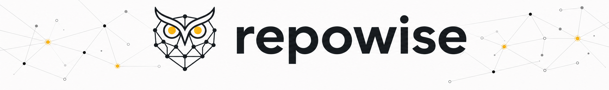</a>

<h1 align="center">Know the code. Know what breaks. Change it with confidence.</h1>

<p align="center">Repowise indexes your code, call graph, git history, tests, docs and design<br />
decisions once, on your machine. Then you and your coding agent ask it things:<br />
what calls this, what breaks if I change it, what is dead, what to fix first, and why it was built this way.</p>

<p align="center">
  <a href="#quickstart"></a>
  <a href="https://www.repowise.dev"></a>
</p>

<table align="center">
<tr>
<td align="center" width="250"><h2>−31.6%</h2></td>
<td align="center" width="250"><h2>2.3×</h2></td>
<td align="center" width="250"><h2>58,924</h2></td>
</tr>
<tr>
<td align="center" valign="top"><sub><strong>less agent output</strong><br />3.8 vs 7.2 tool calls<br /><em>43 questions · p&lt;0.0001</em></sub></td>
<td align="center" valign="top"><sub><strong>more defects surfaced than CodeScene</strong><br />same 20% review budget<br /><em>2,770 files · p=0.003</em></sub></td>
<td align="center" valign="top"><sub><strong>files indexed in one run</strong><br />dotnet/runtime, one laptop<br /><em>120 min · 11.7 GiB peak</em></sub></td>
</tr>
</table>

<p align="center"><sub><strong>Call graph checked against the compiler:</strong> 0.976 to 0.995 precision on Go and TypeScript,<br />
and no tool that finds as much of the graph gets more of it right, in 7 of 7 comparisons.<br />
<em>5 tools · 37,853 compiler edges · every losing row published</em></sub></p>

<p align="center"><sub>
Graph, risk, health, tests and dead code make <strong>zero LLM calls</strong> · no API key needed ·
free and self-hosted · AGPL-3.0 or commercial
</sub></p>

<p align="center">
  <a href="https://repowise.dev/repo/repowise-dev/repowise"></a>
  <a href="https://repowise.dev/repo/repowise-dev/repowise/code-health"></a>
  <a href="https://pypi.org/project/repowise/"></a>
  <a href="https://www.gnu.org/licenses/agpl-3.0"></a>
</p>

<p align="center">
  <a href="#what-it-does"><strong>What it does</strong></a> ·
  <a href="#quickstart"><strong>Quickstart</strong></a> ·
  <a href="#your-agent-stops-guessing"><strong>Agents</strong></a> ·
  <a href="#know-whats-dangerous-before-you-merge"><strong>Changes</strong></a> ·
  <a href="#code-health"><strong>Code health</strong></a> ·
  <a href="#past-one-repo"><strong>Workspaces</strong></a> ·
  <a href="#measured-against-the-field"><strong>Evidence</strong></a> ·
  <a href="#for-teams-and-enterprises"><strong>Enterprise</strong></a> ·
  <a href="https://docs.repowise.dev"><strong>Docs</strong></a>
</p>

</div>

---

Repowise is an ambitious project. We want every engineer, and every agent working
beside them, to understand a codebase the way the person who has maintained it for
five years does: what calls what, what tends to break, what nobody uses anymore, and
why it was built this way. Cutting tokens was never the goal. It happens anyway,
because an agent that can ask the index stops searching, opening and re-reading
files to find out. Measured against the other context tools on the same agent
tasks, it is also the largest saving.

<a id="quickstart"></a>

## Set it up in one line

Open Claude Code, Codex, Cursor or any MCP-capable agent in your repository and paste:

```text
Read https://docs.repowise.dev/setup.md and set up Repowise in this repository.
```

The agent installs Repowise, indexes the repo with no API key, wires itself to the
index, and asks you before anything costs money. Prefer to do it yourself:

```bash
uv tool install repowise          # or: pipx install repowise / pip install repowise
cd /path/to/your/repo
repowise init --yes --no-prose    # graph, git, health, dead code, docs. No key, no spend.
repowise serve                    # local dashboard + MCP server
```

`init` wires Claude Code automatically. Then ask your agent *"Use Repowise
`get_overview` to summarize this repository"* or *"What breaks if I change
`src/auth.py`?"*
[Full setup, every agent, optional model-written docs →](docs/start/QUICKSTART.md)

---

<a id="why-repowise"></a>
<a id="what-it-does"></a>

## What it does

One index, three ways to use it. Find the question you came with; each one links to
the page that answers it.

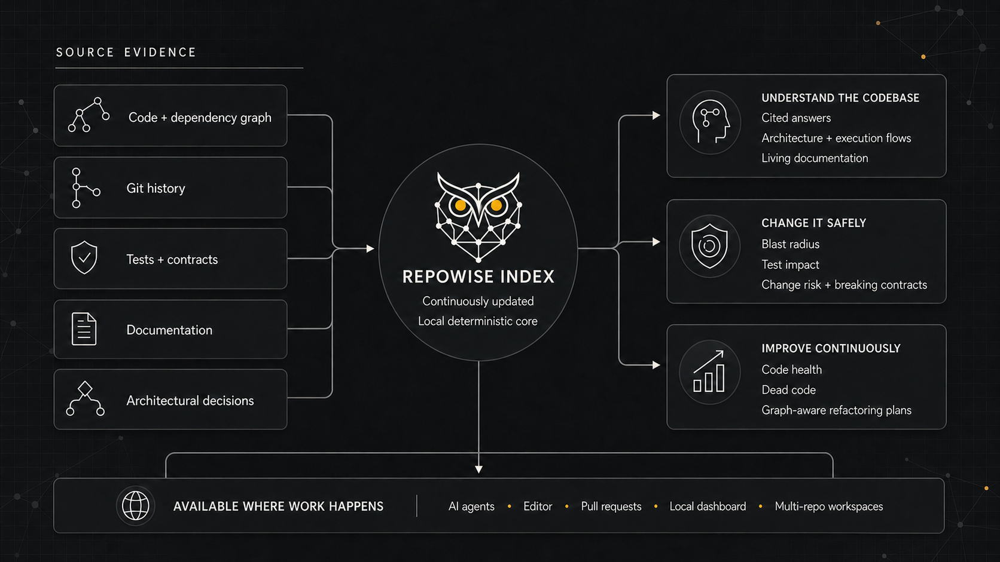

### Understand the code

| You ask | Repowise gives you |
|---|---|
| *How does checkout work in this repo?* | A cited answer built from the call graph and the generated docs, in one call. [Search and answers](docs/layers/WIKI.md) |
| *What calls this function, and what does it call?* | A call graph across 26 parsed languages, every edge stamped with how it was resolved and how far to trust it, plus traced execution flows from each entry point. [The graph](docs/layers/GRAPH.md) |
| *Can I get docs for this codebase?* | A wiki for every module and file, rendered from the code's structure with no key, or written by a model when you choose. It updates incrementally after each commit. [Docs](docs/layers/WIKI.md) |
| *Which of our docs are wrong?* | Markdown checked against the tree: every reference to a file or symbol the code no longer has, with the line to edit. [Doc drift](docs/layers/DOC_DRIFT.md) |
| *Why is it built this way?* | Decisions mined from ADRs, `# WHY:` comments, commit and PR history and your agent sessions, each tied to the code it governs and flagged when it goes stale. [Decisions](docs/layers/DECISIONS.md) |
| *Who knows this code?* | Owners, bus factor, knowledge-loss risk when the main author goes quiet, and suggested reviewers. [Ownership](docs/layers/OWNERSHIP.md) |
| *Can I see the architecture?* | An explorable dependency map, C4 views, and a Structurizr export, no model involved. [Dashboard](docs/start/DASHBOARD.md) |

### Change it safely

| You ask | Repowise gives you |
|---|---|
| *What breaks if I change this?* | Symbol-level blast radius: the callers of what you changed, the files that historically change with it but are missing from your diff, and the tests that reach it. [Change risk](docs/layers/CHANGE_RISK.md) |
| *How risky is this PR?* | Where the change ranks against your repository's own recent commits, with the reasons, as a directive your agent can act on. [Change risk](docs/layers/CHANGE_RISK.md) |
| *Which tests should run?* | The tests a diff actually exercises, from a coverage report if you have one and from the call graph if you do not. [Test intelligence](docs/layers/TEST_INTELLIGENCE.md) |
| *Did this PR add untested lines?* | Patch coverage, branch coverage on changed lines and path-scoped gates in CI, on GitHub, GitLab or any runner. [CI gates](docs/start/CI.md) |
| *Will this API change break another repo?* | HTTP, gRPC, topic and OpenAPI contracts matched across repositories, with a breaking-change guard and the consumer files it affects. [Workspaces](docs/scale/WORKSPACES.md) |
| *Is anyone else editing these files?* | Other open branches touching the same files or their co-change partners, each with the reason it is listed. [Branch overlap](docs/layers/CHANGE_RISK.md#branch-overlap) |
| *Did we just commit a secret?* | Keys, tokens and risky calls found in the working tree and in full git history, with a pre-commit check and a CI gate. [Security signals](docs/layers/SECURITY.md) |

### Improve it continuously

| You ask | Repowise gives you |
|---|---|
| *What should we fix first?* | A ranked queue weighing impact against effort, using churn, fan-in, coverage and bug history. [Fix first](docs/layers/CODE_HEALTH.md#fix-first) |
| *Where is the debt?* | A 1 to 10 score for every file from 53 deterministic detectors, split into defect risk, maintainability and performance, validated against real bug history. [Code health](docs/layers/CODE_HEALTH.md) |
| *Why is this slow?* | N+1 queries, I/O in loops, blocking calls inside async code and quadratic loops, traced across function and file boundaries. [Performance](docs/layers/CODE_HEALTH.md#performance-findings) |
| *How do I break this up safely?* | Concrete refactoring plans: Extract Method, Extract Class, Move Method, Split File, Break Cycle, with the exact symbols that move and what moves with them. Ready to hand to an agent. [Refactoring](docs/layers/REFACTORING.md) |
| *What can we delete?* | Unreachable files, unused exports and unused packages, each with a confidence tier and the evidence behind it. [Dead code](docs/layers/DEAD_CODE.md) |
| *Where do bugs keep landing?* | Bug-fix commits traced to files and symbols, and a warning when your agent edits a bug magnet. [Bug history](docs/layers/BUG_HISTORY.md) |
| *Are our tests testing anything?* | Tests with no assertions, tests that only check their own mocks, and untested hotspots. [Test-quality smells](docs/layers/CODE_HEALTH.md#test-quality-smells) |

<details>
<summary><strong>Things people do not expect it to do</strong></summary>

- **Test coverage without running coverage.** Most repositories never produce a
  coverage report. Repowise answers "is this tested, and by what" from the import and
  call graph, and labels every answer measured or inferred.
- **It checks its own health score on your repository.** After each index it reports
  how many of the lowest-scoring files actually had bug fixes in your recent history,
  so a bad score on your codebase is visible to you.
- **It learns from your agent sessions.** With transcript capture on, the corrections
  you keep repeating ("use the shared HTTP client") become tracked decisions it
  feeds back to the agent later. Transcripts never leave your machine.
- **It writes your `CLAUDE.md` and `AGENTS.md`** from the real index and keeps them
  current, so even an agent with no MCP support starts informed.
- **It shrinks command output before your agent reads it.** `repowise distill pytest`
  keeps every failure and drops the noise, and nothing is lost: an `expand` command
  restores any cut.
- **New git worktrees start indexed.** A linked worktree seeds its index from the base
  checkout instead of starting cold.
- **It knows which external systems you depend on.** Package manifests across PyPI,
  npm, Cargo, Go, NuGet, Maven and CMake feed a map of the services and libraries the
  code reaches.

</details>

<div align="center">
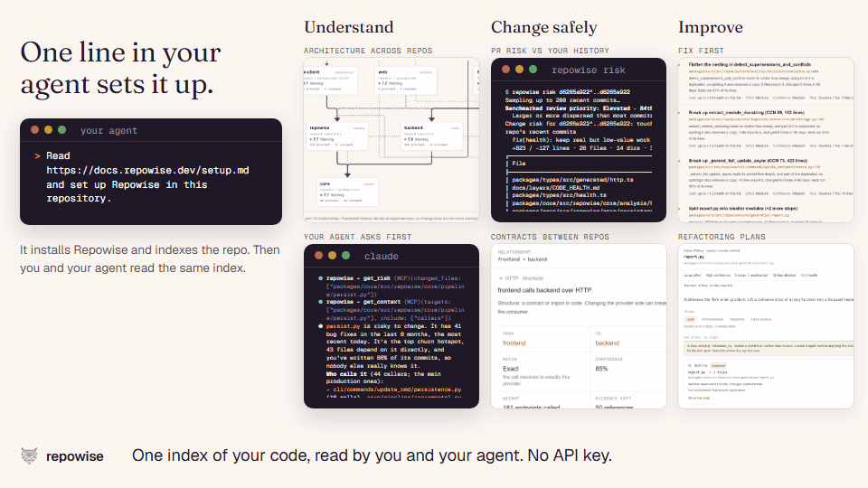
<p><sub>A dashboard tour recorded on this repository. The same local index powers the UI,
MCP tools, editor views and CI gates. No API key and nothing uploaded.</sub></p>
</div>

### Pick your front door

| If you care about... | Start here |
|---|---|
| **A coding agent that knows the repository** | Task-shaped context in fewer calls, with decisions and risk delivered before the agent asks. [For agents ↓](#your-agent-stops-guessing) |
| **Safer pull requests and faster CI** | Change risk, symbol-level callers, missing co-changes and the tests a diff needs. [Change intelligence ↓](#know-whats-dangerous-before-you-merge) |
| **Paying down the code most likely to hurt you** | A defect-validated health score, then the concrete fix. [Code health ↓](#code-health) |
| **An estate of many repositories** | Contracts matched across repos, breaking-change guards, architecture rules in CI, one MCP endpoint for everything. [Workspaces ↓](#past-one-repo) |
| **Rolling it out across a company** | Self-hosted with nothing leaving your network, per-language accuracy, sizing, compliance status and licensing in one place. [Teams and enterprise ↓](#for-teams-and-enterprises) |

---

## Your agent stops guessing

Every question your agent asks about a repository has an answer that could have been
computed ahead of time. *Who calls this function? What breaks if I change it? Why is
it written this way? Which files are actually dangerous?* Without an index, the agent
rediscovers that answer on every task: grep, read, re-read, forget.

Repowise gives Claude Code, Codex, Cursor, VS Code and any other MCP host
**ten task-shaped MCP tools** backed by one index of graph, git, docs and decisions.
Most code tools are built around data entities, one file or one symbol at a time,
which pushes agents into long chains of sequential calls. These are built around
tasks: pass several targets in one call and get the whole picture back.
[The tool list ↓](#the-ten-mcp-tools)

**About tokens.** Every tool in this category promises to cut your token bill, and
there are a lot of tools in this category. We think tokens are a symptom. An agent
burns them because it does not know the codebase, so it searches, opens files, opens
more files, and searches again. Give it an index that already knows, and the savings
show up on their own. They also happen to be the best we have measured: in a paired
agent loop over 43 questions on `django/django`, Repowise cut the agent's own output
by **31.6%** (p&lt;0.0001) and got there in **3.8 tool calls instead of 7.2**, ahead
of every other context tool in the same run. On 42 sealed retrieval tasks it found
**0.876** of the files a fix needed, against **0.610** for the next tool.
[Method and every row we lose →](docs/BENCHMARKS.md)

**Context arrives before the agent asks.** Optional [hooks](docs/agent/HOOKS.md) push
it into the session when it matters: the governing decision when your agent edits a
file that decision covers, a warning when it touches a file with a run of recent bug
fixes, a short briefing at session start, and a correction when it reaches for a path
that does not exist.

**It learns from how you work.** Switch on transcript capture
(`repowise decision source set session --on`) and Repowise reads your own agent
transcripts for the corrections you keep making, turning the durable ones into
tracked decisions it delivers back later. Transcripts never leave your machine; one
batched model call per update turns the candidates that clear the deterministic
gates into records, and `--no-llm` keeps the gates and drops that call.

<details>
<summary><strong>What the index builds</strong></summary>

Five layers, one index:

| Layer | What it contributes |
|---|---|
| **1. Graph** | File and symbol dependencies across 26 AST-parsed languages, confidence-stamped call resolution, communities, centrality, cycles and execution flows |
| **2. Git history** | Hotspots, ownership, co-change, bus factor and bug-fix history: behavioural signals static analysis cannot see |
| **3. Docs** | A wiki for every module and file, hybrid search, and your own markdown checked against the tree for claims the code no longer supports |
| **4. Decisions** | Architectural rationale from ADRs, inline markers, commits, PRs and agent sessions, each claim traced to evidence |
| **5. Health and change** | 53 deterministic detectors across defect risk, maintainability and performance, change risk, test impact, dead code and concrete refactoring plans |

The structural wiki needs no model. Model-written prose is an optional upgrade, one
page or directory at a time.

[How the layers fit together →](docs/layers/INTELLIGENCE_LAYERS.md) ·
[How the graph earns trust →](docs/layers/GRAPH.md)

</details>

### Also: stop paying for output nobody reads

Most of what an agent reads back from a shell command is noise: 300 lines of passing
tests wrapped around 4 failures, full commit bodies when it asked what changed
recently. `repowise distill <cmd>` compresses command output **before the agent reads
it**, errors first, exit code preserved.

```bash
repowise distill pytest          # 61% fewer tokens, all 11 failure lines kept
repowise distill git log -50     # 89% fewer tokens
repowise saved                   # what distillation saved you, in tokens and dollars
```

Every omission leaves an inline `[repowise#<ref>]` marker that `repowise expand <ref>`
reverses in full, so the agent can pull the detail back without re-running the
command. Small outputs pass through untouched. An opt-in hook rewrites noisy commands
for the agent automatically.

<div align="center">
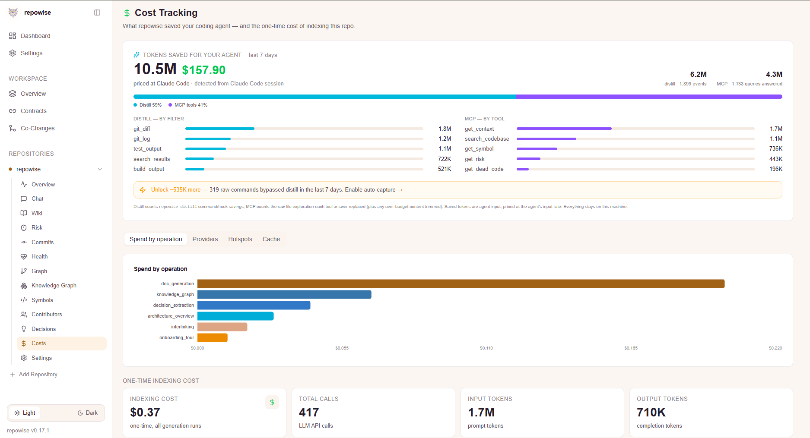
<p align="center"><sub>The <strong>Costs</strong> dashboard tallies both savings surfaces. Every event is priced from the model that produced it, and where the evidence is ambiguous it declines to claim a saving. Example from a week of heavy local use.</sub></p>
</div>

Full guide: **[docs/agent/DISTILL.md →](docs/agent/DISTILL.md)**

---

## Know what's dangerous before you merge

Four deterministic signals, all computed from the graph and git history, no LLM:

- **Change risk.** Score any commit or `base..HEAD` range **0-10** from the shape of
  the diff, ranked against your repository's own recent commits. PR mode returns
  directives an agent can act on: `may_break`, `missing_cochanges`, `missing_tests`,
  `tests_to_run`. One command: `repowise risk main..HEAD`.
  ([reference →](docs/layers/CHANGE_RISK.md))
- **Bug history.** Which files and symbols actually get bug-fixed, and how recently.
  Doc, test and config commits are filtered out so the count means what it says, and a
  file with a run of recent fixes is flagged as a bug magnet while you edit it.
  ([reference →](docs/layers/BUG_HISTORY.md))
- **Test intelligence.** Which tests reach a file and which ones a diff exercises, from
  a coverage report or from the call graph. ([reference →](docs/layers/TEST_INTELLIGENCE.md))
- **Change coordination.** Which other open branches edit the files you are editing,
  every row saying why it is listed, and whether the diff in front of you is one
  change or several unrelated ones. `repowise overlap` and `repowise risk`.
  ([reference →](docs/layers/CHANGE_RISK.md#branch-overlap))

### Which tests cover this file, without a coverage report

Ingest LCOV, Cobertura, Clover, JaCoCo or a Go coverprofile and you get the measured
answer. Most repositories never produce one, so the graph answers instead: a test file
that imports a source file *reaches* it, which is a recorded edge, where most tools
fall back to matching file names.

```bash
repowise impacted-tests main..HEAD   # only the tests this diff exercises
repowise health                      # untested hotspots, graph-aware
```

<sub>Checked against a real <code>coverage run --contexts=test</code> on this repository:
<strong>95.7% precision</strong> on what reaches a file and <strong>97.5% on the run
list</strong>. Every row is stamped <code>basis: "measured"</code> or
<code>"inferred"</code>, measured wins where both can answer, and an empty answer means
unknown, never "no tests".
<a href="docs/layers/TEST_INTELLIGENCE.md"><strong>Test intelligence →</strong></a></sub>

### In CI, and on every pull request

Patch coverage, doc drift, security and change risk run as gates in your own
pipeline through the [GitHub Action](docs/start/CI.md#github-actions), a
[GitLab template](docs/start/CI.md#gitlab) or plain CLI commands anywhere else, with
annotations, SARIF and GitLab Code Quality output. The gates need no API key.
[Repowise in CI →](docs/start/CI.md)

<a id="the-pr-bot"></a>

On GitHub you can also install the free **[Repowise PR Bot](https://github.com/apps/repowise-bot)**,
a hosted GitHub App that puts the same analysis on every pull request. One comment,
edited in place on every push, and **a green PR gets no comment at all**. It shows
symbol-level blast radius (the contracts the PR changed and every caller outside the
PR), the tests and co-change partners missing from the change, change risk against
the repository's own history, and a public analysis page per PR. Zero LLM calls, so
the same diff always gets the same review.

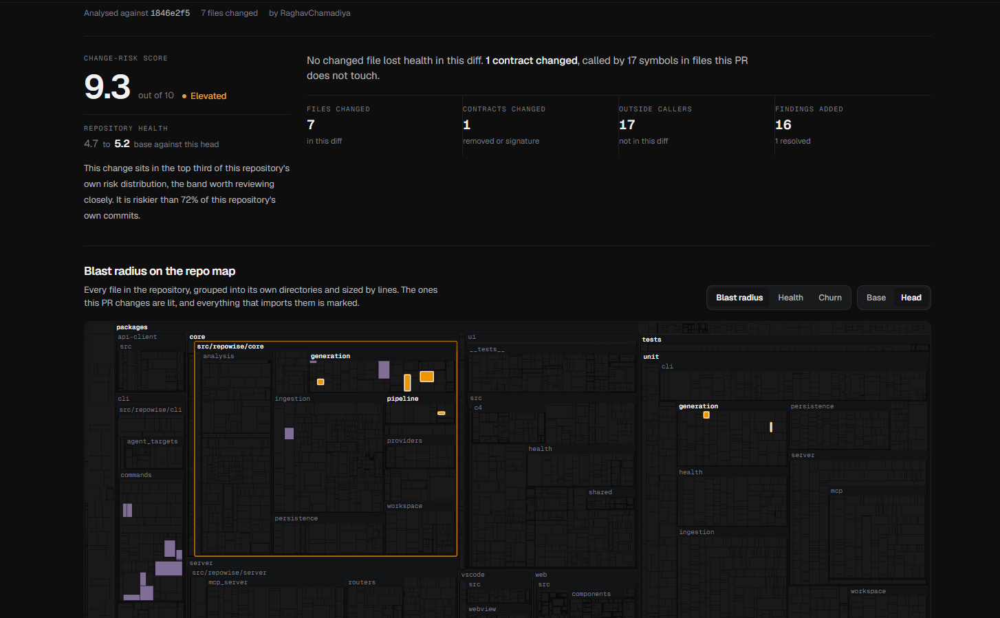

<sub>A real comment on a real PR: [repowise-dev/repowise#1204](https://github.com/repowise-dev/repowise/pull/1204) ·
[its analysis page →](https://repowise.dev/pr/repowise-dev/repowise/1204) ·
[install the PR bot →](https://github.com/apps/repowise-bot)</sub>

---

<a id="code-health"></a>

## ★ Know exactly what to fix

A score that says *"this file is risky"* is where most tools stop. Repowise scores
every file, finds where the risk concentrates, and names the specific fix.

<div align="center">

</div>

Every file is scored 1-10 by **53 deterministic detectors** (McCabe complexity, brain
methods, LCOM4 cohesion, god classes, clone detection, untested hotspots, change
entropy, prior-defect history and more), read through three lenses: **defect risk**,
**maintainability** and **performance**. Performance findings such as N+1 queries and
I/O in loops are traced *across* functions and files through the call graph, which is
where file-local linters lose them. Only 25 of the 53 detectors move the defect score,
because that is the number carrying published accuracy claims.

> **Zero LLM calls, zero cloud.** Detector weights are **calibrated against a real
> defect corpus, not hand-tuned**: every file scored at a commit before the bug
> window so nothing leaks backward, with file size as an explicit control, so a
> detector only earns weight for defect lift beyond a file being big.

**It checks itself on your repository.** After every index, Repowise compares its own
flags with your git history and tells you what it found: *"16 of the 20 lowest-health
files had a bug fix in the last 6 months, 3.3x the 24% baseline."* If that number is
bad on your codebase, you will see it.

**Then it names the fix.** **Extract Class**, **Extract Helper**, **Move Method**,
**Break Cycle**, **Split File** or **Extract Method**, with the exact methods, edges
and symbols that move, the callers and co-changing files that move with them, and a
ranking that puts a fix on a central hub above the same fix on a leaf. Extract Method
runs a dataflow pass over the function to lift the exact span and infer a
behaviour-preserving signature.

```bash
repowise next                          # what to fix first, ranked by impact and effort
repowise health                        # KPIs and lowest-scoring files
repowise health --refactoring-targets  # ranked, concrete plans
repowise health --trend                # snapshots plus declining-health alerts
repowise dead-code                     # what can go, by confidence tier
```

The dashboard renders each plan as a card with a copy-to-agent button. An optional
model step, never in the indexing path, expands a plan into generated code and a
unified diff.

<sub>Validated on <strong>21 open-source repositories across 9 languages</strong>
(2,826 files scored at a fixed point and checked against the following 6 months of bug
fixes): <strong>ROC AUC 0.737</strong> [0.683, 0.787]. Against <strong>CodeScene</strong>
on the 2,770 files both tools scored, ranking by Repowise surfaces <strong>2.3x the
defects under a fixed review budget</strong> (paired, p = 0.003). CodeScene keeps a
shorter, slightly more precise list.
<a href="docs/BENCHMARKS.md#5-code-health-predicts-defects">Full head-to-head and its limits →</a></sub>

Guides: **[code health](docs/layers/CODE_HEALTH.md)** ·
**[refactoring](docs/layers/REFACTORING.md)** ·
**[dead code](docs/layers/DEAD_CODE.md)**

---

## See all of it

`repowise serve` starts the full web dashboard next to the MCP server. No separate
setup, all local.

<table>
<tr>
<td width="50%">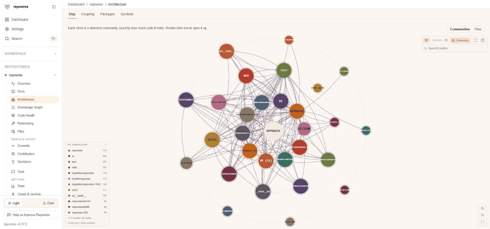<br/><sub><b>Architecture</b> · the dependency graph, laid out and explorable, with per-node context and change coupling</sub></td>
<td width="50%">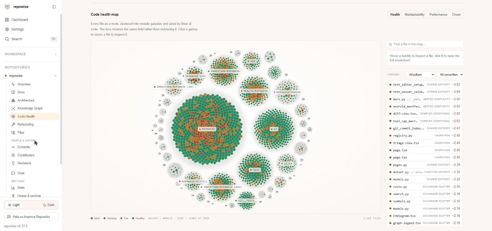<br/><sub><b>Code Health</b> · every file as a bubble, hover any one to inspect its score, size, coverage and findings</sub></td>
</tr>
<tr>
<td width="50%">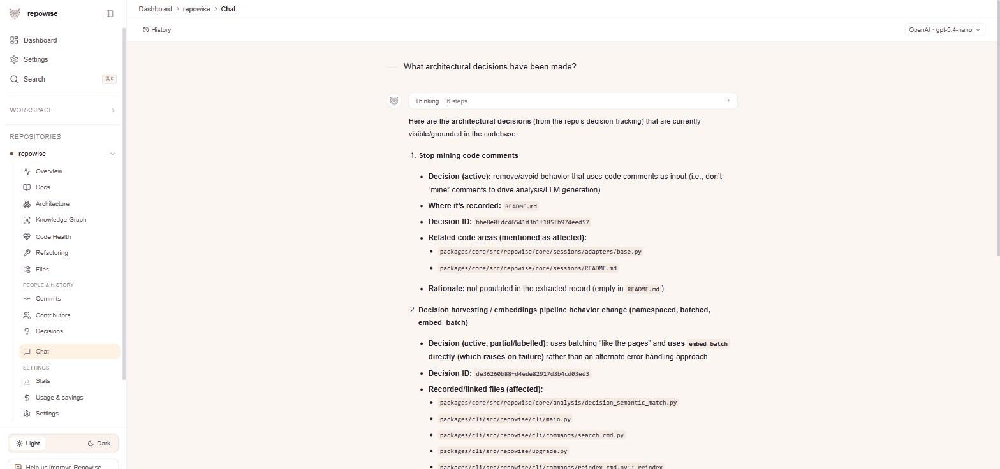<br/><sub><b>Chat</b> · ask the codebase a question, answers cite the files and pages they came from</sub></td>
<td width="50%">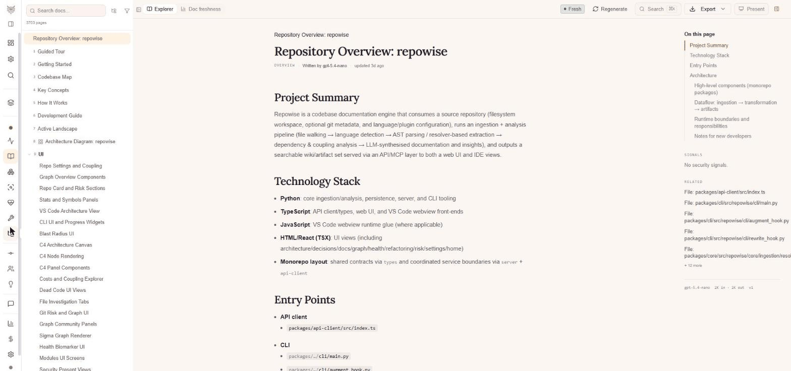<br/><sub><b>Docs</b> · generated wiki pages for the whole codebase, with confidence and freshness badges</sub></td>
</tr>
</table>

Also in there: **Architecture** and **C4** views, the **Knowledge Graph** and a
zoomable map, **Risk**, **Hotspots**, **Coupling** and **Blast radius**,
**Contributors** and **Ownership**, **Decisions** with an evidence drawer and
timeline, **Symbols**, **Security**, **Dead code**, **Costs** and **Workspace**.
Every view and what it answers: **[docs/start/DASHBOARD.md →](docs/start/DASHBOARD.md)**

---

<a id="past-one-repo"></a>

## One intelligence layer across your software estate

Real systems are not one repository, and the expensive failures live in the gaps
between them. Change a backend contract and Repowise can name the frontend calls that
consume it, the services downstream, the companion files missing from the change, and
the architecture rule the new dependency violates, before it ships.

| Workspace intelligence | What it answers |
|---|---|
| **Contract map** | Which services provide and consume each HTTP, gRPC, event, socket and data contract? Links keep their exact or candidate confidence and the source evidence. |
| **Cross-repo blast radius** | If this provider changes, which downstream services are in structural reach, and which may drift through historical co-change? |
| **Breaking-change guard** | Was an endpoint removed or an OpenAPI, proto or signature shape changed incompatibly, and which consumer files are linked to that contract? |
| **Test impact** | Which tests in the consumer repos should run for this provider change, measured from coverage or inferred from the call graph? |
| **Architecture as code** | Does the live system graph violate declared dependency rules or contain cycles? `repowise workspace check` gates CI. |
| **Architecture health** | How coupled is the estate? Propagation cost, the cyclic core, service roles and a deterministic 1-10 architecture score. |
| **Federated context** | One dashboard and one MCP server answer across every repository while keeping repo-level evidence. |

The system map models **services**, not just repository boxes, and never conflates a
real contract with "these files often changed together". HTTP field-level comparison
covers a bounded OpenAPI 3.x subset; matched consumers prove endpoint exposure, not
field use or runtime failure.
**[Workspace guide and exact support matrix →](docs/scale/WORKSPACES.md)**

Worktrees and updates stay light: a linked worktree seeds its index from the base
checkout, and post-commit hooks, file watching, webhooks or polling keep each
repository and the cross-repo graph current.
[Keeping the index fresh →](docs/scale/AUTO_SYNC.md)

---

## Supported languages

**26 languages parsed to an AST, 40 on a five-rung ladder, framework-aware where an
ecosystem handler exists.** Every language ships in the open-source distribution.

<p>
  <strong>Full &nbsp;</strong>
  
  
  
  
  
  
  
  
  
  
  
  
  
</p>
<p>
  <strong>Good &nbsp;</strong>
  
  
  
  
  
  
  
  
  
  
  
  &nbsp;<strong>· Partial &nbsp;</strong>
  
  
</p>

<details>
<summary><strong>The full ladder, and what each rung gives you</strong></summary>

| Rung | Languages | What you get |
|---|---|---|
| **Full** (13) | Python · TypeScript · JavaScript · Svelte · Vue · Java · Kotlin · Go · Rust · C++ · C# · Scala · Ruby | The whole pipeline: AST symbols, import resolution, a resolved call graph, heritage, docstrings, framework edges and code-health markers |
| **Good** (11) | C · Swift · PHP · Dart · Object Pascal · COBOL · GDScript · VB.NET · Elixir · F# · Objective-C | All of the above except the full health suite, within the language-specific ceilings in the full matrix |
| **Partial** (2) | Luau / Roblox · Razor / Blazor | Luau: AST symbols and `require()` resolution, Rojo and `.luaurc` aware. Razor: component symbols, `@code` and component-tag call edges, C# health markers; no import resolution yet |
| **Lightweight** (6) | Clojure · Haskell · Lean 4 · Erlang · HTML · QML | A real file-to-file import graph, and no symbol-level claims |
| **Structural** (8) | R · Zig · Julia · Elm · OCaml · Crystal · Nim · D | Git history: blame, hotspots, co-change, ownership, bug history |

SQL and dbt projects get `ref()` / `source()` lineage, shell scripts get function-level
symbols, HTML pages contribute their `<script src>` and `<link href>` dependencies, and
OpenAPI, Protobuf, GraphQL, Dockerfile, Terraform and similar formats get dedicated
handlers. Anything else is still tracked through git history.

Every call edge is stamped with **how it was resolved and how much to trust it**, from
`same_file` at 0.95 down to a repo-wide name match at 0.50, labelled as the guess it
is. Accuracy per language, graded against each language's own compiler:
[docs/BENCHMARKS.md#accuracy-by-language](docs/BENCHMARKS.md#accuracy-by-language).

Full matrix: **[docs/layers/LANGUAGE_SUPPORT.md →](docs/layers/LANGUAGE_SUPPORT.md)** ·
adding a language takes five small steps and no changes to the parser core:
**[docs/architecture/language-support.md →](docs/architecture/language-support.md)** ·
languages moving up the ladder: **[roadmap →](ROADMAP.md#languages)**

</details>

---

## Supported agents and editors

**Six agents wired end to end · two at the Full tier · every other MCP host one
paste away.**

<p>
  <strong>Full tier &nbsp;</strong>
  
  
</p>
<p>
  <strong>Good tier &nbsp;</strong>
  
  
  
  
</p>

**Full** is every surface Repowise has: MCP tools, skills, slash commands, a managed
instructions file, hook-level interception of tool calls, and transcript mining after
the session. **Good** is MCP tools and the config to reach them, without hooks or
transcript mining. Anything else that speaks MCP is one snippet away:
`repowise agents print-config claude-code` prints a server entry for Cline, Windsurf,
Zed, Gemini CLI or any host that reads `mcpServers`.
[Integration matrix →](docs/agent/INTEGRATIONS.md)

**In VS Code**, the Repowise extension shows what your change breaks before you push
(riskiest files, what is downstream, forgotten companion files, missing tests,
suggested reviewers), health in the gutter and status bar, callers and ownership on
hover, and refactoring plans as CodeLens. One install also registers the MCP server,
so the same index serves you and your agent. Install from the Marketplace or Open VSX
and run **Repowise: Set Up This Repository**. [VS Code guide →](docs/agent/VSCODE.md)

---

## The ten MCP tools

Every response carries a `_meta` envelope with the indexed commit, the index age and a
stale warning when the index has fallen behind your checkout, so your agent always
knows how much to trust what it just read.

<details>
<summary><strong>See the MCP tool surface</strong></summary>

| Tool | What only this tool answers |
|---|---|
| `get_overview()` | Architecture summary, module map, entry points, git health. The first call on an unfamiliar codebase. |
| `get_answer(question)` | Hybrid retrieval (full-text plus vector), graph expansion and one cited answer with a calibrated `retrieval_quality`. Search, read and reason in a single round-trip. |
| `get_context(targets, include?)` | Triage card for files, modules or symbols: summary, signatures, hotspot flag, governing decisions, symbol ids. `include` opens callers, callees, ownership and metrics. Batch many targets in one call. |
| `get_symbol("file.py::Name")` | One indexed symbol's source with exact line bounds. |
| `search_codebase(query)` | Hybrid search over code and docs, by symbol, path or concept. |
| `get_risk(targets?, changed_files?)` | Hotspots, dependents, co-change partners, ownership, test gaps, bug history. Pass `changed_files` for PR mode and get a `directive` back. |
| `get_change_risk(revspec)` | What a commit, range or uncommitted change made worse across defect risk, maintainability and performance, the tests that touch it, and how the diff ranks against recent commits. |
| `get_why(query?, targets?)` | Architectural decisions with their verbatim evidence. Falls back to git archaeology when no decision exists. |
| `get_dead_code(...)` | Unreachable code by confidence tier, with cross-repo consumers in workspace mode. |
| `get_health(targets?, include?)` | Health scores and findings across all three lenses, Fix first, coverage, trends, doc drift and refactoring plans. |

Ten is a deliberate ceiling: a small, task-shaped surface is easier for an agent to
choose from than a large one. Seven more tools (dependency paths, execution flows,
refactoring code generation, finding triage, and three workspace architecture tools)
are opt-in. Parameters, examples and when to use which:
**[docs/agent/MCP_TOOLS.md →](docs/agent/MCP_TOOLS.md)**

</details>

---

## Measured against the field

Open-source agent-context tools, the same repositories, the same pinned commits, the
same questions, each tool given its full advertised surface. The full page carries the
rows we lose beside the rows we win.

<div align="center">
<picture>
  <source media="(prefers-color-scheme: dark)" srcset=".github/assets/bench/file-coverage-dark.svg" />
  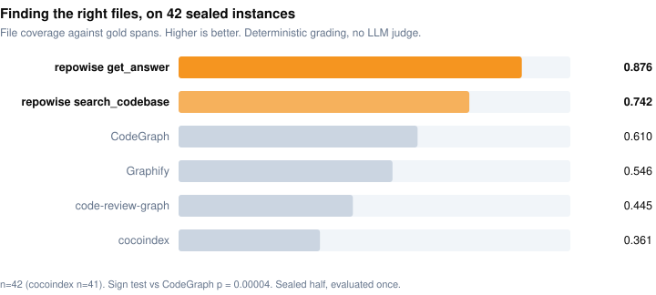
</picture>
<picture>
  <source media="(prefers-color-scheme: dark)" srcset=".github/assets/bench/agent-output-tokens-dark.svg" />
  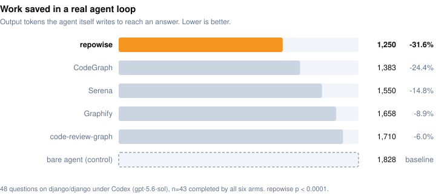
</picture>
</div>

- **Finds the right files.** 0.876 file coverage against CodeGraph's 0.610 on a
  **sealed** 42-instance split held out from every improvement round. 19 wins, 1 loss.
  Deterministic grading, no LLM judge. *n=42, sign test p=0.00004.*
- **Less work in a real agent loop.** -31.6% output tokens against a bare agent, leaner
  on 37 of 44 questions. *n=43, p&lt;0.0001.* CodeGraph is a genuine second at -24.4%.
- **Fewer steps.** 3.8 tool calls where the bare agent needed 7.2, and 3.0 files opened
  instead of 7.2: the mechanism behind the saving, visible directly.
- **A call graph the compiler agrees with.** Against the Go team's own call graph and
  the TypeScript checker's own resolution, Repowise main reads 0.976 to 0.995
  precision, with recall up in all 7 cells since August. In all seven, no tool that
  recovers as much of the graph gets more of it right. The tool with the highest
  recall in most Go cells is still not us, and the page says so.
- **Accuracy by language.** Graded against each language's own toolchain: C 0.95 to
  0.98, Python 0.96 to 0.98 on three of four repositories, Rust 0.85 to 0.90, C# 0.73
  to 0.92, C++ 0.75, Java 0.73 to 0.78, each with its recall and its weak spots.
- **Scale.** dotnet/runtime, 58,924 files, indexed in 120 minutes at 11.7 GiB peak
  memory on one laptop. Building just the call graph uses 75 MB at the median, the
  lowest of five tools on 35 of 35 repositories.

**[The full results, the methodology, and the rows we lose →](docs/BENCHMARKS.md)** ·
**[The research it is built on →](docs/LINEAGE.md)**

<details>
<summary><strong>How it compares on capability</strong></summary>

No single product competes with all of this, so there is no single table. Rows marked
*measured* are head-to-head numbers that link to
**[docs/BENCHMARKS.md](docs/BENCHMARKS.md)**, where the sample sizes, the tests and the
rows we lose live. Unmarked rows are capability presence, not measurements.

### As an agent context layer

| | repowise | CodeGraph | Serena | DeepWiki |
|---|---|---|---|---|
| Self-hostable, open source | ✅ AGPL-3.0 | ✅ | ✅ | ❌ cloud only |
| Private repo, no cloud | ✅ | ✅ | ✅ | ❌ OSS forks only |
| MCP tools served | 10 default + 7 opt-in | 1 | 29 | 3 |
| **Finds the gold files** *([measured](docs/BENCHMARKS.md#1-finding-the-right-files), n=42 sealed)* | ✅ **0.876** | 0.610 | not in this run | not measured |
| **Output tokens vs a bare agent** *([measured](docs/BENCHMARKS.md#2-what-changes-in-a-real-agent-loop), n=43)* | ✅ **-31.6%** | -24.4% | -14.8% | not measured |
| **Memory to build the graph** *([measured](docs/BENCHMARKS.md#what-it-costs-to-run), 5 tools, 35 repos)* | ✅ **75 MB**, lowest on 35 of 35 | 757 MB | not measured | n/a, cloud |
| **Time to build the graph** *([measured](docs/BENCHMARKS.md#what-it-costs-to-run), same run)* | **2.77s**, fastest on 14 of 35 | **3.65s**, fastest on 16 | not measured | n/a, cloud |
| **Time to build the full index, django** *([measured](docs/BENCHMARKS.md#what-it-costs-to-run))* | ⚠️ **366.8s**, slowest here | ✅ **16.4s** | not measured | n/a, cloud |
| **Call-edge precision, hand-graded** *([measured](docs/BENCHMARKS.md#7-edge-precision), 560 rows, 9 languages)* | ✅ **85.7%** | 58.6% | not measured | not measured |
| **Call-edge precision, judged by a compiler** *([measured](docs/BENCHMARKS.md#8-the-same-question-against-an-answer-key-we-do-not-control), 5 tools, 7 cells)* | ✅ **nothing that finds as much gets more of it right**, 7 of 7 | lower precision in 7 | not measured | not measured |
| Generated documentation | ✅ | ❌ | ❌ | ✅ |
| Proactive agent hooks | ✅ Claude + Codex | ❌ | ❌ | ❌ |
| Generated `CLAUDE.md` / `AGENTS.md` | ✅ | ❌ | ❌ | ❌ |
| Command-output distillation | ✅ reversible | ❌ | ❌ | ❌ |
| Architectural decision records | ✅ | ❌ | ❌ | ❌ |
| Multi-repo workspace intelligence | ✅ contracts, co-change, federated MCP | ❌ | ❌ | ❌ |

**The two cost rows answer different questions.** Building the call graph, we are the
lightest tool measured, about ten times lighter than the next, and roughly as fast as
the fastest. Building the *whole* index, CodeGraph is **22x faster than we are**,
because by then we have also built the git-history layer, the wiki, the decisions and
the health pass. If a call graph is all you need, that is the right trade and you
should take it. With model-written prose on, it is **135x**.

**The hand-graded precision row cuts both ways.** About fourteen percent of the call
edges we draw are wrong, and on `seastar` CodeGraph grades better than we do. The
compiler row exists because we graded the hand-read one ourselves: on Go and
TypeScript the answer key is the Go team's own call graph and the `tsc` checker's own
resolution, which we neither wrote nor can tune. Precision alone is easy to win by
drawing almost nothing, and recall alone by drawing everything, so the claim is the
pair.

<sub>Competitors measured at CodeGraph 1.5.0, Graphify 0.9.31, Serena 1.6.2.dev0 and
code-review-graph 2.3.7 in August 2026. Repowise compiler-graded figures are from main
on 2026-10-03; the other Repowise rows are from `081a59fa`, August 2026.</sub>

### As a code health tool

| | repowise | CodeScene |
|---|---|---|
| Self-hostable, open source | ✅ AGPL-3.0 | ⚠️ on-prem Docker, proprietary |
| Code health score (1-10) | ✅ 53 detectors, 25 scoring | ✅ 25-30 |
| Brain Method / LCOM4 / god class | ✅ | ✅ |
| **Defects found at a 20% review budget** *([measured](docs/BENCHMARKS.md#5-code-health-predicts-defects), 2,770 files)* | ✅ **0.173** | 0.074 |
| **Effort-aware ranking, Popt** *(measured, p=0.003)* | ✅ **0.607** | 0.462 |
| **Precision at that budget** *(measured)* | 0.580 | ✅ **0.636**, a shorter list |
| **Discrimination, ROC AUC** *(measured, paired)* | 0.731 | 0.705, *p=0.054, not significant* |
| Business impact (resolution time) | ❌ *we could not replicate this on open data* | ✅ Code Red study |
| Git intelligence (hotspots, ownership, co-change) | ✅ | ✅ |
| Pre-merge change-risk scoring | ✅ 0-10 + directives | ✅ |
| Concrete cross-file refactoring plans | ✅ graph-aware + blast radius | ⚠️ within-function only |
| Test-coverage intelligence | ✅ LCOV/Cobertura/Clover/JaCoCo/Go | ❌ |
| Dead code detection | ✅ | ❌ |
| Serves it to an AI agent over MCP | ✅ | ✅ |

CodeScene is the only other vendor in this category with a published empirical defect
study, which is why it is the one we ran head to head. It flags about 27 files where
we flag 132, so if you want a short list to act on, its threshold is the better fit.

### Documentation generators

DeepWiki, Google Code Wiki and Swimm generate documentation from a repository, which
overlaps one of our layers. **We have not measured against them**, so there is no
table here.

### The PR bot, against LLM review bots

| | Repowise PR Bot | CodeRabbit | Greptile |
|---|---|---|---|
| LLM calls per PR | ✅ **zero** | ❌ every review | ❌ every review |
| Same diff, same review | ✅ deterministic | ❌ sampled output | ❌ sampled output |
| Your code sent to a model provider | ✅ never | ❌ yes | ❌ yes |
| Symbol-level blast radius | ✅ call graph | ❌ | ⚠️ prose, from context |
| Co-change partners missing from the PR | ✅ git history | ❌ | ❌ |
| Change risk vs the repo's own history | ✅ 0-10 + percentile | ❌ | ❌ |
| Silent on a clean PR | ✅ by default | ⚠️ configurable | ⚠️ configurable |

An LLM reviewer is a different product: it can read intent, and it can be wrong in a
new way on every run. This one does set arithmetic over a call graph and a git
history, so pushing the same diff twice gives the same review twice. Full side-by-side
comparisons: **[repowise.dev/compare →](https://www.repowise.dev/compare)**

</details>

---

<a id="for-teams-and-enterprises"></a>

## For teams and enterprises

AI makes producing a change cheaper. It does not make understanding its consequences
cheaper. In a large estate that answer crosses repositories, ownership boundaries,
service contracts, test suites and years of architectural history. Repowise gives
developers, agents, reviewers and platform teams the same evidence about what exists,
what depends on it, what is risky and what will break, from one index, in place of a
separate health tool, dead-code tool, code-search layer for agents, docs generator and
test-impact service.

### Where it runs, and what leaves your network

| Deployment | Where source is read | Where the index lives | What leaves your network |
|---|---|---|---|
| **Self-hosted, open source** (`pip install repowise`) | your machine | `.repowise/` next to the repo | anonymous CLI telemetry you can switch off, and your own LLM provider only if you turn prose on |
| **Self-hosted, commercial** | your VPC or an air-gapped network | Postgres plus LanceDB or pgvector, inside your network | the same, plus integrations you configure. Nothing at all in air-gapped mode |
| **Hosted** ([repowise.dev](https://www.repowise.dev)) | the hosted indexer | infrastructure we operate | your code goes to the platform |

Graph, git, health, change risk, tests, dead code and PR review make **zero LLM calls**.
Raw source is parsed in memory and never persisted. Prose is optional and runs on your
own provider contract or fully offline through Ollama, chosen per repository. The
threat model and data flows are in the
[security review pack](docs/business/SECURITY_COMPLIANCE.md). The published research each layer is built on, and how we
checked it, is in [LINEAGE.md](docs/LINEAGE.md).

### How accurate, and how big

Call-graph accuracy is graded against each language's own compiler toolchain, and we
publish precision and recall per language, with the misses, in the
[accuracy table](docs/BENCHMARKS.md#accuracy-by-language). On current main, precision
runs 0.95 to 0.99 for Go, TypeScript, C and most Python, 0.85 to 0.90 for Rust, and
0.73 to 0.92 for Java and C#, where overloaded methods are the main gap.

The largest repository indexed so far is dotnet/runtime: 58,924 files in 120 minutes
at 11.7 GiB peak memory, on one 31 GB laptop with no API key. Time and memory by
repository size: [scale](docs/BENCHMARKS.md#scale).

### Source control and CI

Any git host works, because indexing reads a local checkout. On top of that:

- **GitHub**: the [PR bot](#the-pr-bot) (GitHub App), a GitHub Action for the CI
  gates, and webhook auto-sync.
- **GitLab**: a CI template for the same gates and webhook auto-sync.
- **Bitbucket Pipelines and others**: the gates run as plain CLI commands with the
  pipeline's own branch variables. ([Repowise in CI](docs/start/CI.md))
- **Managed integrations** for GitHub Enterprise, Azure DevOps, GitLab self-managed
  and Bitbucket are rolling out.
- **Not on git?** Point `repowise init` at a plain directory, an export, or a Perforce
  or SVN workspace. The graph, docs, decisions and health layers build normally; the
  history layer needs a commit log, and Perforce and SVN adapters are
  [on the roadmap](ROADMAP.md#source-control-beyond-git).

### What is shipping, and what is not yet

| Status | Capability |
|---|---|
| **Shipping in open source** | Every deterministic layer, ten MCP tools, multi-repo workspaces, contract extraction and cross-repo blast radius, test intelligence, [architecture conformance](docs/scale/WORKSPACES.md#architecture-conformance), local dashboard, auto-sync, full-history secret scanning. |
| **GA commercially** | Hosted graph-aware security, CVE prioritization, CycloneDX SBOM and VEX, PCI-DSS and SOC 2 control-coverage reports, audit export and webhook stream, Jira and Confluence, reference HA topology on your infrastructure, custom language extensions, SLA support, IP indemnification. |
| **Rolling out** | Managed GitHub Enterprise, Azure DevOps, GitLab and Bitbucket integrations. SAML/OIDC SSO and SCIM. Engineering-leader dashboards. |
| **Planned** | RBAC and multi-tenancy, a packaged air-gap install bundle, the Helm chart. |

Repowise holds no SOC 2, ISO 27001 or other audited certification today. The SOC 2 and
PCI-DSS reports above are control-coverage signals from your own findings, and every
export says so. Every item is tracked with its status in the
[capability matrix](docs/business/COMMERCIAL.md#4-commercial-capabilities-at-a-glance).

### Pricing, licence and support

Commercial licences are priced **per indexed repository**, with unlimited seats inside
the licensed set. More and more of the code in a repository is written and read by
agents and CI, so seat counts stop tracking the value.
[Details →](docs/business/COMMERCIAL.md#7-licensing--pricing)

**Do we have to open-source our code because of the AGPL?** No. Using Repowise inside
your company, including on internal servers, creates no obligation to publish your
code. The obligations apply if you modify Repowise and offer it to others over a
network, or ship it inside your own product. A commercial licence removes them.

Commercial support comes with a named contact, a response-time SLA and a quarterly
architecture review. Security fixes land on the latest minor release; reports go to
[security@repowise.dev](mailto:security@repowise.dev) under the
[disclosure policy](.github/SECURITY.md).

**[Commercial detail](docs/business/COMMERCIAL.md)** ·
**[Security review pack](docs/business/SECURITY_COMPLIANCE.md)** ·
**[Roadmap](ROADMAP.md)** ·
[hello@repowise.dev](mailto:hello@repowise.dev)

[repowise.dev](https://www.repowise.dev) runs the same engine fully managed. We run it
on our own codebase in the open:
[live snapshot](https://www.repowise.dev/s/5a6b93fa9a69) ·
[explore public repos](https://www.repowise.dev/explore).

---

## Privacy

- **Deterministic or offline mode:** with `--no-prose`, code-derived content stays on
  your infrastructure. The CLI reports **anonymous, opt-out** usage telemetry (command
  names and coarse environment only); turn it off with `repowise telemetry disable`,
  `DO_NOT_TRACK=1`, or by running fully offline.
  [What's collected →](docs/reference/TELEMETRY.md)
- **Optional LLM features:** generated prose, decision extraction and refactoring code
  generation send code-derived prompts directly to the provider configured with your
  own key. Repowise does not proxy those calls.
- **What's stored:** the graph, embeddings, generated wiki pages and git metadata. Raw
  source is processed transiently and never persisted.
- **Fully offline:** Ollama plus a local embedding model means zero external calls.

Doing a security review? **[docs/business/SECURITY_COMPLIANCE.md →](docs/business/SECURITY_COMPLIANCE.md)**

---

## CLI

```bash
repowise init [PATH]      # index a codebase (asks; --yes --no-prose needs no key)
repowise generate [PATH]  # write wiki pages with a model, on demand
repowise serve [PATH]     # MCP server + local dashboard
repowise update [PATH]    # incremental update (--workspace for every repo)
repowise watch            # re-index on file change
repowise search "<q>"     # hybrid search (fulltext / semantic / symbol / path)
repowise ask "<q>"        # a synthesized answer with citations
repowise context <files>  # triage card: layer, hotspot, fix history, freshness
repowise symbol <id>      # one symbol's body, with verified line bounds
repowise why <q|path>     # decisions, rationale, git archaeology
repowise next             # what to fix first
repowise health           # code-health KPIs and lowest-scoring files
repowise risk main..HEAD  # score a branch or PR range
repowise overlap          # other branches editing the same files
repowise impacted-tests   # only the tests a diff exercises
repowise dead-code        # unreachable code by confidence tier
repowise doc-drift        # documentation the code no longer supports
repowise security         # secrets and risky patterns, tree or full history
repowise decision list    # architectural decisions
repowise export --format structurizr  # the architecture as Structurizr DSL
repowise distill pytest   # compact, errors-first, reversible command output
repowise saved            # tokens and dollars saved by distillation
repowise workspace add    # multi-repo workspace management
repowise doctor           # check setup, API keys, index drift
repowise uninstall        # remove what repowise wrote, and say what it left
```

Every command and flag: **[docs/reference/CLI_REFERENCE.md](docs/reference/CLI_REFERENCE.md)** ·
config: **[docs/reference/CONFIG.md](docs/reference/CONFIG.md)** ·
something not working: **[docs/start/TROUBLESHOOTING.md](docs/start/TROUBLESHOOTING.md)** ·
all docs: **[docs/README.md](docs/README.md)**

---

## Contributing

```bash
git clone https://github.com/repowise-dev/repowise
cd repowise
uv sync --all-packages
uv run repowise --version
uv run pytest tests/unit/
```

New here? You do not have to read 3,000 files to start. We keep a public index of this
repository built by Repowise itself, re-indexed on every push:
[**explore repowise with repowise →**](https://repowise.dev/repo/repowise-dev/repowise)
(architecture, hotspots, ownership, decisions, and a ranked
[refactoring backlog](https://repowise.dev/repo/repowise-dev/repowise/refactoring) you
are welcome to pick from).

Full guide, including how to add languages and LLM providers:
[CONTRIBUTING.md](.github/CONTRIBUTING.md) · architecture:
[docs/architecture/](docs/architecture/README.md)

---

## License

AGPL-3.0. Free for individuals, teams and companies using Repowise internally.

For commercial licensing (the enterprise security and compliance layer, SSO/SCIM, RBAC,
workflow integrations, priority support and SLA, or embedding Repowise in a product
without AGPL obligations), see
**[docs/business/COMMERCIAL.md](docs/business/COMMERCIAL.md)** or contact
[hello@repowise.dev](mailto:hello@repowise.dev).

---

<div align="center">

<em>Built for engineers who got tired of watching their AI agent <code>cat</code> the same file for the fourth time.</em>

<p align="center"><sub>⭐ If Repowise earns a place in your workflow, <strong>give it a star</strong>. It costs you nothing, and it's the signal that keeps a small team building this in the open.</sub></p>

<p align="center">
  <a href="https://repowise.dev"><strong>repowise.dev</strong></a> ·
  <a href="https://www.repowise.dev/explore"><strong>Explore →</strong></a> ·
  <a href="https://discord.gg/cQVpuDB6rh"><strong>Discord</strong></a> ·
  <a href="https://x.com/repowisedev"><strong>X</strong></a> ·
  <a href="mailto:hello@repowise.dev"><strong>hello@repowise.dev</strong></a>
</p>

</div>
