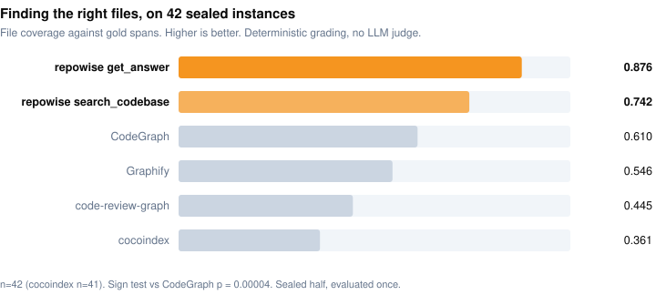
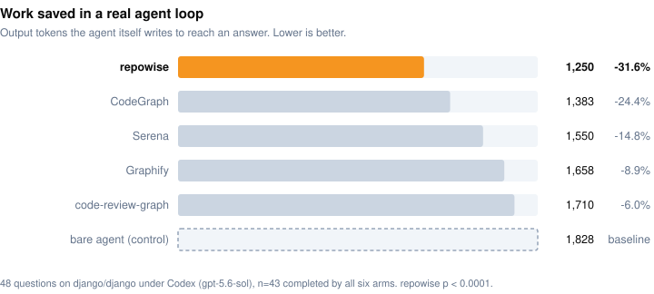

# Benchmarks

Every number repowise publishes, with its sample size, its test, and a link to the
raw data. Nothing here is measured on a private corpus. The harnesses, the
pre-registrations and every graded cell live in
**[repowise-bench](https://github.com/repowise-dev/repowise-bench)**, which is also
where the depth is: this page is the summary, that repository is the evidence.

Each section leads with the result; method and caveats are one fold down, and
nothing put there changes a headline. Where we have not run a comparison, the row
says **not measured** rather than carrying a checkmark.

## The scoreboard

**Six of the thirteen rows below are wins against a named competitor. Two are
losses, one is level, three are not measured, and one is a ratio against no tool
at all.** They sit in one table on purpose: a page that reports only its wins is
marketing with a sample size attached.

| Question | Measured against | Result |
|---|---|---|
| **Are the call edges true, judged by a compiler** | CodeGraph, codebase-memory-mcp, Graphify, code-review-graph | [**we win**](#is-the-call-graph-correct). No tool that finds as much of the graph gets more of it right, in all 7 cells |
| **Are the call edges true, hand-graded from source** | CodeGraph | [**we win**](#7-edge-precision), 85.7% against 58.6%, 560 rows read on both sides |
| **Finding the right files** | CodeGraph, Graphify, code-review-graph, cocoindex | [**we win**](#1-finding-the-right-files), n=42 held out, p=0.00004 |
| **Work saved in a real agent loop** | the same field plus Serena and a bare agent | [**we win**](#2-what-changes-in-a-real-agent-loop) on all three agent harnesses we tried, n=43 at p&lt;0.0001 |
| **Does the health score predict real bugs** | CodeScene | [**we win**](#5-code-health-predicts-defects) on recall and effort-aware ranking, p=0.003, and lose the business-impact axis outright |
| **Memory to build the graph** | the same four graph tools | [**we win**](#what-it-costs-to-run), lowest of five tools on **35 of 35** repositories, about 10x lower than the next |
| **Loading one commit's context** | naive file reads, `git diff` | [**35.6x**](#loading-one-commits-context-the-easy-number) fewer tokens than naive |
| **Speed to build the graph** | the same four graph tools | [**level**](#what-it-costs-to-run). Fastest on 14 of 35 repositories, CodeGraph on 16 |
| **How much of the call graph we find** | the same four graph tools | [**we lose**](#is-the-call-graph-correct). Two tools draw a bigger map, and we publish what their extra edges cost them |
| **Time to build the full index** | CodeGraph, Graphify, code-review-graph | [**we lose**](#what-it-costs-to-run), 22x, because we build five layers where they build one |
| **Command-output compression** | RTK | [**not measured**](#command-output-compression) head to head |
| **Documentation generation** | DeepWiki, Google Code Wiki, Swimm | **not measured** |
| **PR review** | CodeRabbit, Greptile | **not measured** |

**The two cost rows are different questions and are the easiest thing here to
misread.** Building the call graph, we are the lightest tool measured and about as
fast as the fastest. Building the *whole index*, we are 22x slower than a tool
that only builds a call graph, because by then we have also built the git history,
the wiki, the decisions and the health pass. The **not measured** rows are
capability comparisons rather than measurements, and live in the
[README's feature table](../README.md#how-it-compares-on-capability); we would
rather write that than let a checkmark do a number's job.

<picture>
  <source media="(prefers-color-scheme: dark)" srcset="../.github/assets/bench/file-coverage-dark.svg" />
  
</picture>
<picture>
  <source media="(prefers-color-scheme: dark)" srcset="../.github/assets/bench/agent-output-tokens-dark.svg" />
  
</picture>

---

## Is the call graph correct

A call graph is a map of which function calls which. It is what lets a tool answer
"what breaks if I change this". There are exactly two ways to get one wrong: **miss
calls that are real**, or **invent calls that are not there**. Every tool trades one
against the other, and either number on its own is trivially gamed. Draw an edge
between everything and you find 100% of the real calls. Draw one edge you are sure
of and 100% of your edges are correct.

So the pair is the only honest reading, and this is the pair. **Precision** is the
share of a tool's edges that are real. **Recall** is the share of the real call
graph it found.

| cell | repowise | CodeGraph 1.5.0 | codebase-memory-mcp 0.10.8 | Graphify 0.9.31 | code-review-graph 2.3.7 |
|---|---|---|---|---|---|
| cobra (with tests) | 0.972 / 0.684 | 0.929 / 0.763 | 0.912 / 0.743 | 0.971 / 0.433 | 0.997 / 0.174 |
| gitleaks (no tests) | 0.976 / 0.955 | 0.972 / 0.920 | 0.934 / 0.967 | 0.997 / 0.886 | 0.759 / 0.026 |
| gitleaks (with tests) | 0.974 / 0.914 | 0.971 / 0.895 | 0.922 / 0.945 | 0.995 / 0.832 | 0.800 / 0.032 |
| syft (no tests) | 0.943 / 0.513 | 0.872 / 0.508 | 0.635 / 0.542 | 0.771 / 0.447 | 0.968 / 0.201 |
| syft (with tests) | 0.950 / 0.322 | 0.864 / 0.338 | 0.673 / 0.361 | 0.802 / 0.273 | 0.966 / 0.086 |
| zod (no tests) | 0.992 / 0.703 | 0.729 / 0.373 | 0.987 / 0.694 | 0.825 / 0.248 | 0.932 / 0.652 |
| hono (no tests) | 0.977 / 0.731 | 0.805 / 0.684 | 0.949 / 0.686 | 0.980 / 0.688 | 0.966 / 0.691 |

> ### **In all seven cells, no tool that finds as much of the call graph as we do gets more of it right.**

**Nobody is above us on both numbers, anywhere.** Read across any row: the tools
scoring higher than us on precision are below us on recall, every time, and the
tool above us on recall is below us on precision, every time.

That claim names no threshold, which is what makes it worth something. It cannot be
tuned by picking a cutoff, and adding a competitor can only break it. **Two
competitors were added after it was first written and it held.**

**The answer key is not ours.** Every graph-quality number in this field, ours
included, is normally scored against something the publisher controls, so a tool
that is confidently wrong in a consistent way scores well and a reader has no way
to check. Here the key is the **Go team's own call graph** from
`golang.org/x/tools/go/callgraph/rta` over the fully type-checked program, and on
TypeScript the **`tsc` type checker's own resolution** of every call site. We did
not write either, we cannot tune either, and anyone with the toolchain can
regenerate both. Five tools, seven cells, **37,853 oracle edges**.

### What we lose, at full size

**We do not draw the biggest map.** We lead recall in the two TypeScript cells and
in **none of the five Go cells**. On cross-file coverage across 35 repositories,
codebase-memory-mcp separates from us on 15 and we separate on none. Those are real
losses and they are why the row above says we lose that column.

**We are the most precise tool outright in only one cell of seven**, tied in one
more, and beaten in five. Against the two tools this experiment started with,
CodeGraph and codebase-memory-mcp, we are the most precise in seven of seven, and
that narrower claim should always carry its label.

**What the oracle adds is the price of a bigger map, not an excuse for ours.** On
syft, more than a third of what the coverage leader emits is a call the Go
compiler says does not exist, and the highest precision anywhere on this page,
0.997, comes from a graph holding **17% of the calls in the repository**. A graph
that small is very hard to be wrong in and not much use to walk.

**Graphify's result is the one worth taking seriously** and should not be lumped in
with that: 89% recall against our 95% on gitleaks is a narrow, real trade.

<b>Method, limits, and what this does not show</b>

**The two methods agree.** On Go, the hand-graded audit below read 29/30 = 96.7%
for us and 29/30 = 96.7% for CodeGraph. The Go compiler, over roughly 1,600 edges
on the same repository, says **97.6% and 97.2%**. Two unrelated methods, one person
reading source and one type checker, land within about a point on both arms. That
is the result we care about most, and it is not a competitive one. It also removes
the n=30 ceiling: hand-grading caps a precision estimate at roughly ±13 points near
a 95% rate, while an oracle grades every edge, so n becomes the size of the
repository.

**Where our own miss goes**, decomposed rather than waved at. On syft without tests
we miss 3,846 of the oracle's 7,898 edges: **44% of that miss is dynamic dispatch
alone** and a further **39% is dispatch with a closure at one end**, and the two
buckets overlap so neither is the whole gap. Interface dispatch is the ceiling and
nobody in the comparison has cleared it, at 6.5 distinct possible targets per call
site. Matching that recall means emitting six edges where one is right, which is
the behaviour the precision table charges other tools for.

**Do not compare recall across rows.** It swings from 0.03 to 0.97, driven by how
many entry points the oracle had (4 on gitleaks, 268 on syft-with-tests), not by
tool quality. Only within-row comparisons carry meaning, and a pooled recall over
these cells would be meaningless.

Further limits:

- **Two languages, seven cells, five repositories.** This is not a nine-language
  claim and must not be quoted as one. The hand-graded audit below is the
  nine-language number.
- **A contradicted edge is very strong evidence, not proof.** RTA is unsound under
  reflection and `go:linkname`, so a genuinely dynamic edge can land in that
  bucket. It applies to all five arms equally and the gaps are far too large to be
  explained by it, which is why the metric is named *precision against the oracle*
  rather than precision.
- **Edges the oracle cannot speak about are charged to nobody** and reported at
  full size. That bucket is 0.4% to 11.1% of a tool's output on the Go cells and
  16% to 46% on the TypeScript ones, where dependencies are not installed in the
  pinned corpus.
- **A library has no `main`, so RTA has no roots**; cobra is analysed through its
  test binaries only, and the two variants of a repository answer different
  questions, so report both or say which you used.
- **Two oracle languages, and the programme stops at two.** The other corpus
  languages either need a per-repository build that does not exist on the
  measurement machine, have no sound call-graph tool (Rust), or admit no oracle
  even in principle (Python, Ruby, PHP). The hand-graded audit below is the
  permanent method there, not a stopgap.
- **The TypeScript with-tests variants are void and quoted nowhere.** The pinned
  corpus installs no dependencies, so a third of call sites go unresolvable.
- **The three newer competitors are priced on these two languages only**, and
  none was ever entered into the hand-graded audit in either direction. That
  audit is a two-tool claim and this one a five-tool claim; neither transfers to
  the other's languages.
- **Two of the five arms are read through an adapter we wrote**, and both now
  beat us on precision somewhere, so the reading matters. Graphify tags 93% of
  its call edges `INFERRED` and we score all of them, the choice least
  favourable to us. code-review-graph is scored on resolved rows only, the
  choice most favourable to it. Both are argued in the benchmark and either can
  be recomputed from the artifacts.

Full method, per-cell artifacts, the twenty hand-confirmed identities the protocol
required, and the graded pre-registration including the two predictions that
missed:
**[graph/experiments/g4-oracle-anchored](https://github.com/repowise-dev/repowise-bench/tree/master/graph/experiments/g4-oracle-anchored)**.

---

## The same question, hand-graded across nine languages

**Two sections ask whether the edges are true, because there are two ways to
find out and each covers what the other cannot.** Above, a compiler is the judge
across five tools, which is unarguable but reaches only two languages. Here,
people read the source across nine languages and two tools, which reaches far
wider but is graded by us. Where both exist they agree to within about a point.

30 rows per language per tool, seed 2026, stratified by resolution strategy,
every row read from source with its imports and enclosing scope open.
Java is the one cell read at 40 rows rather than 30, because it was a single
repository and that repository turned out to be an outlier; it was widened to a
second one.

| | correct / n | 95% CI |
|---|---|---|
| **repowise** | **240/280 = 85.7%** | [81.1, 89.3] |
| **CodeGraph 1.5.0** | **164/280 = 58.6%** | [52.7, 64.2] |

| Language | repowise | CodeGraph | |
|---|---|---|---|
| typescript | 29/30 | 7/30 | separates |
| go | 29/30 | 29/30 | tie |
| csharp | 30/30 | 20/30 | separates |
| python | 28/30 | 19/30 | separates |
| kotlin | 27/30 | 13/30 | separates |
| swift | 23/30 | 19/30 | tie |
| cpp | 22/30 | 16/30 | tie |
| rust | 22/30 | 13/30 | tie |
| java *(n=40)* | 30/40 | 28/40 | tie |

**Read our number the other way round: roughly fourteen percent of our call edges
are wrong.** That is the number we plan against, and rust, cpp and java are where
it concentrates.

**Four of nine cells separate. Five are ties and we report them as ties.** At n=30
the interval runs about ±16 points near 60%, so a point-estimate gap inside two
overlapping intervals is not a win. C++ is a tie despite looking like a 20-point
lead.

<b>Method, limits, and what this does not show</b>

**One repository goes clearly to them.** On `seastar` CodeGraph reads 6/10 against
our 5/10, the only repository in the audit, on any language, where they beat us on
a clear margin. Our misses there are chained calls on an untyped receiver; they
infer the callee's declared return type and validate against it, so a failed
inference costs them an edge instead of buying them a wrong one. On `aria2` both
sides read 10/10 and they resolve 24,950 distinct call edges to our 9,486.
Precision is not the only reading.

**This audit was graded by us, on both sides.** That is the strongest form of a
weak thing, and it is exactly what the oracle section above exists to check. The
two agree where both exist, to within about a point, but only the oracle has an
answer key we did not produce.

**All nine cells are measured at one commit**, and the resolver has moved since.
Every corpus repository's call population was diffed site by site against the
current tip: three cells are byte-identical, six moved, and **of the 280 graded
rows twelve moved — every one of them a row graded `wrong`, with no row graded
`correct` moving at all.** Re-reading at the tip can therefore only raise the
number, so 85.7% is a floor. The table is not redrawn here because a cell whose
population moved needs a fresh proportional draw rather than a twelve-row patch.
No cell was measured on the 0.44.0 release.

**All 600 graded rows are published**, one file per cell, each row carrying the call
site, the declaration the tool bound it to, the verdict and the reason it was
given. A script in the same directory rebuilds every table above from them and
fails if it disagrees. 560 of those rows enter the pooled figures: C++ is read at
50 rows per side and enters at a seeded 30 so that it carries the same weight as
every other language. Every row on the page now carries its own verdict.

**Precision is one of two halves.** We lead no recall cell against the oracle, and
lose cross-file coverage on 15 of 35 repositories in the same bench. A precision
win is a claim about the edges a tool draws, never about how many.

**[graph/experiments/g1-edge-precision/rows](https://github.com/repowise-dev/repowise-bench/tree/master/graph/experiments/g1-edge-precision/rows)**

---

## Finding the right files

Before a tool can save an agent any work, it has to point at the right code.
**Grading is deterministic and no LLM judge is involved anywhere in this number**,
which makes it the most reproducible result on the page: ContextBench ships gold
file spans, and a tool either returns them or it does not.

**Every number below comes from instances this work has never seen.** The 112
instances were split 70 / 42 by instance id, **pinned before any of it started**,
and the 42 were kept sealed until the final measurement.

| Tool | File coverage | n | Precision | Files served |
|---|---:|---:|---:|---:|
| **repowise** (`get_answer`) | **0.876** | 42 | 0.087 | 19.2 |
| **repowise** (`search_codebase`) | **0.742** | 42 | **0.168** | **8.2** |
| CodeGraph | 0.610 | 42 | 0.093 | 14.0 |
| Graphify | 0.546 | 42 | 0.033 | 34.5 |
| code-review-graph | 0.445 | 42 | 0.240 | 5.4 |
| cocoindex | 0.361 | 41 | 0.092 | 7.1 |

Head to head per instance against CodeGraph: `get_answer` **19 wins, 1 loss, 22
ties, sign test p = 0.00004**. `search_codebase` **13 wins, 3 losses, 26 ties,
p = 0.021**.

**These are two different tools with two different profiles, and we would rather
say so than average them into one claim.** `get_answer` finds the most, from a list
of ~19 files. `search_codebase` finds fewer but is the most efficient per file
served, **0.742 from 8.2 files**, better coverage-per-file than anything else in
the table. If you are paying by the token, that is the row to read.

**Precision is not our column.** code-review-graph's 0.240 is nearly three times
ours. Part of that is mechanical, since precision rises for whoever returns fewest
files, which is exactly why files-served is a column here and not a footnote.

<b>Method, limits, and what this does not show</b>

**Why this is not benchmark tuning.** We first ran this and came **last, at
0.228**. We published that. The cause was a query-time gate discarding most
candidates before ranking ever happened. Fixing that path is what moved the number,
and it is a fix any user gets rather than a change shaped around these questions.
The check on that claim is the split, and it points the right way:

| | other half (n=70) | **sealed half (n=42)** |
|---|---:|---:|
| repowise (`get_answer`) | 0.810 | **0.876** |
| repowise (`search_codebase`) | 0.684 | 0.742 |
| CodeGraph | **0.6093** | **0.6095** |

Overfitting makes the unseen half score worse. Ours scores better, on both tools.
CodeGraph, which nobody tuned against either half, scores the same on both to three
decimal places, so the two halves are equally hard and the gap is about the tool
rather than the questions. **We do not quote a pooled 112-instance figure**, though
it is easy to compute and would be 0.835. Averaging the halves loses the only
number that matters.

**The cocoindex row is not from the same sitting**, and it is printed rather than
smoothed away: measured 2026-08-09 against the other five from 2026-08-02 to
2026-08-06, same instances, same gold spans, same deterministic grading. Its n is
41 because one named instance never answered even when queried alone, so it is
excluded rather than counted as a zero, which makes its row *better* than counting
it would (0.361 against 0.353). Its placing was
[pre-registered before its index existed](https://github.com/repowise-dev/repowise-bench/tree/master/configs),
including the prediction that it would come last.

**This is retrieval, not task success.** It says we find the right files, not that
an agent using us writes better code.

Measured on repowise `081a59fa` (between v0.37.0 and v0.38.0). Raw cells:
**[rung8](https://github.com/repowise-dev/repowise-bench/tree/master/results/bakeoff_2026_08/rung8)**.

---

## What changes in a real agent loop

The section a skeptic should read first. Every question in `django/django`'s
question set, 48 of them, across five question shapes. Six arms: repowise, four
competing tools, and a bare agent with no tools. Byte-identical prompt, full
advertised tool surface per arm, a freshly built index on the same pinned commit,
and a bare control verified free of local hooks. Two things have to be true for a
tool to be worth mounting: the agent has to actually call it, and the loop has to
get leaner when it does.

**48 questions on Codex (`gpt-5.6-sol`).** Every tool called on every question, so
this is like for like.

| Tool | Agent used it | Output tokens | vs bare agent | Tool calls | Leaner on | p |
|---|---:|---:|---:|---:|---:|---:|
| **repowise** | **44 / 44** | **1,250** | **-31.6%** | **3.8** | **37 of 44** | **<0.0001** |
| CodeGraph | 44 / 44 | 1,383 | **-24.4%** | 4.0 | 37 of 44 | **<0.0001** |
| Serena | 43 / 43 | 1,550 | -14.8% | 10.1 | 35 of 43 | <0.0001 |
| Graphify | 43 / 43 | 1,658 | -8.9% | 7.4 | 31 of 43 | 0.003 |
| code-review-graph | 43 / 43 | 1,710 | -6.0% | 7.2 | 26 of 43 | 0.046 |
| *bare agent (control)* | 0 / 44 | 1,828 | baseline | 7.2 | n/a | n/a |

A third less output than working with no tool at all, reached in **3.8 tool calls
against the bare agent's 7.2**, opening 3.0 files instead of 7.2. One answered
question replacing roughly six greps, visible in the call counts rather than
inferred.

**CodeGraph is a genuine second at -24.4%**, and the honest reading is that we lead
a field in which more than one tool works. Correcting for testing five tools at
once, three reductions are solid and two are marginal.

**We ran this on three agent harnesses**, because the answer depends on the
harness as much as on the tools: Codex above, Claude Code, and a local `qwen3:8b`
under Ollama where inference is free and the win shows up as time instead. Both
other tables are in the fold with their controls, including the one whose token
column fails its own control and is therefore quoted for nobody.

<b>Method, limits, and what this does not show</b>

5 of the 48 questions are missing from every arm equally because the run hit an API
usage cap. Paired comparisons are unaffected; the figures are over the 43 all six
arms completed.

**The saving grows with the work.** Splitting at the median by how much the bare
agent needed: easier half 27.2%, harder half **34.3%**, correlation +0.379.
Pre-computed structure replaces exploration, and harder questions contain more
exploration to replace. That split is post-hoc and the pre-registered comparisons
are the stronger evidence.

**Second harness: 15 questions on Claude Code (`claude-sonnet-5`).**

| Tool | Tools advertised | Schema cost (chars) | Agent used it | Output tokens | vs bare | Leaner on | p |
|---|---:|---:|---:|---:|---:|---:|---:|
| **repowise** | 10 | 17,561 | **15 / 15** | **2,420** | **-15.9%** | **12 of 15** | **0.035** |
| CodeGraph | 1 | 1,567 | 13 / 15 | 2,540 | -11.7% | 10 of 15 | 0.302 |
| Serena | 29 | 29,050 | 4 / 15 | 2,551 | -11.3% | 8 of 15 | 1.000 |
| code-review-graph | 30 | 28,118 | **0 / 15** | 2,768 | -3.8% | 10 of 15 | 0.302 |
| Graphify | 10 | 5,482 | 3 / 15 | 2,878 | 0.0% | 7 of 15 | 1.000 |
| *bare agent (control)* | 0 | 0 | n/a | 2,877 | baseline | n/a | n/a |

The "agent used it" column is the interesting one: under Claude Code most of these
tools were barely called at all, code-review-graph never once and Graphify three
times in fifteen. Nothing differed about the servers, questions or indexes between
the two harnesses. Claude Code loads MCP tool schemas on demand, so the agent has
to go looking before it can call anything, and frequently never does. **Treat that
column as unstable, including our own 15 of 15.** Reruns on later days returned 4
of 15 and then 3 of 15 for us, and 2 of 14 for CodeGraph. Whether the collapse is
the model or the harness is **inconclusive**: the same 15 questions on Opus,
against bands fixed before the run (12+ means the model, 6 or fewer means schema
deferral, 7 to 11 inconclusive), came back at 7. That run's token column fails its
own control (-9.3% when the tool was called against -10.7% when it was not), so no
token figure is quoted from it for any tool including ours.

**Third harness: `qwen3:8b` under Ollama via opencode**, same 15 questions, same
seed. Every cell called its tool, 15 of 15 on both rows.

| Row | Agent used it | Output tokens | vs bare | Leaner on | p | Wall clock | vs bare |
|---|---:|---:|---:|---:|---:|---:|---:|
| **repowise, full surface** | **15 / 15** | **1,319** | **-40.8%** | **15 of 15** | **0.00006** | **117s** | **-27.5%** |
| **repowise, local-only tools** | **15 / 15** | **1,172** | **-47.9%** | **15 of 15** | **0.00006** | **96s** | **-41.5%** |
| *bare agent (control)* | 0 / 15 | 2,336 | baseline | n/a | n/a | 171s | baseline |

**Two repowise rows, never combined.** `get_answer` writes its answer using a
hosted model, so a row using it is not a local-only result. The second row switches
it off and leaves only tools that run against the local index. We verified the
restriction holds rather than assuming it: instructed directly and repeatedly to
call `get_answer`, that agent could not reach it in any of its 15 cells. repowise
roughly doubles the tokens fed in on a single step while cutting steps from 3.3 to
2.1 and halving what the model writes, which is why the win shows up as time:
reading a large payload once is cheap on a GPU, generating text token-by-token
across several rounds is not.

**What this section will not claim:**

- **This is work saved, not quality.** A blind judge scored every tool in the
  field, ours included, a fraction **below** the bare agent on the 48-question run,
  in a range of 0.04 to 0.25 points on a 10-point scale, all smaller than the 0.69
  points by which this benchmark moves when rerun unchanged. No tool here
  measurably changed answer quality in either direction. Ours is at the low end of
  that band and we will say so if it becomes a real effect. "No significant
  difference" is not parity, and an equivalence claim needs a test we have not run.
  On the local run the full surface scored +1.32 against the bare agent, above the
  judge's measured 0.69 noise, but the win-loss count is 10 to 5 at p = 0.30 and
  removing the single best question drops it to +0.99; the local-only row is
  **+0.20, a null**. The defensible statement is narrower: the local-only
  configuration answers about as well as a bare agent in roughly half the wall
  clock, on hardware you already own.
- **The quality columns cannot be compared across tables**, because grading a model
  with a judge from its own family is a known bias, so the judges differ.
- **Not a universal saving.** One repository, one commit, one prompt. Three
  harnesses, which is more than most published numbers in this category, and still
  not a constant.
- **Adoption is not a stable property of a tool.** Whether an agent calls a
  codebase server at all depends more on the harness than on the server. Any
  adoption figure, ours included, is only meaningful with its harness and its date
  attached. Ordering across four instruments was Sonnet 3 to 4, Opus 7, Codex 15,
  local `qwen3:8b` 15.
- **No dollar figure**, and the control that retired it is the most useful thing we
  ran. code-review-graph, having never called its server once in 15 questions and
  carrying 28,118 extra characters of schema that should cost *more*, measured
  **43% cheaper than the bare agent**. The cause is prompt caching: whichever arm
  runs first warms it. An arm's position in the cycle correlated **-0.487** with its
  dollar cost. Output tokens are never cached and correlate **+0.010**, so those are
  what we publish. If you see a token claim anywhere that does not say whether it
  controls for cache state and arm ordering, ask about that first.

Raw data, every cell including failures:
**[rung9](https://github.com/repowise-dev/repowise-bench/tree/master/results/bakeoff_2026_08/rung9)**
(48-question Codex) and
**[rung6](https://github.com/repowise-dev/repowise-bench/tree/master/results/bakeoff_2026_08/rung6)**
(the 15-question runs). What producing them cost in runs, machine hours and API
spend, plus the per-tool setup traps that were most of the real effort:
[head-to-head](https://github.com/repowise-dev/repowise-bench/tree/master/head-to-head).

---

## Code health predicts defects

A health score is worth something only if the files it flags are the files that
break. Scores are taken at a historical commit, bug fixes are counted over the
following six months, and nothing after the scoring commit feeds the score.

Across **21 repositories, 9 languages, 2,826 files**: **ROC AUC 0.737** (95% CI
0.683 to 0.787), ranging 0.55 to 0.86 across individual repos. It beats recent
churn by +0.100 AUC and prior-defect history by +0.117 (DeLong p < 1e-9). On
PROMISE/jEdit, a dataset it never saw which carries no git history at all, it holds
at **0.76 to 0.78**.

**Against CodeScene**, the closest commercial product and the only other vendor in
this category with a published empirical defect study. Both tools scored the same
2,770 files at the same leakage-free commit against the same labels:

| Paired test | repowise | CodeScene | |
|---|---:|---:|---|
| Recall at a 20%-of-lines review budget | **0.173** | 0.074 | p = 0.003 |
| Effort-aware ranking (Popt) | **0.607** | 0.462 | p = 0.003 |
| Defect density, size-normalized (Alert:Healthy) | **2.18x** | 0.56x | p = 0.003 |
| Discrimination (ROC AUC) | 0.731 | 0.705 | p = 0.054, marginal |
| Precision at a 20%-of-lines review budget | 0.580 | **0.636** | p = 0.64, a tie |

Ranking by repowise health surfaces **2.3x the defects under a fixed review
budget**.

**Where CodeScene is ahead, and why it is a real choice.** Its precision lead is
not significant, but the behaviour behind it is worth having: it flags about **27
files** where we flag **132**, trading recall for a short list a team will actually
work through. That is a deliberate operating point, not a weaker model.

**The axis we lost outright.** CodeScene's "Code Red" study reports a **-0.58**
correlation between Code Health and mean issue-resolution time, on proprietary Jira
data. We could not replicate it on open data: across 17 repositories and 271 files,
GitHub PR merge time correlated at **-0.09** (95% CI -0.19 to +0.14), and six
queue-independent effort signals all came back flat with every interval spanning
zero. Merge time on GitHub largely measures maintainer review-queue availability.
**The business-impact axis remains CodeScene's, unreplicated on open data.**

<b>Method, limits, and what this does not show</b>

**It is not better than raw file size at discrimination.** LOC-only scores 0.742
against our 0.737 (p = 0.92, a tie). Where it wins is effort-aware ranking, Popt
+0.134 (95% CI +0.080 to +0.198): the same discrimination as counting lines, much
better at ordering a fixed review budget, and unlike a line count it says why.

**The signal is weak among files of similar size.** Holding size fixed, within-band
AUC runs 0.525 / 0.572 / 0.593 / 0.718 across NLOC quartiles, so it survives
cleanly only in the largest quartile, and a positive control confirms that collapse
is a real absence rather than too few positives to detect one. A prior-defects
baseline also still beats us on Popt by 0.085 even while losing on AUC.

Our AUC edge over CodeScene is **marginal**, and so is our raw defect-density lead
(16.9x against 14.2x, p = 0.65 on a heavy tail); the size-normalized version is the
one that reaches significance and the one to cite.

Marker weights are **calibrated against a real defect corpus, not hand-tuned**:
every file scored at a commit preceding the bug window so nothing leaks backward,
and an L2-logistic fit with file size as an explicit control, so a marker only
earns weight for defect lift *beyond* being big. Only **26** of the 49 detectors
are permitted to move the defect number, because that is the number carrying these
accuracy claims.

Reports:
**[BENCHMARK\_REPORT.md](https://github.com/repowise-dev/repowise-bench/blob/master/health-defect/BENCHMARK_REPORT.md)** ·
**[COMPARISON\_REPORT.md](https://github.com/repowise-dev/repowise-bench/blob/master/health-defect/COMPARISON_REPORT.md)**

---

## What it costs to run

**Two different questions, and mixing them up is the easiest mistake to make about
this page.** One is what it costs to build a call graph, measured against tools that
build only a call graph. The other is what it costs to build everything repowise
builds. We lead the first and lose the second, and both are below.

### Building the call graph

Graph construction only, on the same 35 repositories, all five tools: 175 cells,
0 failed, three timed runs each after a discarded warmup, nothing restored from
cache.

| Tool | Median build | Median peak memory | Fastest on |
|---|---:|---:|---:|
| **repowise** | **2.77s** | **75 MB** | 14 of 35 |
| CodeGraph | 3.65s | 757 MB | **16 of 35** |
| codebase-memory-mcp | 6.21s | 1,113 MB | 5 of 35 |
| code-review-graph | 9.97s | 361 MB | 0 |
| Graphify | 12.23s | 860 MB | 0 |

**Memory is a clean sweep and it is the number that matters most in practice.** We
are the lowest-memory tool on **35 of 35 repositories**, no exceptions, and the gap
widens with repository size: 64 MB against CodeGraph's 749 MB under 1,000 files,
152 MB against 1,164 MB above it. Our worst repository in the whole corpus is 468 MB.
Three of the four other tools exceed that on repositories a tenth the size, and one
reaches **5,523 MB** on the same repository where we use 468 MB. That is the
difference between running in a normal CI container and not.

**Speed is level, not a win, and this page used to claim otherwise.** CodeGraph is
fastest on 16 repositories to our 14: we lead under 1,000 files and trail above
it, because we do more resolution work per file. The other half of that trade is
the precision table above.

### Building the whole index

This is what `repowise init` actually costs, and here we are the slowest in the
field on every repository measured. On `django/django`:

| Tool | Index time | What it builds |
|---|---:|---|
| CodeGraph | 16.4s | call graph |
| code-review-graph | 44.8s | call graph |
| Graphify | 141.5s | call graph, communities |
| **repowise** (`--no-prose`) | **366.8s** | five layers, below |
| **repowise** (default, prose on) | **1,058s** | five layers plus generated documentation |

That is **22x** CodeGraph like for like and **135x** with prose on. Both numbers
ship and the 22x is not the user-facing one.

**The 22x is not a graph number.** The call graph itself is done in about 3
seconds. The rest of that clock builds four more layers on `django/django`: a
90,477-edge graph with communities and flow tracing, git history mined across
2,630 files, **3,392 wiki pages** embedded for natural-language search,
architectural decisions, and code health at **5,317 findings**.

So "22x slower" and "the index contains categorically more" are both true and
neither cancels the other. **If a call graph is all you want, CodeGraph builds one
in 16 seconds and you should use it.** The dishonest move would be quoting the ratio
without the column beside it, which is why the column is there. It is also a
one-time cost: updates after the first index are incremental.

<b>Method, limits, and what this does not show</b>

**The two tables have different denominators and must never be quoted against each
other.** The graph table is construction only: no documentation, no embeddings, no
health pass. The index table is a full `repowise init`.

**One caveat runs in our favour on the graph table and is stated rather than
buried.** Our graph is built in memory and discarded, so serialisation cost is
excluded from our column, while CodeGraph writes a real SQLite index (115 MB on one
repository). Our memory figures come from a subprocess arm built precisely so peak
RSS could be read the way every competitor's already was.

**CodeGraph's own headline speed claim is incremental re-sync**, roughly 0.3s to
fold one file into a 4,400-file project. That is unmeasured here and we expect to
lose it.

**Seconds alone is not a quality claim.** CodeGraph produces more distinct call
edges than we do on several repositories.

**The corpus caps near 2,000 files**, so genuinely large-repository behaviour is
measured on the top 10 of 35 rather than at scale. Single machine, single OS: the
memory ratios are unlikely to invert but absolute numbers will move.

A fitted build-cost curve for five tools across a 12x repository-size range, which
nobody in this field had published, is in
[head-to-head](https://github.com/repowise-dev/repowise-bench/tree/master/head-to-head#the-result-nobody-in-the-field-had-published-a-build-cost-curve).
Our exponent is sublinear at 0.906, and we publish that as sublinear **work** rather
than efficiency, because symbol density halves across the range. That is a product
finding against us.

Full per-repository tables:
**[graph/experiments/g6-build-cost](https://github.com/repowise-dev/repowise-bench/tree/master/graph/experiments/g6-build-cost)**.

---

## Command-output compression

`repowise distill <cmd>` compresses command output *before* the agent reads it:
errors first, exit code preserved, every omission recoverable through an inline
`[repowise#<ref>]` marker.

| Command | Raw tokens | Distilled | Saved |
|---|---:|---:|---|
| `pytest -q` (11 failures) | 3,374 | 1,317 | **61%**, all 11 `FAILED` lines kept |
| `git log -50` | 3,064 | 331 | **89%** |
| `git diff` (30 commits) | 62,833 | 8,635 | 86%, **unsupported, see below** |
| `git log --oneline -30` | 321 | 321 | 0%, already compact |
| `git status` (clean) | 83 | 83 | 0%, too small to distill |

**One row above is inflated, by the mechanism that broke RTK's number.** A saving
may only count output the agent would actually have received, and the host
truncates a command result at 30,000 characters. `git diff`'s 62,833 raw tokens is
eight times that cap and predates it. **Treat that 86% as unsupported until
re-measured.** `pytest` and `git log` sit under the cap and are unaffected.

<b>Method, limits, and what this does not show</b>

**There is a comparable tool and we have not run it.**
[RTK](https://blog.jetbrains.com/ai/2026/07/rtk-claude-code-token-savings/) does
this and essentially only this. It is also the tool whose advertised 60 to 90% came
back **7.6% more expensive** under JetBrains' rerun. So this table is a
before-and-after of our own output, which is the weaker design. Only a paired run
would settle it.

The two 0% rows are the net-positive guard working: distill never inflates small
output. One run per command on one repository, so these are point measurements.
Reduction is also not comprehension: the bytes removed are measured, the evidence
they were safe to remove is narrower.

Full guide: **[docs/agent/DISTILL.md](agent/DISTILL.md)**

---

## Loading one commit's context, the easy number

This is the measurement almost every tool in this category publishes, and we are
labelling it as such. Over the 30 most recent non-merge commits of `pallets/flask`,
counted with deterministic `tiktoken` (`cl100k_base`):

| Strategy | Tokens per commit |
|---|---:|
| naive, full contents of every changed file | 13,984 |
| `git diff` only | 1,408 |
| **`get_context`** | **393** |

**35.6x fewer than naive, pooled**, 29.3x as a mean of per-commit ratios, and 3.6x
pooled against `git diff`.

**What this does not tell you.** It is one payload, not a session. It says our
representation of a commit is smaller than the commit, not that an agent finishes
faster. The honest version of that question is the agent loop above, where the
answer on the same harness is a much more modest 15.9%.

<b>Method, limits, and what this does not show</b>

**Lead with the pooled figure.** Pooled is sum over sum, so it weights each commit
by the tokens actually at stake. A mean of per-commit ratios does not: a one-line
commit where `get_context` returns 40 tokens contributes a huge ratio that counts
equally against one saving a hundred thousand. That is how a 35x becomes a 209x in
a press release.

Raw CSV:
**[token\_efficiency\_flask30](https://github.com/repowise-dev/repowise-bench/blob/master/results/bakeoff_2026_08/rung1/token_efficiency_flask30_2026-08-01.csv)**

---

## Limits that apply to the whole page

<b>Four limits that are not specific to any one section</b>

- **Every retrieval number here is Python or Go.** The graph sections are wider, at
  nine languages hand-graded and two compiler-graded, and they are the only
  sections that are. A JavaScript/TypeScript corpus (`mui/material-ui`, six tools,
  a 12x size range) is built and half graded, but **its sealed half is unrun and
  nothing from it is quoted here.** Publishing the development half is what that
  split exists to prevent, so the row arrives when the sealed half is evaluated,
  once.
- **We index code files only, which depresses our own coverage on repositories
  with documentation.** Deliberate: on doc-heavy repositories the docs outweigh the
  code, and indexing them polluted the index and degraded retrieval for the code
  questions the tool exists to answer. On the JavaScript corpus above, **21% of
  gold files are `.md` or `.json`**, unreachable to us by construction rather than
  by ranking. cocoindex makes the opposite trade, is the only arm of six to
  retrieve any documentation gold, and pays for it on code gold.
- **The agent-loop section is one repository**, `django/django` at one commit, which
  is in every model's training data, and it measures single-session questions of
  roughly four to nine turns each. **Nothing on this page measures a long
  multi-hour engineering task**, and we will not imply a number for one.
- **Command-output compression has no head-to-head and one row that needs
  re-measuring.**

---

## How to read a number on this page

In July 2026 JetBrains took two popular token-saving tools and reran their headline
claims on real agent work.

| Tool | Advertised saving | What JetBrains measured |
|---|---|---|
| [Caveman](https://blog.jetbrains.com/ai/2026/07/speak-to-ai-agents-like-cavemen-tosave-tokens/) | 65% | **8.5%** |
| [RTK](https://blog.jetbrains.com/ai/2026/07/rtk-claude-code-token-savings/) | 60 to 90% | **7.6% more expensive** at low reasoning effort (p = 0.004) |

Greptile's 82% became 45% under Augment's rerun. The pattern is consistent enough
to be a rule: in this category, the advertised number and the reran number are
different numbers. **Measuring one context load is easy. Measuring an agent loop is
hard.** Agents re-read, backtrack, re-plan and re-explore, so a compression that
looks like 90% on one payload routinely nets out near zero across a session.

This page publishes both and labels which is which. We reran our own headline on a
second and then a third harness and published what came back: it moved a number we
had been quoting, and the agent-loop section carries the correction.

Four rules apply to every number here, each because breaking it produced a wrong
published figure at least once. **Pre-register before spending**, as its own commit,
so a favourable result cannot become a different question afterwards. **Seal a
half**, split by instance id before any work begins, evaluated once. **Precision and
files-served beside coverage**, never averaged into one figure. **Prove an arm was
alive and its extractor works before recording a zero**, because a dead server, a
wrong tool name and a broken output parser all score exactly like a bad tool. The
method end to end, with every gate and the failure that put it there:
**[THE\_LOOP.md](https://github.com/repowise-dev/repowise-bench/blob/master/head-to-head/THE_LOOP.md)**.

---

## Where the depth is

This page is the summary. Everything below it is the evidence, in
**[repowise-bench](https://github.com/repowise-dev/repowise-bench)**: what each run
cost in machine hours and API spend, the build-cost curve, one page per competitor
with every setup trap, all nine method gates, every launch command and exclusion
with its reason, one pre-registration per scored run committed before that run spent
anything, and every graded cell including the runs we invalidated with their
invalidation notes attached.

| Start here | For |
|---|---|
| **[graph/](https://github.com/repowise-dev/repowise-bench/tree/master/graph)** | The graph-quality bench: hand-graded precision across nine languages, the compiler oracle on Go and TypeScript, cross-file coverage and build cost across five tools |
| **[head-to-head](https://github.com/repowise-dev/repowise-bench/tree/master/head-to-head)** | The retrieval and agent-loop bench: who wins what, what each index can rank at all, and what it all cost to produce |
| **[results/bakeoff\_2026\_08](https://github.com/repowise-dev/repowise-bench/tree/master/results/bakeoff_2026_08)** | Every graded cell and every verbatim response |
| **[repro/README.md](https://github.com/repowise-dev/repowise-bench/blob/master/repro/README.md)** | Per claim: what it costs to reproduce, how long it takes, and which ones need credentials we cannot hand you |

**Found a problem with one of these numbers, or want your tool in the field?**
Adding a competitor is a YAML block, no Python and no runner change. See
[CONTRIBUTING.md](https://github.com/repowise-dev/repowise-bench/blob/master/CONTRIBUTING.md).

Tool versions as measured: CodeGraph 1.5.0, Graphify 0.9.31, Serena 1.6.2.dev0,
code-review-graph 2.3.7, cocoindex as of 2026-08-09, codebase-memory-mcp 0.10.8.

## See also

- [The five intelligence layers](layers/INTELLIGENCE_LAYERS.md)
- [Code health methodology](layers/CODE_HEALTH.md)
- [MCP tool reference](agent/MCP_TOOLS.md)
- [Roadmap](../ROADMAP.md), including the interface-dispatch recall ceiling
