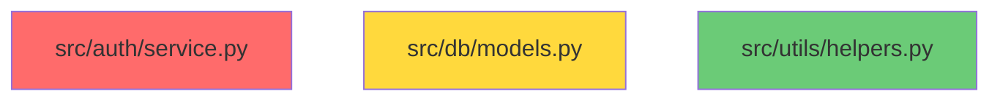

# Git Intelligence Audit & Improvement Plan

> Audit date: 2026-03-26
> Scope: git_indexer.py, git metadata model, MCP tools, decision records

---

## Current Architecture

### Collection (git_indexer.py)

| Operation | Method | Limit |
|-----------|--------|-------|
| Per-file commit history | `repo.iter_commits(paths=file, max_count=500)` | 500 commits/file |
| Blame ownership | `repo.blame("HEAD", file)` | Files <= 100 KB only |
| Co-change detection | `git log -500 --name-only --no-merges` | 500 repo-wide commits |
| Tracked file listing | `git ls-files` | All files |
| Significant commits | Filter by message quality, skip bots/noise | Top 10/file |
| Churn percentile | Rank by `commit_count_90d` across all files | Top 25% = hotspot |

### Storage (git_metadata table)

```
commit_count_total, commit_count_90d, commit_count_30d
first_commit_at, last_commit_at, age_days
primary_owner_name, primary_owner_email, primary_owner_commit_pct
top_authors_json, significant_commits_json, co_change_partners_json
is_hotspot, is_stable, churn_percentile
```

### Consumers (MCP tools)

| Tool | Git Fields Used | Purpose |
|------|----------------|---------|
| `get_overview` | None | Pre-generated wiki pages only |
| `get_context` | owner, last_commit, age, top_authors | Ownership & freshness |
| `get_risk` | churn_percentile, commit_count_30d/90d, significant_commits, co_change_partners, is_hotspot | Risk trends, hotspot detection, risk classification |
| `get_why` | top_authors, significant_commits, first/last_commit, age_days, commit_count_total | Origin story, commit-decision linking, archaeology fallback |
| `search_codebase` | Indirect (page confidence) | - |
| `get_dependency_path` | None | Pre-computed graph only |
| `get_dead_code` | last_commit_at, primary_owner, age_days | Enriches dead code findings |
| `get_architecture_diagram` | None | Pre-computed pagerank for sorting |

---

## Phase 1 — Quick Wins (Low Effort, High Signal)

### 1.1 Make the 500 commit limit configurable

**Where:** `git_indexer.py:357` and `git_indexer.py:233`

**Problem:** Hardcoded `max_count=500` for both per-file history and co-change analysis. For long-lived repos, this may cover only 1-2 years. `commit_count_total` is capped at 500 even if the file has 3000 commits, making the "stable" classification unreliable and hiding how deeply embedded a file is.

**Fix:**
- Add `commit_limit` to `.repowise/config.yaml` (default 500, max 5000)
- Pass through from CLI: `repowise init --commit-limit 2000`
- Store a `commit_count_capped: bool` column on `git_metadata` so downstream tools know when the count is truncated
- Surface this in `get_risk`: "Note: commit history truncated at 500; actual history may be deeper"

**Affected tools:** `get_risk` (total count accuracy), `get_context` (ownership accuracy), `get_why` (archaeology depth)

---

### 1.2 Un-skip revert commits

**Where:** `git_indexer.py:45` — `_SKIP_PREFIXES = ("Merge ", "Bump ", "chore:", "ci:", "style:", "build:", "release:", "revert:")`

**Problem:** `revert:` commits are some of the most valuable signals in a codebase — they indicate something went wrong and was rolled back. Currently filtered as noise.

**Fix:**
- Remove `"revert:"` from `_SKIP_PREFIXES`
- Add `"revert"` to `DECISION_SIGNAL_KEYWORDS` in `decision_extractor.py` so reverts are mined for decisions
- In `_classify_risk_type`, count revert commits alongside fix commits for bug-prone classification

**Affected tools:** `get_risk` (better bug-prone detection), `get_why` (richer archaeology)

---

### 1.3 Lower minimum message length

**Where:** `git_indexer.py:47` — `_MIN_MESSAGE_LEN = 20`

**Problem:** Filters out meaningful short messages like `"fix auth race cond"` (18 chars), `"add JWT support"` (15 chars).

**Fix:** Lower to `12`. Still filters `"wip"`, `"fix"`, `"update"` type noise.

---

### 1.4 Conditionally keep `build:` commits with decision signals

**Where:** `git_indexer.py:478-490` — `_is_significant_commit`

**Problem:** `build:` commits like `"build: migrate from webpack to vite"` are architectural decisions but are currently filtered.

**Fix:** Before checking skip prefixes, check if the message contains any `DECISION_SIGNAL_KEYWORDS`. If it does, keep it regardless of prefix (except `"Merge "`).

---

## Phase 2 — Richer Signals (Moderate Effort)

### 2.1 Track diff size (lines added/deleted)

**Problem:** Commit count alone doesn't capture change magnitude. A file with 50 one-line typo fixes looks identical to one with 50 massive refactors. This is a major blind spot for `get_risk`.

**What to add:**
```python
# New columns on git_metadata
lines_added_90d: int
lines_deleted_90d: int
avg_commit_size: float  # (added + deleted) / commit_count_90d
```

**How:** Use `git log --numstat` (one extra flag) during per-file indexing. Parse the `+N -N` output per commit. Aggregate into 90d and 30d windows.

**Downstream impact:**
- `get_risk`: Distinguish "churn-heavy" (many small changes) from "volatile" (large rewrites). Add `change_magnitude` to risk output.
- `get_dead_code`: Files with 0 lines added but existing in repo are stronger dead-code candidates.

---

### 2.2 Commit message classification

**Problem:** `_classify_risk_type` only detects bug-fix commits via regex. No classification for feature, refactor, or dependency changes.

**What to add:** Classify each significant commit into categories:
```python
COMMIT_CATEGORIES = {
    "feature": r"\b(add|implement|introduce|create|new|feat:)\b",
    "refactor": r"\b(refactor|restructure|cleanup|rename|reorganize|extract|simplify)\b",
    "fix": r"\b(fix|bug|patch|hotfix|revert|regression|broken|crash|error)\b",
    "dependency": r"\b(upgrade|bump|update dep|migrate to|switch to)\b",
}
```

**Store as:** `commit_categories_json` on `git_metadata` — `{"feature": 12, "refactor": 8, "fix": 3, "dependency": 2}`

**Downstream impact:**
- `get_risk`: New `change_pattern` field: "primarily refactored", "bug-prone", "feature-active", "dependency-churn"
- `get_why`: Richer intent signals without LLM calls — "60% of commits are refactors suggests ongoing architectural improvement"

---

### 2.3 Recent ownership & bus factor

**Problem:** Ownership is single-dimensional — one primary owner based on blame lines or total commit count. Doesn't answer "who owns this *now*?" or "how risky is the bus factor?"

**New columns:**
```python
recent_owner_name: str       # Most commits in last 90d
recent_owner_commit_pct: float
bus_factor: int              # Authors needed to cover 80% of commits
contributor_count: int       # Total distinct authors
```

**Computation:**
- `recent_owner`: Filter commits to 90d window, count by author, pick top
- `bus_factor`: Sort authors by commit count desc, sum until >= 80% of total, count = bus factor

**Downstream impact:**
- `get_context`: Show both historical owner and recent owner. "Originally alice's (67%), recently maintained by bob (85% of last 90d changes)"
- `get_risk`: New risk type `"bus-factor-risk"` when bus_factor == 1 and commit_count_total > 20. Surface in risk summary.

---

### 2.4 Add temporal decay to co-change scoring

**Problem:** A file pair that co-changed 5 times 2 years ago gets the same score as one co-changing 5 times last month. Stale coupling is noise.

**Fix:** Capture commit timestamps during co-change analysis. Change `--format=%x00` to `--format=%x00%ct` (adds Unix timestamp). Apply exponential decay:

```python
# Instead of: pair_counts[(a, b)] += 1
age_days = (now - commit_timestamp).days
weight = math.exp(-age_days / 180)  # half-life ~125 days
pair_counts[(a, b)] += weight
```

**Store as:** `co_change_partners_json` already has `co_change_count` — change to float, add `last_co_change_date`.

**Downstream impact:**
- `get_risk`: Co-change partners reflect *current* coupling, not historical noise
- Reduces false positives where files were once coupled but have since been decoupled

---

## Phase 3 — Deeper Intelligence (Higher Effort)

### 3.1 Rename/move tracking with --follow

**Where:** `git_indexer.py:357` — `repo.iter_commits(paths=file_path, max_count=500)`

**Problem:** If `auth/service.py` was renamed from `auth/handler.py`, commit history, age, and co-change relationships start at the rename. The file's true history is lost.

**Fix:** Use `repo.iter_commits(paths=file_path, follow=True, max_count=N)` during initial indexing. GitPython supports `--follow`. Store `original_path` if different from current path.

**Trade-off:** Slower — `--follow` is more expensive. Consider making this opt-in: `repowise init --follow-renames`.

**Downstream impact:**
- `get_context`: Accurate age and ownership for renamed files
- `get_why`: Origin story traces back to true creation, not rename point
- `get_risk`: Accurate commit_count_total for risk assessment

---

### 3.2 Fix incremental update gaps

**Where:** `git_indexer.py:267` — `index_changed_files()`

**Problem:** Incremental updates (`repowise update`) re-index individual files but do NOT recompute:
- Co-change partners (requires full 500-commit walk)
- Churn percentiles (requires all files to rank against)

A file that just became the hottest in the repo won't be flagged until the next full `repowise init`.

**Fix options:**
1. **Lightweight:** Store `last_full_reindex_at` timestamp. Surface in tools: "Percentile data from 2026-03-20; run `repowise init` to refresh."
2. **Medium:** Recompute percentiles across all files after incremental git re-index (cheap — just sorting existing data)
3. **Full:** Run co-change analysis on a smaller window (last 100 commits) during update, merge with existing data

Recommendation: Option 2 (recompute percentiles) + option 1 (staleness indicator for co-changes).

---

### 3.3 PR-level context for decision mining

**Problem:** `mine_git_archaeology` processes individual commits, but architectural decisions are often captured at the PR level — PR descriptions, review discussions, grouped commits. Individual commits are often terse ("wip", "fix tests") while the PR says "Migrate auth from sessions to JWT."

**Approach:**
- Detect GitHub remote from `git remote -v`
- For significant commits, resolve PR via `git log --merges --ancestry-path <sha>..HEAD` or GitHub API
- Store `pr_number`, `pr_title` alongside significant commits
- Feed PR titles into decision extraction (higher signal than commit messages)

**Trade-off:** Requires GitHub API access (optional). Could use `gh` CLI if available, degrade gracefully if not.

**Downstream impact:**
- `get_why`: Much richer origin stories — "Introduced in PR #142: Migrate auth to JWT (merged by alice, 2024-03-15)"
- Decision extraction: Higher-confidence decisions from PR descriptions

---

### 3.4 Merge conflict frequency tracking

**Problem:** Files that consistently have merge conflicts are risky — this signal isn't captured anywhere.

**How:** `git log --merges --diff-filter=U` or parse merge commits for conflict markers. Alternatively, track files that appear in merge commits with multiple parents.

**Store as:** `merge_conflict_count_90d` on `git_metadata`.

**Downstream impact:**
- `get_risk`: New signal for `"high-coupling"` risk type. Files with frequent merge conflicts are coordination bottlenecks.

---

### 3.5 Git-aware decision staleness

**Where:** `decision_extractor.py` — `compute_staleness()`

**Problem:** Staleness is based on commit count and age, not on *what* changed. A decision about "use JWT for auth" isn't stale because someone reformatted the file. It's stale if recent commits conflict with the decision's content.

**Fix:** When computing staleness, check if significant commits (post-decision-creation) contain keywords that conflict with the decision's tags or content. E.g.:
- Decision says "use Redis for caching", recent commit says "migrate to memcached" → high staleness
- Decision says "use JWT", recent commit says "reformat auth module" → low staleness

Keyword overlap between decision text and recent commit messages, weighted by conflict signals ("replace", "remove", "deprecate", "switch from").

---

## Phase 4 — Tool Enhancements

Improvements to MCP tools that leverage the new data from Phases 1-3.

### 4.1 Enrich `get_overview` with repo-wide git health

Currently `get_overview` returns only wiki pages with no git data. Add a `git_health` section:

```json
{
  "git_health": {
    "total_files_indexed": 342,
    "hotspot_count": 28,
    "avg_bus_factor": 1.8,
    "files_with_bus_factor_1": 45,
    "churn_trend": "increasing",
    "top_churn_modules": ["src/auth", "src/api"],
    "stale_since_last_full_reindex": false
  }
}
```

---

### 4.2 Boost `search_codebase` by git freshness

Currently search ranks by semantic/FTS relevance only. Boost recently-active files:

```python
final_score = relevance_score * (1 + 0.2 * recency_factor)
# recency_factor: 1.0 for files changed in 30d, 0.5 for 90d, 0.0 for older
```

---

### 4.3 Augment `get_dependency_path` with co-change signal

When no direct import path exists between two files, check co-change data:

```json
{
  "path": [],
  "distance": -1,
  "co_change_signal": {
    "co_change_count": 7,
    "last_co_change": "2026-03-10",
    "note": "No import dependency, but these files co-change frequently — likely logical coupling"
  }
}
```

---

### 4.4 Annotate `get_architecture_diagram` with change heat

Add optional `show_heat: bool` parameter. When true, annotate Mermaid nodes with churn color:



---

### 4.5 Smarter `get_dead_code` with "last meaningful change"

Currently uses `last_commit_at` which includes formatting-only changes. Use commit classification (Phase 2.2) to find the last *meaningful* commit (feature or fix, not style/chore). Dead code that hasn't had a meaningful change in 12+ months is a much stronger signal.

---

## Summary / Phase Map

| Phase | Items | Theme | Depends On |
|-------|-------|-------|------------|
| **1** | 1.1, 1.2, 1.3, 1.4 | Quick wins — config, filter fixes | Nothing |
| **2** | 2.1, 2.2, 2.3, 2.4 | Richer git signals — diff size, classification, ownership, decay | Phase 1 (for config) |
| **3** | 3.1, 3.2, 3.3, 3.4, 3.5 | Deeper intelligence — renames, incremental fix, PR context, conflicts, staleness | Phase 2 (for classification data) |
| **4** | 4.1, 4.2, 4.3, 4.4, 4.5 | Tool enhancements — consume new data in MCP tools | Phases 2-3 |
