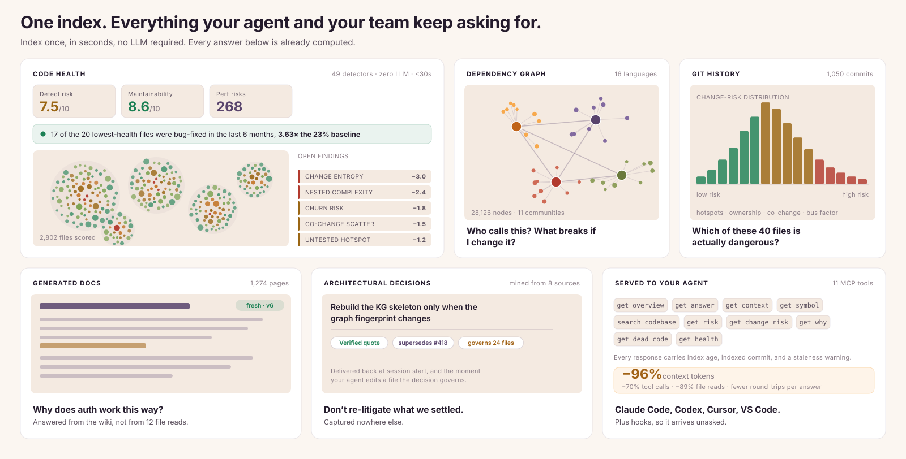

# repowise documentation

Index your codebase once. Your agent stops grepping, your team stops guessing
which change is dangerous, and both get their answers from the same place.

To set up with an agent, paste this into it:

```text
Read https://docs.repowise.dev/setup.md and set up Repowise in this repository.
```

By hand: the [Quickstart](start/QUICKSTART.md) gets you indexed and connected to
your agent in under five minutes, with no API key.

<div align="center">
  
</div>

For a map of every layer and how they feed each other, read
[layers/INTELLIGENCE_LAYERS.md](layers/INTELLIGENCE_LAYERS.md).

---

## I want to...

### Give my agent context

| Doc | What it covers |
|-----|----------------|
| [start/QUICKSTART.md](start/QUICKSTART.md) | Install, index, and connect your agent |
| [agent/INTEGRATIONS.md](agent/INTEGRATIONS.md) | Which agents are supported at what depth, and how to add one |
| [agent/MCP_TOOLS.md](agent/MCP_TOOLS.md) | The ten task-shaped tools, what each answers, and the opt-in extras |
| [agent/HOOKS.md](agent/HOOKS.md) | Context and warnings that reach the agent without it asking |
| [agent/DISTILL.md](agent/DISTILL.md) | Compress noisy command output before your agent reads it |
| [agent/LENS.md](agent/LENS.md) | Lens in the Claude Code plugin: the spinner, change review, Flow and the `/lens` map shown while Claude works |
| [layers/GRAPH.md](layers/GRAPH.md) | The dependency graph, and how much to trust each edge |
| [layers/LANGUAGE_SUPPORT.md](layers/LANGUAGE_SUPPORT.md) | What works per language: 26 parsed to a full AST, 40 on the support ladder |

### Find what to fix first

| Doc | What it covers |
|-----|----------------|
| [layers/CODE_HEALTH.md](layers/CODE_HEALTH.md) | Defect risk, maintainability and performance risk per file, and the Fix first queue |
| [layers/PERFORMANCE.md](layers/PERFORMANCE.md) | N+1 queries, I/O in loops and blocking calls, grouped into plans and a default queue |
| [layers/REFACTORING.md](layers/REFACTORING.md) | Graph-aware refactoring plans, from Extract Method to Performance Fix |
| [layers/OWNERSHIP.md](layers/OWNERSHIP.md) | Owners, bus factor, and where knowledge is at risk |
| [start/DASHBOARD.md](start/DASHBOARD.md) | Every view in the local dashboard |

### Delete dead code safely

| Doc | What it covers |
|-----|----------------|
| [layers/DEAD_CODE.md](layers/DEAD_CODE.md) | Unreachable files, unused exports and zombie packages, with confidence tiers and deletion readiness |

### Know if a change is risky

| Doc | What it covers |
|-----|----------------|
| [layers/CHANGE_RISK.md](layers/CHANGE_RISK.md) | Score a commit, a `base..head` range or uncommitted work against your repo's own history |
| [layers/BUG_HISTORY.md](layers/BUG_HISTORY.md) | Which files and functions keep getting fixed, and how recently |
| [layers/SECURITY.md](layers/SECURITY.md) | The local scan: 22 pattern kinds plus a symbol-name scan, history scanning for secrets, and its limits |
| [start/CI.md](start/CI.md) | Gate pull requests with the GitHub Action or the GitLab template |

### Know which tests matter

| Doc | What it covers |
|-----|----------------|
| [layers/TEST_INTELLIGENCE.md](layers/TEST_INTELLIGENCE.md) | Coverage ingestion, untested hotspots, and the tests a diff touches, with or without a report |

### Generate and keep docs current

| Doc | What it covers |
|-----|----------------|
| [layers/WIKI.md](layers/WIKI.md) | The generated wiki: page types, styles, and what `update` re-renders |
| [layers/DOC_DRIFT.md](layers/DOC_DRIFT.md) | Claims in your markdown checked against the tree |
| [scale/AUTO_SYNC.md](scale/AUTO_SYNC.md) | Keep the index fresh on every commit |

### Understand why code is this way

| Doc | What it covers |
|-----|----------------|
| [layers/DECISIONS.md](layers/DECISIONS.md) | Architectural decisions mined from your repo and your agent sessions |

### Run across many repos

| Doc | What it covers |
|-----|----------------|
| [scale/WORKSPACES.md](scale/WORKSPACES.md) | Multi-repo intelligence: cross-repo contracts, co-changes, one MCP server |
| [scale/WORKTREES.md](scale/WORKTREES.md) | Linked git worktrees seed their index from the base checkout |
| [../docker/README.md](../docker/README.md) | Running repowise in Docker |

### Evaluate repowise for my company

| Doc | What it covers |
|-----|----------------|
| [business/SECURITY_COMPLIANCE.md](business/SECURITY_COMPLIANCE.md) | What leaves your machine, what is stored, and the answers your security team wants |
| [business/COMMERCIAL.md](business/COMMERCIAL.md) | Hosted tier, enterprise options and commercial licensing |
| [BENCHMARKS.md](BENCHMARKS.md) | Every published number with its sample size and method, including the rows we lose |
| [LINEAGE.md](LINEAGE.md) | The published research each layer is built on, where it lives in the code, and how we checked it |
| [../ROADMAP.md](../ROADMAP.md) | What we are building next, and what we are not |

### Fix a problem

| Doc | What it covers |
|-----|----------------|
| [start/TROUBLESHOOTING.md](start/TROUBLESHOOTING.md) | `repowise doctor`, then install, indexing and answer problems |
| [reference/UPGRADING.md](reference/UPGRADING.md) | Notes for upgrading between versions |

### Contribute

| Doc | What it covers |
|-----|----------------|
| [../.github/CONTRIBUTING.md](../.github/CONTRIBUTING.md) | How to set up, test and submit a change |
| [architecture/README.md](architecture/README.md) | How repowise is built: pipelines, graph algorithms, health internals |

---

## Reference

| Doc | What it covers |
|-----|----------------|
| [reference/CLI_REFERENCE.md](reference/CLI_REFERENCE.md) | Every command and flag |
| [reference/API_REFERENCE.md](reference/API_REFERENCE.md) | The `repowise serve` HTTP API: what OpenAPI does not carry (spend, auth, errors, streaming) |
| [reference/CONFIG.md](reference/CONFIG.md) | `.repowise/config.yaml`, `health-rules.json`, and environment variables |
| [reference/MCP_RESPONSE_FIELDS.md](reference/MCP_RESPONSE_FIELDS.md) | The field dictionary for every MCP response, including the `_meta` envelope |
| [reference/HOOKS_REFERENCE.md](reference/HOOKS_REFERENCE.md) | The exact settings entries each hook install writes |
| [reference/CHANGE_REVIEW_API.md](reference/CHANGE_REVIEW_API.md) | Reviewing a change from Python, with or without a checkout |
| [reference/WORKSPACE_CONTRACTS.md](reference/WORKSPACE_CONTRACTS.md) | How a workspace names, reads and matches cross-repo contracts |
| [reference/COMPUTED_GLOSSARY.md](reference/COMPUTED_GLOSSARY.md) | Definitions for every computed metric |
| [reference/TELEMETRY.md](reference/TELEMETRY.md) | What anonymous telemetry collects, and how to turn it off |
| [start/USER_GUIDE.md](start/USER_GUIDE.md) | The everyday guide to how the pieces fit |
| [CHANGELOG.md](CHANGELOG.md) | Release history |

Agent and editor pages: [Codex](agent/CODEX.md) ·
[opencode](agent/OPENCODE.md) · [Hermes](agent/HERMES.md) ·
[VS Code](agent/VSCODE.md) ·
[Lens for Claude Code](agent/LENS.md) ·
[Claude Code as a provider](agent/CLAUDE_CODE_PROVIDER.md) ·
[all integrations](agent/INTEGRATIONS.md).
