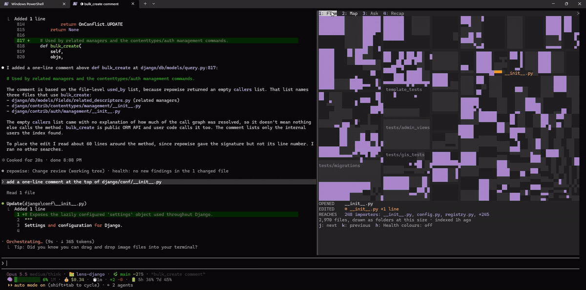

# Lens for Claude Code

Lens is the part of the Repowise Claude Code plugin that you see. The plugin's
hooks and MCP tools already feed the index to Claude. Lens draws what that index
knows into the Claude Code interface itself: which file Claude is working on and
how much depends on it, the decision or fix history behind a file it edits, how
much a distilled command output was cut, what the change did to code health,
a dashboard of each turn (what an edit reaches, where Claude's context came
from, what Repowise answered), and a map of the repository
with Claude's reads and edits marked on it.



Lens ships inside the plugin as a Claude Code mod. There is nothing separate to
install. It is quiet at rest: each surface draws only when it has something to
say, and the map pane opens only when you ask for it.

## What Lens shows

On-screen wording below is quoted from the code. Values in angle brackets stand
for figures your own index fills in.

### The band above the prompt

At most two rows above the prompt, counting the change review row and the
compaction brief row, and empty when there is nothing to report. Those two rows
keep their place, and the dim information rows above them fill what is left. The
band gives way when Claude Code shows a survey there.

- **A setup hint**, once per session, when something stops Lens from showing
  everything. It stays for the first turn that ends while it shows, then
  retires.

  | Situation | Row |
  |---|---|
  | Indexed repo, no local server running | `Lens map needs the local server: repowise serve --no-ui` |
  | The local server is running but does not list this repo | `Lens map needs a local server for this repo: repowise serve --no-ui` |
  | The local server asks for an API key | `local server needs an API key; Lens does not read keys` |
  | Git repo with no Repowise index | `index this repo for Lens: repowise init --no-prose --yes` |
  | The `repowise` CLI is not installed | `Lens needs the Repowise CLI: pip install repowise` |

  Lens shows these commands for you to run. It never runs them itself.
- **Index freshness**, while the index is behind the checked-out commit:
  `index behind HEAD (<N> files changed) · repowise update`. It stays quiet
  while `repowise update` is already running.
- **Savings**, once the local server reports tokens saved since the session
  started: `<N> tokens (<M> inferred) · $<X> saved since this session started · all agents on this repo`.
  The figure comes from the server's savings ledger, which counts every agent on
  this repo, not only this Claude Code session. Dollars are the priced input
  side only. In a narrow terminal the row shortens to
  `<N> tokens (<M> inferred) · $<X> saved this session · all agents`.
- **The change review row** and **the compaction brief offer**, described
  below. These carry buttons.

### Spinner text

While Claude reads or edits a file inside the indexed repo, Lens appends the
file's reach to Claude Code's spinner: `<file name> · <N> caller files · <N> contributors`,
with the file's base name.
Lens looks each file up once per session with `get_context`. The text appears
from the next redraw after that lookup lands, never holding the spinner up.
Counts the index does not know are left out.

### Margin notes under edits

Under an Edit or Write, at most two dim lines repeat what the Repowise
`PostToolUse` hook flagged for that file. Lens adds no thresholds of its own:
if the hook said nothing, there is no note.

- `a standing decision covers this file: <title>`
- `a decision found in this file, not yet reviewed: <title>`
- `fixed <N> times in 6 months, most recently <age>, mostly in <symbol>`

Margin notes need the `repowise-augment` hook on your PATH, which installing the
`repowise` CLI provides.

### Squeeze rows under distilled output

When a Bash result was shortened by `repowise distill`, Lens draws one row under
it: a 12-cell bar for the share of lines kept, then
`<N> lines → <kept> · ~<N> tokens omitted · <N> failed · repowise expand <ref>`.
Failure and error counts appear only when the test runner reported them. When a
result carries several omission markers the row adds `(+<N> more)`. Everything
on the row is read from the distill marker and the output itself. See
[Distill](DISTILL.md) for how output gets shortened and how `repowise expand`
restores it.

### Change review card and buttons

After a turn in which Claude edited files (Edit, MultiEdit, Write or
NotebookEdit), Lens reviews the working tree with `get_change_risk`. The
review starts in the background as soon as the first edit lands. Turns that
were interrupted or failed, and subagent turns, are not reviewed.

While it runs, the band shows only `Reviewing the change...`. The review
gives up after 20 seconds. A timeout or a failure is reported in the row under
Claude's answer, as `Change review timed out after 20 s` or
`Change review could not run: <reason>`.

The result appears as one row beneath Claude's answer, for example:

```
Change review (working tree, <N> changed files) · Health: <verdict> · <findings> · Diff shape: bigger than <N>% of this repo's recent commits; size, not danger · Tests to run: <N> tests, inferred from the dependency graph, not measured: <tests> · Branches: ◦ 1 other branch also edits <file> (<branch>)
```

- `Health:` says what the comparison found, for example
  `no new findings in all <N> changed files`, `improved, <N> findings resolved, none new`,
  or the review's own headline when it found new findings.
- A partial comparison says so: `Scope: compared <N> of <M> changed files; <K> not analysed (<reasons>), so this is not a clean bill`.
- Tests say whether they are `measured by stored coverage` or
  `inferred from the dependency graph, not measured`.
- Branch overlap uses a neutral `◦` mark. Green, amber and red are reserved for
  health.
- A clean change with no other branch in its files gets the short form:
  `Change review (<scope>) · health: <verdict>`.

The band then shows a summary such as `review · health: <N> new findings, review required`
with up to three buttons, each pressed with the number shown beside it:

| Button | When it shows | What a press does |
|---|---|---|
| `1: Run tests` | The review names tests to run | Submits a visible prompt to Claude: `Run the tests Repowise names for this change, <basis>: <tests>` |
| `2: Why` | The Repowise hook flagged a decision on a file edited this turn | Opens the `/lens` pane on the Ask field with `why <decision>` in it. Nothing is asked until you press Enter |
| `3: Details` | The review returned its full verdict | Prints the review's status, headline, reasons and next actions into the transcript for you to read |

The band row stays quiet for a clean review with no tests, no overlapping
branch and no decision. A new turn retires it.

### The /lens pane

`/lens` opens a pane with four tabs, `1: Flow  2: Map  3: Ask  4: Recap`. A session
starts on Flow; after that `/lens` reopens the tab shown last.

**Flow** is a dashboard of the turn, built from what only Lens sees: the chat
already shows each step, so Flow shows what those steps add up to. Each
section draws only when it has something to say.

The header is the Repowise owl on one line, `{◉,◉}`, beside the status. The
owl's eyes carry its state: `{─,─}` at rest, a slow blink while Claude works,
eyes to the side `{◐,◐}` while a Repowise call is in flight, `{^,^}` for a
moment after a turn that ended with an answer, and a neutral `{•,•}` after a
turn that stopped. With `prefersReducedMotion` on it does not blink. The
status is `Working · <m:ss>` while Claude works, then how the turn ended, kept
until your next prompt: `Done · <time>` (with a thistle), `Stopped · <time>`
when you interrupted it, or `Did not finish · <time>` after a refusal or an
error, with `edited <N> files` when it edited. A prompt sent while a turn is
still open marks that turn stopped. Under it, at full strength:
`Repowise <N> calls · Claude opened <N> files, <N> named by Repowise first`,
plus `edit landed in a file Repowise named` when one did (or
`No Repowise calls`). A file counts as named by Repowise first when a Repowise
reply earlier in the session named that exact repo-relative path. Then your
own words, dim: text the session puts before a prompt (agent hand-backs,
system reminders, task notifications, command wrappers) is left out, and when
nothing you typed remains the line is not drawn.

**BEFORE YOU ACCEPT** lists, per file this turn edited, only what the change
reaches that Claude did not look at, from the index (the facts say
`as of the last index`):

- `<N> direct importers; Claude opened <N>`: files that import it directly
  (the map's depth-1 blast radius, the same request, never a second one).
- `not opened, usually changes with it (co-change score): <file> 0.80, ...`:
  the two strongest co-change partners Claude did not open, with the server's
  0 to 1 score.
- `<N> test files reach query.py (inferred); none run`: tests that reach the
  file, measured or inferred as the server says, and how many a test command
  this session named (by path, file name or folder, as a whole word).
- The turn's health from the change review's own result, never a second call:
  `this turn introduced 1 finding: complex method in query.py`, or
  `health compared in part only; no new findings in the part compared`. A turn
  that introduced nothing draws nothing.

**WORKING SET** lists the files this turn edited, then the ones it read, at most
six (`+<N> more`): the file, `edited` or `read`, how Claude came to it (the
Repowise tool that named it first, `search` when a search returned it, or
`direct`), and what the index knows of it: `hotspot`, `<N> files use it`
(importers and callers together, not only direct importers), and
`recent owner <name> <share> %`. These come from the file card Lens already
fetches for the spinner. Below 80 columns the index facts are left out.

**CONTEXT** is one bar of the bytes of tool results Claude received this turn,
by kind, each kind its own shade so it reads without color:
`█ Repowise <size>  ▓ file reads <size>  ▒ search <size>  ░ shell <size>  · other <size>`,
then `first edit after <time>`. Lens counts each result's size; it keeps no
content.

**REPOWISE CALLS** has one line per call: the time since the turn started, the
tool, what it asked about, how long it took, and what the reply was built
from, for example `420 ms · 1 target · 1 documentation page · index current`.
The call Claude is waiting on is marked `▸` and says `asking...`. A call about
a file Claude had already edited this session says, dim,
`from the index before this edit`. Questions you ask from Lens land in the
Ask tab, not here. Press a call to open its detail; `j: Next call` and
`k: Previous call` move between them. The detail shows `how it was answered`
(only what the reply said about itself, such as `indexed at <commit>`,
`index <N> days old`, `verified against the code`,
`partial: the server capped it`, `confidence <level>`,
`reply <size> (cap <N> characters)` and `<N> tokens left out, restorable`),
`reply begins` with its first characters, and `Claude then opened`: the files
Claude opened after this reply named them, or `nothing yet`. When the calls do not fit, a dim
line says `<N> earlier calls hidden · j / k step through calls` (or
`<N> later calls below · ...`).

Earlier turns keep one line each,
`Turn <N> · <time> · <N> Repowise calls · <N> files read · <N> edited`, with
`stopped` or `did not finish` when they did not end with an answer; past six
turns they fold into `Earlier: <N> turns · ...`.

Flow's text keeps your terminal's own colors and never sets a background.
Only marks take an accent: heather plum for the hills, the thistle,
Repowise's tool names and its part of the bar; amber for the owl's eyes and
the call in flight. Health colors never appear here. In a repo without an index
Flow still counts Claude's own work and says
`Repowise is not connected in this repo, so only Claude's own steps show here.`
Before the first turn it says
`Lens is listening. Send a prompt and this tab shows what only Lens sees: what an edit reaches, where Claude's context came from, and what Repowise answered.`

**Map** shows the whole repository as quiet tiles, one per file, sized by
lines of code and grouped into folders, in two tones close to the terminal's
own ground, so the current turn is the only colour on it. As Claude works,
the files of its turn light up: search matches glow faintly, files Claude
opened turn mist, the edit (and Claude's latest step) turns orange, files a
Repowise reply named take a deep plum, and the files that import the edit
ripple out in plum from it. Every mark fills a whole tile; a file too small
for a tile of its own still lights one full cell where it sits. Opened and
edited files keep their names beside their tiles, and large folders show their
names faintly. The empty ground between tiles is the terminal's own
background. In a very large repository, where most files would be smaller than
a pixel, folders are drawn as tiles instead of files.

Under the map, a story strip says what happened this turn, a row each once it
has something to say:

```
SEARCHED  class QuerySet: 4 files · django/db/models/sql/*.py: 7 files
OPENED    manager.py · query.py  ◆ query.py named by get_context
EDITED    ◉ query.py +1 line
REACHES   12 importers: manager.py (opened), fields.py, prefetch.py, +9
```

The strip is the map's legend. Before anything happens it says
`Nothing lit yet this turn. Files Claude searches, opens and edits light up here.`
The importers come from the import graph, so they are inferred from imports,
not observed calls; while that lookup runs the row says
`finding the files that import <file>`. A scope line says how much of the repo
is drawn: `<N> files, all drawn`, `<N> of <M> files drawn at this size · rest too small to draw`,
`<M> files, drawn as folders at this size`, or, when the server stopped at its
cap, `4,000 largest of <M> files drawn`, then `indexed <age>` and
`<N> touched files not on the map` when some were outside it.

The keys under the map walk what the turn lit. They are letters, since digits
switch tabs, and only the ones that would do something are shown:

| Key | What it does |
|---|---|
| `j` | Select the next lit file: the edit, then the files Claude opened, then the edit's other importers, then files a Repowise reply named; it wraps around |
| `k` | Select the previous one |
| `z` | Zoom into the folder holding the selection: only that folder's files, at the full pane size, with their names |
| `u` | Zoom out one folder |
| `x` | Clear the selection |
| `h` | Health colours on or off |

The selected tile gets a bright ring, and one line under the strip says what it
is: its path, why it is lit (`Claude edited it, +1 line`, `Claude opened it`,
`imports query.py`, `named by get_context`), and what Lens already knows of it
(`hotspot`, `131 files use it`, `recent owner ...`, `9 tests reach it (inferred)`).
Lens asks for nothing new to fill that line. Zoomed in, a breadcrumb such as
`django / db / models` sits above the map and the scope line counts that
folder's files, and `j` and `k` walk only the lit files in it. Selection draws
one redraw, no animation. A new prompt or a `/clear` starts with nothing
selected and the whole repo in view, and a file the turn stops lighting loses
its selection. On a narrow pane the keys stay on one row: the least used ones
(`x`, then `u`, `k`, `z`) give way to a `…` first, and `h` stays.

The `Health colours` button under the map (hotkey `h`) colours the tiles by
health band instead, `Excellent`, `Good`, `Fair`, `Needs work`, `At risk` and
`Not scored`, with that legend; the `lens_map_health` setting starts the map
that way. The glow and ripple animations play briefly. With Claude Code's
`prefersReducedMotion` setting on, the map shows still frames only. Colours
follow Claude Code's `theme` setting: a light theme gets the light ramp.

The map needs the local server (full mode). Without it the Map tab shows the
setup hint instead.

**Ask** asks the index about this repo. `/lens ask` and the review's `Why`
open it, and `/lens ask <question>` asks at once, its reply landing in the
Ask tab. Before the first question the field says
`Ask about this repo. Answers cite the evidence they used.` A question that
starts with "why" goes to `get_why`, which reads decision records, commits and
rationale comments. Anything else goes to `get_answer`. Each reply is headed
`Built from the index`, or `Written by this repo's configured model, from the index`
when `get_answer` may have used the model your repo configures. The reply shows
the tool's confidence or basis and the evidence it cites, or
`no evidence cited`. Long replies are cut at 4,000 characters, with the cut
stated. One question runs at a time: asking another meanwhile shows
`still answering the last question; ask again when it lands`.

**Recap** summarizes the session from what Lens already observed, with no new
lookups:

| Row | Example value |
|---|---|
| `Files` | `<N> edited of <M> files touched`, with `<M>` shown as `200+` once the count of touched files is capped |
| `Change review` | `none this session`, shown in place of the four review rows when no review has run |
| `from the last change review` | a dim sub-head over the next four rows |
| `Code health` | the last review's health verdict |
| `Findings` | `<N> resolved · <N> new findings`, or `not compared` |
| `Tests to run` | `<N> tests, measured` or `<N> tests, inferred` (`<N> test files, ...` when the review names files), or `none named` |
| `Branches overlapping` | the overlap line, `none found` or `not reported` |
| `Saved` | the savings row, `nothing yet since this session started`, or `needs the local server: repowise serve --no-ui` |
| `Decisions surfaced` | `<N>: <titles>` or `none` |

The footer says `Lens made no model calls. Every figure here is read from the local index.`
After Ask replies that may have come from the model, it says
`Lens made no model calls. <N> Ask replies from get_answer may have been written by this repo's configured model.`

### Compaction brief

After Claude Code compacts the conversation, the band offers
`context compacted  1: Brief Claude`, or `context compacted  4: Brief Claude`
when a change review row is showing, since that row takes 1 to 3. Pressing it
submits one visible prompt, at most 1,200 characters, built from this
session's edits, the decisions the hook surfaced and the last change review,
with no model call. It starts
`The context was compacted. This brief is built from the Repowise index and this session's edits:`
and lists `Files edited:`, `Decisions in play:` and `Open review items:` from
this session. Lens does not change the compaction or its summary. The offer
goes away when you press it or start the next turn.

### Desktop map

In the Claude desktop app, the Map tab draws the same map as an SVG image
instead of terminal cells, without the animations. A map too detailed for the
desktop drawing says
`Lens map has too much detail to draw here; the terminal map shows it`. Other
surfaces that open the pane say
`Lens map: not drawn on this surface (terminal and desktop app only)`.

## Turning it on

Requirements:

- **Claude Code 2.1.287 or later.** Older versions load the rest of the plugin
  and skip Lens.
- **The Repowise plugin**, installed as described in the
  [plugin README](../../plugins/claude-code/README.md):
  `/plugin marketplace add repowise-dev/repowise`, then
  `/plugin install repowise@repowise`.
- **An indexed repo.** In a git repo with no index, Lens shows the
  `repowise init --no-prose --yes` hint. Outside a git work tree it stays
  silent.

Lens picks one of two modes at session start and checks again after each turn:

| Mode | When | What shows |
|---|---|---|
| Full | `repowise serve --no-ui` is running for this repo on this machine | Everything: the band including savings, spinner text, margin notes, squeeze rows, the change review, the `/lens` pane with Flow, the map, Ask and Recap, and the compaction brief |
| Lite | The repo is indexed but no local server serves it | Everything except the map and the savings row. The Map tab and the Recap's `Saved` row point at `repowise serve --no-ui` |

Lite mode works through the plugin's MCP server, which the plugin starts on its
own. Full mode adds the local server, which Lens finds through
`.repowise/serve.lock.json`.

## Settings

Six toggles in the plugin's `userConfig`. Changing one reloads Lens.

| Setting | Default | What it controls |
|---|---|---|
| `lens_margin` | on | Margin notes under Edit and Write |
| `lens_squeeze` | on | Squeeze rows under distilled Bash output |
| `lens_review` | on | The change review after a turn that edits files, its card and its buttons |
| `lens_flow` | on | The Flow tab. Off, Lens records nothing for it and the pane opens on the Map |
| `lens_map_health` | off | Start the map with health colours on its tiles. Off, the map is quiet tiles lit by Claude's turn; the `Health colours` button switches either way |
| `lens_pane_autoopen` | off | Open the map pane on its own the first time Claude reads a file, when the terminal is wide enough to place it without asking. `/lens` opens it at any time |

## Commands

| Command | What it does |
|---|---|
| `/lens` | Opens the pane on the tab shown last (Flow at first), with keyboard focus |
| `/lens flow` | Opens the pane on the Flow tab |
| `/lens map` | Opens the pane on the Map tab |
| `/lens ask` | Opens the pane on the Ask tab |
| `/lens ask <question>` | Asks the question; its reply lands in the Ask tab |
| `/lens recap` | Opens the pane on the Recap tab |

`/lens` writes nothing into the transcript. The pane is the answer.

## Troubleshooting

**Nothing from Lens appears at all.** Lens needs Claude Code 2.1.287 or later.
Mods can also be switched off by Claude Code's remote rollout setting or by an
administrator. In each case only Lens is missing: the plugin's MCP tools,
commands, skills and hooks keep working.

**Nothing draws in some places.** Claude Code draws mod interface only in its
terminal interface and the desktop app. Nothing from Lens appears in the VS
Code chat panel, `claude -p`, the Agent SDK, cloud sessions, or desktop
sessions running in WSL.

**The map pane does not open on its own.** Claude Code places a pane nobody
asked for only in a terminal at least 144 columns wide. Below that, with
`lens_pane_autoopen` on, the band says
`Lens map is ready; this pane is too narrow to open on its own. Run /lens`.
`/lens` asks for the pane directly. If Claude Code still cannot place it, the
band says `Lens map needs a wider terminal: <reason>`.

**The Map tab shows a hint instead of a map.** The map needs the local server.
Run `repowise serve --no-ui` in the repo. If the server has an API key
configured, Lens stays in lite mode, because it never reads keys.

**The docked pane is grey, not my terminal's background.** The docked pane's
surface is Claude Code's own; mods cannot set or clear it. Lens draws nothing
behind its own rows, and inside the map the empty ground is the terminal's
own background.

**The map says it could not load.** `Lens map could not load; it tries again on /lens`.
Run `/lens` again once the server is up.

**A tab says Lens could not draw it.** `Lens could not draw this tab; details in the debug log`.
The tab bar stays, so the other tabs still work. Claude Code's debug log has a
line starting `lens:` that names the tab and the error.

**The change review timed out.** It has 20 seconds. The review is skipped for
that turn and runs again after the next turn that edits files.

**After `/clear`.** A `/clear` starts Lens's view of the conversation over. Flow's turns, the map's lighting
and story, the change review, the Ask answer, the brief offer and the savings
baseline all reset, since `/clear` restarts Claude Code's own session clock.
What the index said stays (the health map, file cards and the importers already
asked for), so the map redraws without asking the server again. Resuming a
session does not reset anything.

## Footprint

What Lens does and does not do, as the code enforces it:

- **Lens never denies, holds, rewrites or approves a tool call.** Every tool
  call passes through Lens unchanged, and so does its result. Lens registers
  no `tool.check` hook, so every permission question, its own included, gets
  Claude Code's own answer. Lens's lookups (`get_context`, `get_change_risk`,
  `get_why` and `get_answer` on the plugin's MCP server) ask permission like
  any MCP call. To let them run without a prompt, allow
  `mcp__plugin_repowise_repowise__get_context`,
  `mcp__plugin_repowise_repowise__get_change_risk`,
  `mcp__plugin_repowise_repowise__get_why` and
  `mcp__plugin_repowise_repowise__get_answer` once, with `/permissions` or in
  `permissions.allow` in your settings. A refused lookup leaves that part of
  Lens empty and the rest working.
- **Flow only counts what passes.** It records each tool call's name, a few
  arguments, its timing and the size of its result, never the result itself
  (Repowise replies keep a short summary and their first 2 KB). What Flow
  keeps (the last six turns, at most 60 steps each) stays in memory and is
  gone when the session ends. Its facts come from requests Lens already makes:
  the file card, the map's blast radius and the change review.
- **Anything that reaches Claude goes through a button you pressed.** `Run tests`
  and `Brief Claude` submit a prompt you can see in the transcript. `Why` only
  fills the Ask field. `Details` prints into the transcript for you. Lens does
  not change your prompts or the compaction.
- **Lens itself makes no model calls** and reads no environment variables or
  API keys. The only Claude Code setting it reads is `prefersReducedMotion`.
- **Lens talks only to the local Repowise server and the plugin's MCP server.**
  It contacts the server only at a plain `http` loopback address
  (`127.0.0.1`, `localhost` or `::1`) named in `.repowise/serve.lock.json`.
- **Lens runs no command that writes to your repo.** It runs read-only git
  (`git rev-parse` and `git diff --name-only`) to compare the index with HEAD,
  and `tasklist` or `ps` to check whether a server process is alive. It reads
  `.repowise/state.json`, `.repowise/serve.lock.json` and
  `.repowise/.update.lock`, and writes no files. Setup and update commands are
  shown for you to run.

The rest of Repowise is not covered by those statements, and two things there
matter:

- **`get_answer` may use the model your repo configures.** An Ask question that
  does not start with "why" goes to `get_answer`, which synthesizes its answer
  with the repo's configured model provider when one is set. The Recap footer
  counts those replies.
- **The Repowise MCP server and local server send anonymous usage telemetry**
  unless you turn it off. The MCP server records one event per tool call (the
  tool name, status and coarse measures, never the question, results or paths),
  and Lens's own lookups are tool calls like any other. See
  [Telemetry](../reference/TELEMETRY.md) for what is collected, and
  [how to opt out](../reference/TELEMETRY.md#how-to-opt-out): `repowise telemetry disable`
  or `DO_NOT_TRACK=1`.

## Related

- [Repowise plugin for Claude Code](../../plugins/claude-code/README.md)
- [Hooks](HOOKS.md): the context the plugin's hooks give Claude, which the
  margin notes repeat for you
- [Distill](DISTILL.md): the output compression behind squeeze rows
- [MCP tools](MCP_TOOLS.md): the tools Lens calls

The Lens source lives in [`packages/claude-mod`](../../packages/claude-mod).
