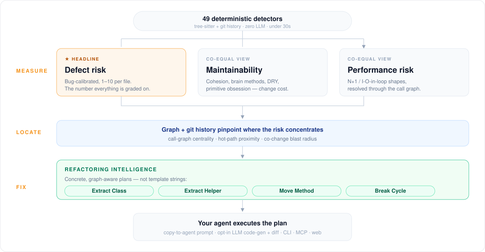

# Code Health

Repowise scores every file in your repo from 1 to 10 on three signals: **defect
risk**, **maintainability**, and **performance risk**. The score is computed by
static analysis over tree-sitter ASTs and git history, with **no LLM calls and
no cloud requirement**, and the defect signal's weights are calibrated against a
real bug corpus rather than hand-tuned.

<div align="center">

</div>

The loop is **measure → locate → fix**: score every file, use the dependency
graph and git history to find where risk concentrates, then emit a concrete
refactoring plan an agent can execute.

**Linters check patterns. This predicts risk.** A linter flags a line matching a
known-bad shape. The health score estimates which files are likely to harbor the
next bug, ranks them, and has been validated forward in time against real defect
history. It uses signals a linter has no access to — churn, ownership,
co-change, blast radius, hotspots — and even its one linter-adjacent pillar
(performance) follows the call graph *across* files, which a file-local linter
cannot do.

## Quick start

```bash
repowise init          # full index, populates health tables
repowise health        # KPIs + 20 worst-scoring files + top findings
repowise update        # re-score only changed files on each subsequent run
```

Open `http://localhost:7777/repos/<id>/health` for the dashboard once
`repowise serve` is running.

## How a marker is actually computed

Every marker is a deterministic function of the parse tree, the dependency
graph, and git metadata. Two worked examples, one simple and one that shows why
this is not a linter.

**`nested_complexity` — pure AST.** tree-sitter parses the file into a syntax
tree. A walker descends it tracking control-flow depth, incrementing on each
`if` / `for` / `while` / `try` / `switch` node. If any function reaches depth 4
or more, the marker fires, and severity scales with the depth it reached. No
heuristics about intent, no model, no sampling. The same commit produces the
same finding forever.

**`io_in_loop` — AST plus call graph.** The walker finds a call inside a loop
body and resolves the callee through the same resolver the dependency graph
uses. The resolved target is classified against an I/O-boundary lexicon into
`db` / `network` / `filesystem` / `subprocess` / `lock`, and the marker fires
only on an actual round-trip (a `.execute`, an awaited HTTP call, a
`subprocess.run`) — never on a query-builder chain or a same-named pure helper.

The part a linter cannot reach: **the loop and the I/O call do not have to be in
the same function.** If the sink is not local, Repowise walks the resolved call
graph backwards up to three hops and reports the finding with its full
`caller → … → sink` path attached. clippy, ruff's `PERF` rules, ESLint and
golangci-lint all analyze one function at a time, so a loop in one file whose
database call lives in another is structurally invisible to them.

**Why deterministic is a feature, not a limitation.** The score is reproducible,
diffable between commits, and safe to gate CI on. It is also the precondition
for everything in the validation sections below: a score that returns a
different number each time it runs cannot be calibrated against a defect corpus
at all. An LLM asked to rate the same file twice gives two answers, and neither
can be checked against what actually broke.

The full analysis is budgeted to finish in **under 30 seconds on a 3,000-file
repo** — enforced by a CI test
(`tests/integration/test_health_perf_benchmark.py`), including a variant with a
per-line blame index built for every file.

## The markers, and what each is allowed to do

Repowise ships **49 registered detectors (52 marker ids)**, but only **26 are
permitted to move the headline number**. That restriction is deliberate: the
defect score carries published accuracy claims, so only markers that earned
their weight against a bug corpus may affect it.

| Tier | Markers | What it may do |
|---|---:|---|
| **Defect-scoring** | **26** | Calibrated weights; moves the 1-10 score |
| **Performance** | **20** | Own pillar, own cap; never touches the defect score |
| **Maintainability-only (SQL)** | **3** | Maintainability only |
| **Governance** | **3** | Surfaces as a finding; never deducts |

Nothing is inert, but "doesn't move the number" means three different things:

- **Floored (8 markers).** `developer_congestion`, `low_cohesion`,
  `brain_method`, `bumpy_road`, `primitive_obsession`, `dry_violation` and
  `error_handling` at ×0.5; `knowledge_loss` at ×0.4. These fire widely and
  matter for readability, but proved weak defect predictors under leakage-free
  calibration, so they were demoted rather than deleted — and most of them earn
  **full weight in maintainability**, where they belong.
- **Advisory (19 of the 20 performance markers).** Sub-1.0 weights inside a
  category capped at 2.0. Only `io_in_loop` carries full weight.
- **Non-scoring (3 governance markers).** `ungoverned_hotspot`,
  `stale_governance` and `contradictory_decision` are written by an additive
  pass that runs *after* scoring completes, so they surface in `get_risk`,
  `get_context` and `CLAUDE.md` without ever deducting.

### Markers that count toward two signals

Maintainability is not a separate detector set. It is a **second weighting of
the same evidence**, with its own category table and its own caps.

| Markers | In defect | In maintainability |
|---|---|---|
| `low_cohesion`, `brain_method`, `primitive_obsession`, `dry_violation`, `error_handling` | ×0.5 (floored — weak bug predictors) | **×1.0 (full weight)** |
| `god_class`, `large_method`, `nested_complexity` | ×1.13 / ×1.25 / ×1.34 (calibrated) | **×1.0** |
| `sql_high_complexity`, `sql_select_star`, `sql_update_delete_without_where` | — | ×0.7 |

So **11 markers feed maintainability: the 8 shared above plus the 3 SQL-only
ones.** The first group is the design in miniature — a smell that doesn't
predict bugs gets demoted in the pillar that claims to predict bugs, and paid in
full in the pillar that claims to measure how hard code is to work with.

One display nuance: scoring membership and a finding's displayed "home" pillar
are different. `god_class`, `large_method` and `nested_complexity` score in both
pillars but display as defect findings, so a pillar-filtered view shows 8
maintainability findings while 11 markers actually feed the number.

The complete marker roster, per-marker definitions, and the full weight tables
live in
[`docs/architecture/code-health.md`](../architecture/code-health.md#5-the-markers-and-their-categories).

## The score

Each file starts at 10.0 and marker findings deduct from it. Deductions are
capped per category, so no single category can dominate:

| Category | Cap |
|---|---|
| Organizational | −3.5 |
| Structural complexity | −2.5 |
| Test coverage | −2.0 |
| Test coverage gradient | −2.0 |
| Size & complexity | −1.5 |
| Duplication | −1.0 |
| Test quality | −0.5 |
| Error handling | −0.5 |

When a category exceeds its cap, every finding in it is **scaled proportionally**
rather than truncated, so each finding's reported impact stays linear and
attributable — you can always explain exactly why a file scored what it scored.
The final score is clamped to `[1.0, 10.0]`.

Three repo-level KPIs: **Hotspot Health** (NLOC-weighted average over files the
git layer classifies as hotspots), **Average Health** (NLOC-weighted over all
files), and **Worst Performer**.

### Bands

| Band | Score | Meaning |
|---|---|---|
| **Healthy** | `≥ 8.0` | Low-risk, maintainable |
| **Warning** | `4.0 – 8.0` | Rising complexity or process risk |
| **Alert** | `< 4.0` | High-risk; concentrates defects |

The cutoffs are empirical, not arbitrary. On the 2,770-file measured corpus,
Alert files carry **16.9× the per-file defect rate of Healthy files**
(95% CI 8.6–29.0), and **2.18×** the defects-per-KLOC once file size is
normalized out (95% CI 1.00–3.58). Both numbers belong together: the raw ratio
is the headline, and the size-normalized one is the proof it is not simply an
artifact of large files being large.

The bands are defined once in core (`analysis/health/grading.py`) and mirrored
in `@repowise-dev/types`, with a parity test on each side.

## How the weights were calibrated

This is the part that separates "we wrote some heuristics" from "we measured
which heuristics predict bugs."

**The protocol.** Every file is scored at a commit that *precedes* the bug
window (T0), in a detached git worktree whose history stops there. Defect labels
are then collected from the following six months. Nothing after the scoring
commit can reach the score. An L2-regularized logistic regression with **NLOC as
an explicit control** fits each marker's defect lift *beyond file size*, with
leave-one-repo-out cross-validation for generalization. Only the learned
constants ship; the runtime stays fully deterministic.

**The trap that makes this hard.** Leakage here is two-sided, and both sides are
silent failures:

- Score at HEAD and the bug-fix commits themselves *manufacture* the churn,
  co-change and congestion that the process markers then "detect." The score
  looks excellent and means nothing.
- Score naively at T0 and every recency-windowed marker silently stops firing,
  because a worktree six months in the past sees an empty "last 90 days."

Getting both right requires anchoring the recency windows to the worktree's own
HEAD rather than wall-clock time. The evidence that this is load-bearing rather
than ceremonial: `developer_congestion` shipped at weight **1.5** under HEAD
scoring, and came back at coefficient **−0.08** under correct T0 scoring. It is
now floored to 0.5. A shipped constant was wrong by a factor of three, and only
the leakage-free protocol revealed it.

**What calibration rejected.** The markers listed as floored above are there
because the corpus said so. Candidate signals were also tested and formally
declared equivalent-to-null using bootstrap TOST equivalence testing rather than
a mere failure to reach significance: graph centrality (PageRank), code
naturalness, change bursts, and error-handling density all came back flat. Whole
experiments were run and refuted — size-relative scoring (lifts small files but
costs 0.07–0.12 AUC overall), function-level prediction (Popt at or below random
effort-ordering), and recalibrating on SZZ labels (*lower* out-of-fold AUC than
the shipped weights, so the shipped weights were kept).

Full methodology, per-marker coefficients and the rejected-candidate tables:
[repowise-bench/health-defect](https://github.com/repowise-dev/repowise-bench/tree/master/health-defect).

## Does the score find the bugs?

### On your repo, at index time

After an index, Repowise checks the score against your repo's own history and
prints a one-line callout:

```
Does the score find the bugs? 16/20 lowest-health files had a bug fix in the
last 6 months, 3.3x the 24% baseline (80% vs 24%).
```

It ranks every file by score, takes the 20 lowest, and counts how many a `fix:`
commit touched in the trailing ~180 days, contrasted against the repo-wide base
rate. Agents can read the same stat over MCP with
`get_health(include=["accuracy"])`, so a coding agent can confirm the score is
trustworthy on *this* repo before acting on it.

It stays silent on repos with too little history to be honest (fewer than 25
scored files, or fewer than 5 recently-fixed files). One caveat it discloses:
`prior_defect` is itself one down-weighted input to the score, so this is an
association on indexed history, **not** a leakage-free forward prediction. That
is what the next section is for.

### Across projects, leakage-free

Every file graded at a commit preceding the bug window, then checked against
what actually broke. **21 repositories, 9 languages, 2,826 files, 379
defect-bearing.**

| Result | Value |
|---|---|
| Cross-project mean ROC AUC | **0.737** (95% CI 0.683–0.787) |
| Held-out (PROMISE / jEdit 4.0, 4.1) | **0.761** and **0.776** |
| vs. recent churn | **+0.100 AUC** (DeLong p = 5e-10) |
| vs. prior-defect history | **+0.117 AUC** (DeLong p = 3e-15) |
| Per-repo range | 0.55 (axios) to **0.86** (zod) |

ROC AUC measures how often the score ranks a known-buggy file worse than a clean
one: 0.5 is a coin flip, 1.0 is perfect. The **jEdit result is the important
one** — it is a public academic defect dataset that played no part in
calibration, scored from a single commit snapshot with no git history available,
so only the structural markers could fire. That is the main evidence the signal
is not overfit to our corpus.

Confidence intervals come from a two-stage repo-cluster bootstrap (2,000 seeded
replicates, resampling repositories then files within them), because the unit of
generalization is the repository, not the file.

### The limits, stated plainly

These are published because a validation section that only contains wins is not
a validation section.

- **The score does not beat raw file size on discrimination.** LOC-only scores
  AUC 0.742 against our 0.737 (ΔAUC −0.001, p = 0.92). Where it wins decisively
  is effort-aware ranking: **ΔPopt +0.134 (95% CI +0.080 to +0.198)**. Same
  discrimination as counting lines, far better at ordering a fixed review
  budget — and unlike a line count, it tells you *why* a file is risky.
- **Within a size band, most of the signal disappears.** Holding file size
  fixed, within-band AUC is 0.525 / 0.572 / 0.593 / 0.718 across NLOC quartiles.
  The two smallest quartiles straddle 0.5. Discrimination survives cleanly only
  in the largest quartile.
- **That last finding is a real absence, not a measurement artifact.** A
  purpose-built positive control injected a synthetic size-orthogonal signal of
  the headline magnitude into the same corpus, band membership and clustering,
  and recovered it with power 0.998–1.000 in exactly the quartiles where the
  real signal vanishes. So the collapse is a property of the score, not of the
  sample size.
- **A prior-defects baseline still beats us on effort-aware ranking.**
  ΔPopt −0.085 (95% CI −0.141 to −0.035). "Re-inspect whatever broke before" is
  a hard heuristic to beat per line reviewed. Our edge is discrimination plus an
  attributable explanation, not raw bugs-found-per-LOC.

## Head to head against CodeScene

CodeScene is the closest commercial product and the only other vendor in this
category with a published empirical defect study. Both tools scored the **same
2,770 files at the same leakage-free commit against the same labels**, through
the same estimator, with paired tests resampling the same repositories for both.

| Paired test | Repowise | CodeScene | p |
|---|---:|---:|---|
| Recall @ 20%-of-lines review budget | **0.173** | 0.074 | **0.003** |
| Effort-aware ranking (Popt) | **0.607** | 0.462 | **0.003** |
| Defect density, size-normalized | **2.18×** | 0.56× | **0.003** |
| Discrimination (ROC AUC) | 0.731 | 0.705 | 0.054 — *not significant* |
| Defect density, raw | 16.9× | 14.2× | 0.65 — *not significant* |
| Precision @ 20%-of-lines budget | 0.580 | **0.636** | 0.64 — *a tie* |
| Beyond file size (partial ρ) | −0.148 | −0.137 | *both beat size — a tie* |

Ranking by Repowise health surfaces **2.3× the defects under a fixed review
budget**. Three of seven axes are significant wins; the rest are honest ties or
losses:

- **AUC is not a win.** p = 0.054 is above 0.05. The correct statement is "at
  least as good, consistent small edge," not "significantly better."
- **CodeScene's precision lead is a real design choice.** It flags **27** Alert
  files where we flag **132**. That is a deliberately more conservative
  operating point: a short list a team will actually work through, traded
  against recall. If you want a handful of files to fix this quarter rather than
  the ranking that catches the most defects, that operating point is better, and
  it is not a calibration flaw.
- **We could not replicate their business-impact result.** CodeScene's "Code
  Red" study reports a Pearson correlation of −0.58 between Code Health and
  issue-resolution time on proprietary Jira data. On open GitHub data we
  measured **−0.09 (95% CI −0.19 to +0.14)**, and six queue-independent effort
  signals (commit span, review rounds, changes-requested, and others) all came
  back flat with every interval spanning zero. The likely reason is structural —
  GitHub merge time measures maintainer review-queue availability, not change
  difficulty — but the honest summary is that **the business-impact axis remains
  CodeScene's, unreplicated on open data.**

Reports:
[BENCHMARK_REPORT.md](https://github.com/repowise-dev/repowise-bench/blob/master/health-defect/BENCHMARK_REPORT.md) ·
[COMPARISON_REPORT.md](https://github.com/repowise-dev/repowise-bench/blob/master/health-defect/COMPARISON_REPORT.md)

## Three health signals: defect risk, maintainability, and performance

The three signals are computed from the same marker stream by one shared scoring
kernel against independent weight, category and cap tables. They are co-equal
views, **never blended into a single number**.

**Defect risk** is the calibrated headline: the number on the dashboard ring,
the band, the badge, and every accuracy claim above.

**Maintainability** exists because not every smell predicts bugs. The markers
the defect calibration floored are real problems about how hard code is to read
and change; floored inside a defect-framed score they do two unhelpful things at
once — nudge a calibrated number with noise, and get no credit for the problem
they actually describe. Maintainability weights are expert-set, tuned only
against their own category budget, never against the defect corpus.

**Performance risk** flags code whose *structure* wastes work — redundant I/O,
quadratic accumulation, contention — rather than measured runtime. It is
deliberately high-precision and low-recall.

The headline stays exactly the defect score, byte-for-byte, locked by a golden
test against the pre-split implementation. Blending would require a written
rationale and a recalibration corpus, because the band cutoffs, the 16.9×
separation and every AUC figure above are claims about the defect pillar
specifically.

Every finding carries a `dimension` naming its pillar, and all three surface
identically: `summary.*_average` on the REST overview, `kpis.*` on MCP
`get_health`, per-file scores on every metric row, and a line each in `CLAUDE.md`
and `repowise status`.

## Performance risk

The pillar's core is **`io_in_loop`** — a database call, network request,
filesystem read or subprocess spawn executed once per loop iteration, the
classic N+1 — resolved through a shared I/O-boundary classifier and traced
across function boundaries as described above. Around it sit detectors for
quadratic string building, blocking calls inside `async` functions, connection
churn, lock contention, serial awaits that could fan out, membership tests
against lists, and language-specific shapes.

Two markers use call-graph centrality as a *precision gate* rather than a sort
key, firing only in hot functions (top-quintile in-degree, or in a churny
hotspot file), which keeps a noisy shape reviewable.

**Standard linters do not find this class of problem.** On a 12,600-file
benchmark, clippy, ruff, ESLint and golangci-lint together found **0** of the
cross-function I/O-in-loop cases; Repowise surfaced 557 findings of which ~87
span function boundaries, and 95%+ fell in categories ruff has no rule for.
Findings are ordered by impact rather than raw count (**NDCG 0.755** against
0.292 for severity-only ranking).

**Languages.** Performance analysis ships as a self-contained dialect plugin per
language — 11 dialects covering 16 language tags, including Python,
TypeScript/JavaScript, Java, Go, C#, Rust, Kotlin, Scala, Ruby, C++ and Dart. A
language without a dialect emits no findings, never a wrong one.

**Verified findings.** Two advisory markers (`serial_await_in_loop`,
`nested_loop_quadratic`) can be *promoted* when a def/use dataflow pass proves
the loop iterations are independent. A promoted finding asserts its fix instead
of hedging and carries `dataflow_verified: true`. The check is conservative —
anything it cannot prove stays advisory — and it changes the wording, not the
score.

**Soundness limits, by design.** Performance is a static signal, so it
under-reports rather than over-reports. Dynamic dispatch, monkeypatching and
callbacks-as-values produce no call edge and are invisible; ORM lazy-load N+1
fires on attribute access with no visible call and is explicitly out of scope;
chains beyond three hops are not followed; an unmodelled library has no
classified sinks. We call this performance **risk**, never measured performance,
and it never folds into the defect score.

One honest caveat about actionability: `io_in_loop` reports a per-iteration
round-trip, it does not claim the work is avoidable. Database and network
findings are usually batchable; filesystem ones often are not, since deleting N
files genuinely needs N unlinks. The finding still tells you where the time
goes.

Methodology and raw data:
[perf-detection](https://github.com/repowise-dev/repowise-bench/tree/master/perf-detection).

### Product flow

The web Code Health page has a dedicated **Performance** tab. It leads with a
bounded list of causal opportunities rather than a flat wall of observations:
the boundary and execution context, shared intervention, affected call-site and
file totals, confidence, and resolution provenance. Production/tooling and test
contexts are separate views. Expanding an opportunity shows caller-to-sink
paths; raw findings remain canonical and load as a separately paged evidence
drill-down.

When the deterministic service can describe a safe intervention, the
opportunity links by its exact stable `opportunity_id` to the matching
`performance_fix` plan on the existing **Refactoring** page. It never guesses a
nearby plan. When no safe plan exists, Code Health says so and keeps the raw
evidence available.

## Refactoring targets

```bash
repowise health --refactoring-targets
```

A score tells you a file is in trouble; a refactoring target names the fix.
Repowise emits structured suggestions computed deterministically during the
health pass from data it already has — the call graph, the cohesion model, the
clone pairs, git co-change. No re-parse, no LLM, inside the same budget. Seven
detectors ship:

| Type | What it names |
|---|---|
| **Extract Class** | The cohesion groups an incohesive class should split into — exact methods and fields per group |
| **Extract Method** | A behavior-preserving extraction, with the IN/OUT signature inferred from reaching-definitions and liveness analysis |
| **Extract Helper** | A clone's exact occurrences and where the shared helper should live |
| **Move Method** | A feature-envy method and the class it actually belongs to |
| **Break Cycle** | The minimal set of import edges to invert to break a dependency cycle |
| **Split File** | The cohesive files an oversized module should decompose into, plus the import edits in every dependent |
| **Performance Fix** | A proven shared intervention for a causal performance opportunity, with affected call sites and caller-to-sink paths |

Each suggestion is structured data, not a string: a `plan`, the `evidence` that
justifies it, the `impact_delta` it recovers, an `effort_bucket`, and a
`blast_radius` of callers and co-changing files that must move with it. Ranking
is graph-aware. The canonical recommendation service separates benefit and
leverage from cost and risk; a larger blast radius raises cost and risk and is
never presented as benefit. Performance plans retain detector-native benefit
even though they intentionally recover zero defect-health points.

```python
get_health(include=["refactoring"])           # ranked structured plans
get_health(targets=["src/api/server.py"])     # one file in detail
```

Full reference: **[REFACTORING.md](REFACTORING.md)**.

## Trends and coverage

Every health run writes a snapshot (rolling 50 per repo) storing both repo KPIs
and a per-file score map, which powers two repo-level alerts — **Declining
Health** and **Predicted Decline** — and a per-file score trajectory with a
delta and declining flag. Trends stay silent on thin history rather than showing
a misleading single point.

```bash
repowise health --trend
```

Coverage reports light up the test-coverage markers. **LCOV**, **Cobertura**,
**Clover** and a normalized JSON format are auto-detected:

```bash
pytest --cov --cov-report=lcov:coverage.lcov
repowise coverage add coverage.lcov
repowise health
```

## Configuration

Per-file overrides live in `.repowise/health-rules.json`:

```json
{
  "profile": "small-team",
  "disabled_biomarkers": ["primitive_obsession"],
  "severity_overrides": { "complex_method": "low" },
  "rules": [
    { "path": "tests/**/*.py", "disabled_biomarkers": ["large_method"] }
  ]
}
```

`path` is a gitignore-semantics glob over the repo-relative path. The
`small-team` profile demotes the process and people signals a 1-3 person repo
cannot support; an explicit `severity_overrides` key always wins over it.

**Only the severity label is tunable.** The per-marker weight multipliers and
the category caps are the calibrated constants the published accuracy numbers
rest on, and they are deliberately not overridable — so a team's local policy can
never silently change what those numbers mean.

## Incremental updates

`repowise update` re-scores only changed files. Findings and metrics for
unchanged files stay put; no nightly full re-index.

## Comparison

The honest dividing line: each tool below has a rules engine and a definitional
rating. Repowise predicts which files harbor the next bug and validates that
forward in time against a labeled corpus.

| Capability | Repowise | CodeScene | SonarQube | Qlty¹ | Codacy |
|---|---|---|---|---|---|
| Per-file health score | ✅ 1-10 | ✅ 1-10 | ⚠️ A-E from rule counts | ✅ A-F | ✅ A-F |
| Score uses git / behavioral signals | ✅ | ✅ its core | ❌ static rules only | ⚠️ churn vs complexity | ❌ |
| Cross-file / call-graph analysis | ✅ interprocedural | ⚠️ git temporal coupling | ⚠️ taint, security only | ❌ file-local | ❌ file-local |
| Defect-validated against a bug corpus | ✅ AUC 0.737, held-out 0.76-0.78 | ⚠️ "Code Red" study, no per-file AUC | ❌ | ❌ | ❌ |
| Static performance risk across the call graph | ✅ | ❌ | ❌ | ❌ | ❌ |
| Test-coverage ingestion | ✅ | ✅ | ⚠️ imports reports | ✅ | ✅ |
| Cross-file refactoring plans | ✅ + opt-in codegen | ⚠️ 5 in-function smells | ❌ | ❌ | ❌ |
| Trend tracking + declining alerts | ✅ | ✅ | ✅ quality gates | ✅ | ✅ |
| MCP / agent integration | ✅ | ✅ | ✅ | ❌ | ✅ |
| Security scanning | ⚠️ separate layer | ⚠️ secondary | ✅ strong | ❌ | ✅ full suite |
| License | ✅ AGPL-3.0 | ⚠️ proprietary, on-prem Docker | ⚠️ Community free, paid by LOC | ⚠️ free OSS, paid teams | ⚠️ free OSS, paid per dev |

¹ Code Climate Quality was spun out as Qlty Software in November 2024.

**What each does that we do not.** **SonarQube** has the broadest security
scanning, the widest language coverage, and the most adopted merge-gate model.
**CodeScene** is the most mature behavioral-analysis product — knowledge maps,
off-boarding simulation, 28+ languages — and holds the only published business-
impact study in this group, which we could not replicate on open data.
**Qlty** defined the churn-vs-complexity quadrant. **Codacy** has the widest
security suite of the four and polished PR automation.

## See also

- [`docs/architecture/code-health.md`](../architecture/code-health.md): internals,
  the full marker roster, and the complete weight tables.
- [`docs/BENCHMARKS.md`](../BENCHMARKS.md): every published number with its
  sample size and test.
- [REFACTORING.md](REFACTORING.md) · [TEST_INTELLIGENCE.md](TEST_INTELLIGENCE.md) ·
  [BUG_HISTORY.md](BUG_HISTORY.md)
