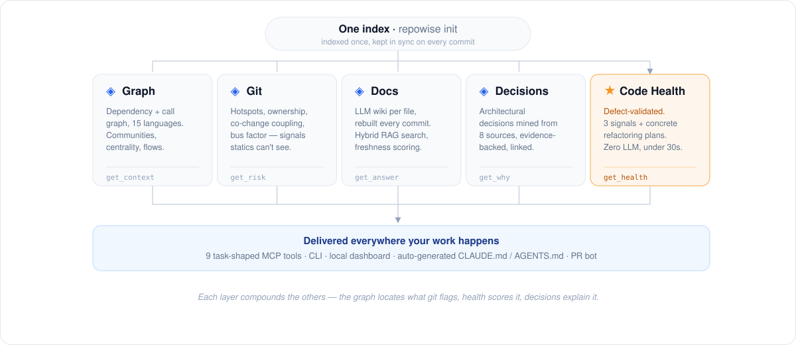

# The Intelligence Layers

repowise indexes your codebase **once**, builds five foundational layers, then
keeps them in sync on every commit. Four further layers are derived from those
five. This document is the deep dive; the README gives the one-paragraph version
of each and links here for the detail.

<div align="center">

</div>

The layers compound. The graph locates what git flags, code health scores it,
decisions explain why it is shaped that way, and the docs make all of it
searchable in natural language.

**Foundational**

1. [Graph Intelligence](#graph-intelligence)
2. [Git Intelligence](#git-intelligence)
3. [Documentation Intelligence](#documentation-intelligence)
4. [Decision Intelligence](#decision-intelligence)
5. [Code Health Intelligence](#code-health-intelligence)

**Derived**: built on the five, each with its own reference page

6. [Change Risk](#change-risk) · [Test Intelligence](#test-intelligence) ·
   [Bug History](#bug-history) · [Security](#security) ·
   [Dead Code](#dead-code-detection)

**Cross-cutting**

- [Proactive context enrichment: hooks](#proactive-context-enrichment-hooks)
- [Auto-sync](#auto-sync-five-ways-to-stay-current)
- [Auto-generated CLAUDE.md](#auto-generated-claudemd)

Everything below is computed **without model calls**, with two named exceptions,
both optional and both skipped entirely on a keyless index: prose quality in the
docs layer, and comment archaeology in the decision layer. Neither is a
requirement for the index.

---

## Graph Intelligence

tree-sitter parses your source into a **two-tier dependency graph**: file nodes
and symbol nodes (functions, classes, methods). 19 languages parse to a full
AST; see [`LANGUAGE_SUPPORT.md`](LANGUAGE_SUPPORT.md) for per-language tiers.

A **confidence-scored call resolver** handles import aliases, barrel
re-exports and namespace imports. Every `calls` edge is stamped with one of 29
named resolution origins (`ResolutionOrigin` in `ingestion/models.py`), each
carrying a fixed confidence from 0.95 (`same_file`) down to 0.50
(`global_unique`, a repo-wide name match, labelled as the guess it is). That
includes per-language tiers for Go packages, JVM same-package and C++
same-target, and twelve receiver-typing origins that resolve a call on a
variable by reading the variable's declaration (Java, C#, Python, Go, Kotlin,
Swift). Heritage extraction covers `extends`, `implements` and trait impls.

- **A closed edge vocabulary** keeps inference from reading as fact. A
  `calls` edge means the parser saw a call; `references` means something only
  holds a handle to the function; `dispatches_to` names an implementation that
  *could* answer for a base method; `framework_binds` is wiring a framework
  performs and no parser could have seen. Consumers read the derived edge sets
  rather than re-deriving their own filter.
- **An execution flow says why it stopped**, from a six-value vocabulary: a real
  end, a cycle, an exhausted hop budget, an all-excluded successor set, a
  confidence-filtered one, or calls that failed to resolve. A trace that simply
  ends is the one thing it never reports.
- **Leiden community detection** (Louvain fallback) finds logical modules even
  when your directory structure doesn't reflect them.
- **PageRank, betweenness centrality, SCC analysis, and execution-flow tracing**
  from entry points identify your most central, most coupled, and most traversed
  code.
- **Framework-aware edges** connect routes to handlers across 22 framework
  detectors, including Django, FastAPI, Flask, ASP.NET, Spring, Micronaut,
  Quarkus, Jakarta, Express/NestJS, Next.js App Router, Remix, tRPC, Hono,
  Gin/Echo/Chi, Axum/Actix/Rocket, Rails, Laravel, TYPO3, Flutter and the
  pytest/gtest test runners.

Full detail, including the resolution-origin table, receiver typing worked
through, and what each edge type does and does not claim:
[`GRAPH.md`](GRAPH.md). Every derived metric is defined in
[`COMPUTED_GLOSSARY.md`](../reference/COMPUTED_GLOSSARY.md).

---

## Git Intelligence

repowise mines your git history to produce signals no static analysis can find.

**Hotspots**: files in the top quartile of *decayed* churn (exponential
half-life, so last month outweighs last year) that also clear minimum-activity
floors, at least 3 commits in 90 days and a meaningful temporal score. Churn
alone would flag every file a bulk refactor touched; the floors keep the list
about sustained activity. Surfaced by `get_risk()` before your agent edits.

**Ownership**: `git blame` aggregated into per-author percentages. Know who to
ping, and where knowledge silos are.

**Co-change pairs**: files that change together in the same commit *without* an
import link. Hidden coupling AST parsing cannot detect. `get_context()` surfaces
co-change partners alongside direct dependencies.

**Bus factor**: how many authors it takes to cover 80% of a file's commits. A
bus factor of 1 is the classic single-owner risk, surfaced in `CLAUDE.md`.

**Significant commits**: up to 50 meaningful commit messages per file, merges,
dependency bumps, lint-only and bot commits filtered out, with the commit body
retained when it carries decision intent. These feed generation prompts, so the
wiki can explain *why* code is structured the way it is.

**Contributor profiles**: every author gets a page, modules they own, top
files, co-authors, commit category mix, silo modules, bus-factor risk files, and
dead-code burden.

**Module health**: a 0–100 composite per top-level module from silo penalty,
hotspot density, dead-code percentage, average churn, doc coverage and median
bus factor.

**Reviewer suggestions**: paste a PR file list into Blast Radius for a ranked
reviewer list, scored by direct authorship (×1.0), co-change partners (×0.5) and
recency (×0.4), capped at the 5 strongest co-change signals per file.

---

## Documentation Intelligence

A wiki for every module and file, rebuilt **incrementally** on every commit.
Deterministic templates render it with no model calls; supplying an LLM key
upgrades the prose rather than enabling the layer.

- **Coverage tracking**: what's documented and what isn't.
- **Freshness scoring** per page, relative to the underlying code.
- **Semantic search via RAG**: hybrid retrieval merging full-text and vector
  results through Reciprocal Rank Fusion, with PageRank bias and a 1–2 hop graph
  expansion that walks the imports and projected-calls graph for flow-shaped
  questions.

A typical single-commit update regenerates only the handful of pages your change
actually touched.

Reference: [`WIKI.md`](WIKI.md).

---

## Decision Intelligence

Architectural decisions mined at index time from **five sources**: ADR files
(Nygard/MADR), PR and squash-commit bodies, inline markers, git archaeology, and
centrality-bounded code comments. Two further capture paths exist for humans and
agents: `repowise decision add`, and mining your Claude Code or Codex session
transcripts. **Seven sources in total, six of them deterministic**; comment
archaeology is the one that reads prose with a model, and it is skipped on a
keyless index. Three further sources were retired for producing records nobody
ever acted on, which [`DECISIONS.md`](DECISIONS.md) names.

```python
# WHY: JWT chosen over sessions — API must be stateless for k8s horizontal scaling
# DECISION: All external API calls wrapped in CircuitBreaker after payment provider outages
# TRADEOFF: Accepted eventual consistency in preferences for write throughput
```

Every decision is **evidence-backed**: each rationale traces to a verbatim source
span, and an anti-hallucination substring gate stamps it **exact**, **fuzzy** or
**unverified**. Corroborating sources raise confidence rather than overwrite each
other.

**On lineage, precisely.** Decisions have a typed-edge schema
(`supersedes` / `refines` / `relates_to` / `conflicts_with`), but **no edges are
written today**. The only detector that produced them scoped conflicts by
similarity, which does not scope, so it is disabled and the edges it wrote were
removed. Lineage stays empty until a structural detector replaces it. What does
work: the diff-driven pass on `repowise update` marks decisions a new commit
reversed, and `repowise decision deprecate --superseded-by` records the successor
on the record itself. See [`DECISIONS.md`](DECISIONS.md).

These records surface everywhere your agent already looks: `get_why()` for the
archaeology, governing decisions in `get_context()`, a `governance_risk` flag in
`get_risk()` PR review, a Key Decisions section in `get_overview()`, and the
`ungoverned_hotspot` / `stale_governance` / `contradictory_decision` findings in
the code-health layer.

```bash
repowise decision add              # guided interactive capture
repowise decision confirm          # review auto-proposed decisions
repowise decision health           # stale, conflicting, ungoverned hotspots
```

The "why" usually walks out the door: when a teammate leaves, or when you reopen
your own repo six months later. This keeps it in the codebase.

---

## Code Health Intelligence

repowise scores **every file 1–10** on three co-equal signals (defect risk,
maintainability, and performance risk) from a roster of **49 deterministic
detectors**, of which only **26 are permitted to move the defect number**. Pure
static analysis over tree-sitter and git data, budgeted (and CI-tested) to
finish in **under 30 seconds on a 3,000-file repo**.

The defect weights are **calibrated offline against a real bug corpus, not
hand-tuned**: every file scored at a commit preceding the bug window (no
leakage), an L2-logistic fit with NLOC as an explicit control so a marker only
earns weight for defect lift *beyond* file size. Only the learned constants
ship; the runtime stays fully deterministic.

Validated leakage-free across **21 repositories, 9 languages, 2,826 files** at
mean ROC AUC **0.737**, and **0.76–0.78** on the public PROMISE/jEdit dataset
that played no part in calibration.

It does not stop at scoring; the layer closes the loop into concrete,
graph-aware refactoring plans an agent can execute: Extract Class, Extract
Method, Extract Helper, Move Method, Break Cycle and Split File, each with its
plan, recovered impact and blast radius.

```bash
repowise health                       # KPIs + lowest-scoring files
repowise health --refactoring-targets # ranked by impact / effort
repowise health --trend               # snapshots + declining-health alerts
```

Full guide, the calibration story and the head-to-head against CodeScene:
[`CODE_HEALTH.md`](CODE_HEALTH.md).

---

## Change Risk

A deterministic live-diff assessment for **a whole commit or `base..head`
range**, computed against the live checkout with no index lookup or model call.
Lead with the benchmarked `risk_percentile` and `classification`, which rank the
diff-shape score against sampled recent commits in the same repo. The supporting
0–10 score is calibrated at single-commit granularity and is not a probability.
Distinct from `get_risk()`, whose PR-blast value is an uncalibrated structural
heuristic over indexed files.

```bash
repowise risk HEAD
repowise risk main..feature-branch
```

Reference: [`CHANGE_RISK.md`](CHANGE_RISK.md).

---

## Test Intelligence

Which tests actually exercise the code you changed, which changed files have no
guarding test at all, and per-file coverage merged across every test that touches
it. Coverage ingests from LCOV, Cobertura, Clover or normalized JSON and feeds the
code-health coverage markers.

**It answers with or without that ingest.** Most repositories never produce a
report, so where one is missing the layer walks the call graph instead: a test
whose calls reach a file executes it, three hops by default, filtered to the call
edges the graph is confident in. Measured against a real
`coverage run --contexts=test`, that reaches **95.7% precision** on what covers a
file and **97.5% on the run list**. Rows are stamped `basis: "measured"` or
`basis: "inferred"`, the measured tier wins outright wherever it can answer, the
two are never averaged, and the inferred tier may never emit a percentage.

The practical payoff is `tests_to_run` in `get_risk()` PR mode: a real list rather
than a guess, so an agent runs the tests that can actually catch its change, on
repositories that have never configured coverage at all.

Reference: [`TEST_INTELLIGENCE.md`](TEST_INTELLIGENCE.md).

---

## Bug History

Bug-fix commits attributed back to the files and functions they repaired, giving
each file a fix count, a last-fixed age, and a "bug magnet" flag. This is why the
generated `CLAUDE.md` orders its *files that need care* by **bug-fix history
first, then churn**: a file that keeps breaking is a better warning than a file
that merely changes often.

Reference: [`BUG_HISTORY.md`](BUG_HISTORY.md).

---

## Security

A static security scan over the working tree **and the full history**, so a
finding carries the commit that introduced it and its author, not just a line
number. Findings are idempotent across re-scans and surface through
`repowise security`, the REST API and the dashboard.

---

## Dead code detection

Pure graph traversal and SQL. No model calls.

```
repowise dead-code

  23 findings · 4 safe to delete

  ✓ utils/legacy_parser.ts          file      1.00   safe to delete
  ✓ auth/session.ts                 file      0.92   safe to delete
  ✓ helpers/formatDate              export    0.71   safe to delete
  ✗ analytics/v1/tracker.ts         file      0.41   recent activity — review first
```

Conservative by design. `safe_to_delete` requires confidence ≥ 0.70 and excludes
14 dynamically-loaded naming patterns (`*Plugin`, `*Handler`, `*Adapter`,
`*Middleware`, `*Mixin`, `*Command`, `register_*`, `on_*`, `*_view`,
`*_endpoint`, `*_route`, `*_callback`, `*_signal`, `*_task`). Dynamic-import
detection and a per-language framework-convention registry further cut false
positives. repowise surfaces candidates; engineers decide.

Reference: [`DEAD_CODE.md`](DEAD_CODE.md).

---

## Proactive context enrichment: hooks

Most MCP tools are passive; the agent has to know to call them. repowise hooks
are active: they act on what the agent is already doing. No LLM calls, no
network, pure local SQLite queries. Installed automatically during
`repowise init`.

There is deliberately **no unconditional pre-search injection**. An earlier
version enriched every `Grep`/`Glob` before it ran and was removed: it added
noise on the majority of searches where the agent had already found what it
wanted. What ships now fires on evidence that the agent needs help:

- **Zero-result rescue**: a grep found nothing, so wiki full-text, fuzzy symbol
  and decision matches surface the closest real hit.
- **Flood digest and triage**: a search returning far too much is replaced with
  a compact per-file digest of match counts and anchor lines, plus the top files
  by PageRank.
- **Wrong-path rescue**: a failed `Read`/`Edit`/`Write` path is resolved against
  the index to the file you almost certainly meant.
- **Read skeleton**: an unbounded read of a large indexed file is served as its
  skeleton with 1-indexed ranges, once per file per session.
- **Stale-read notice**: a file was edited after this session read it earlier.
- **Decision injection**: editing a file with a governing decision surfaces it
  in one line.
- **Session start**: index freshness, the trust protocol, and standing
  decisions.
- **Post-commit staleness**: after a successful commit, merge, rebase,
  cherry-pick or pull, a notice if the wiki has drifted from HEAD.

Claude Code and Codex are both supported.

> **Related capability:** [Distill](../agent/DISTILL.md) reuses the index
> (symbol bounds, centrality, hotspots) to compress noisy command output and
> large reads before the agent sees them, built *on* the layers, not a layer.

---

## Auto-sync: five ways to stay current

| Method | Command | Best for |
|--------|---------|----------|
| **Post-commit hook** | `repowise hook install` | Set-and-forget local development |
| **File watcher** | `repowise watch` | Active development without committing |
| **GitHub webhook** | Configure in repo settings | Teams, CI/CD |
| **GitLab webhook** | Configure in project settings | Teams, CI/CD |
| **Polling fallback** | Automatic with `repowise serve` | Safety net for missed webhooks |

```bash
repowise hook install             # post-commit hook (current repo)
repowise hook install --workspace # all workspace repos
repowise watch                    # or use the file watcher
```

Updates are incremental: only the pages your change actually touched are
regenerated. Full guide: [`AUTO_SYNC.md`](../scale/AUTO_SYNC.md).

---

## Auto-generated CLAUDE.md

After every `repowise init` and `repowise update`, repowise regenerates your
`CLAUDE.md` from actual codebase intelligence, not a template. No LLM calls. An
`AGENTS.md` generator shares the same pipeline.

```bash
repowise generate-claude-md
```

The generated section includes: index freshness and a `_meta` explainer, how to
work in this repo, a **trust protocol** stating when a served result may be used
without re-reading, the MCP tool table, an architecture summary, key modules,
entry points, **files that need care** (ordered by bug-fix history, then churn),
code health across all three signals, standing architectural decisions, and your
build/test commands. A user-owned section at the top is never touched.

```markdown
<!-- REPOWISE:START — Do not edit below this line. Auto-generated by Repowise. -->
## Architecture
Monorepo with 4 packages. Entry points: api/server.ts, cli/index.ts.

## Files that need care (bug-fix history first, then churn)
- payments/processor.ts — 19 bug fixes, last fix 2 days ago (bug magnet); 23 commits/90d

## Standing decisions (ask get_why before diverging)
- JWT over sessions (auth/service.ts) — stateless required for k8s horizontal scaling
<!-- REPOWISE:END -->
```
