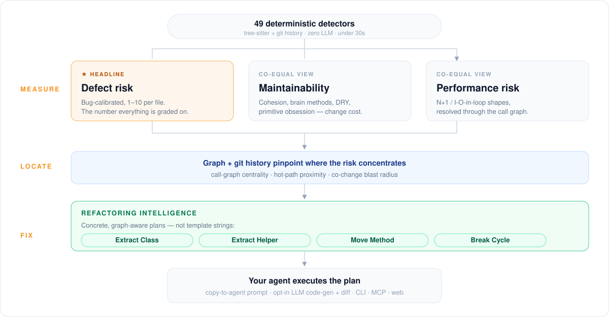

# Refactoring intelligence

A health score tells you a file is in trouble. Refactoring intelligence names the
fix: split this class into these groups, move this method to the class its calls
land in, cut this one import edge to break a cycle, lift these lines into a helper
with this signature. Each plan is structured data computed from the same graph,
class model and git history the health score uses.

Plans are built during the health pass of `repowise init` and `repowise update`.
They need no LLM key, no network and no re-parse. Turning a plan into actual code
is a separate, on-request step that does use an LLM
([Code generation](#code-generation)).

<div align="center">

</div>

## Plan types

| Type | What the plan names |
|------|---------------------|
| **Extract Class** | The cohesive groups (methods and fields) an incohesive or god class splits into. |
| **Extract Method** | A line span to lift out of a long or complex function, with the helper's parameters and return value. |
| **Extract Helper** | Every occurrence of a duplicated block and where the shared helper belongs. |
| **Move Method** | A method that uses another class more than its own, and the class it belongs in. |
| **Break Cycle** | The smallest set of import edges to invert to break a runtime dependency cycle. Advisory: see below. |
| **Split File** | The files an oversized module splits into, which symbols go where, and the import edits in each dependent. |
| **Performance Fix** | One shared change for a performance problem, with the affected call sites and caller-to-sink paths. |

Each detector reports nothing when a signal it needs is missing, so a gap means
"no suggestion", never a guessed one. Output is deterministic: the same commit
gives the same plans and the same ids.

## Quick start

```bash
repowise health --refactoring-targets                  # the stored queue, in serving order
repowise health --refactoring-targets --format json
repowise health --refactoring-targets --recompute      # analyze the working tree instead of the index
repowise health --refactoring-targets --generate-code 1   # code + diff for the top plan (LLM)
```

From an agent, through MCP:

```python
get_health(only=["fix_first"])                                      # refactorings ranked beside other fixes
get_health(include=["refactoring"], only=["refactoring_opportunities"], limit=6)
get_health(targets=["src/api/server.py"], include=["refactoring"])  # one file
get_health(opportunity_id="refop...")                               # one opportunity's steps
get_health(plan_id="refac...")                                      # one plan
```

In the dashboard, the **Refactoring** page lists every type on one board, with
filters for type, confidence and effort. A plan's drawer explains its rank, shows
the tests that reach the code and the command to run them, and can export the
structured plan for an agent. The page never edits code or runs tests on its own.

## Reading the results

A **plan** is one detector's output for one target. An **opportunity** is one
file's refactoring work: the finding it leads with, and its plans as ordered steps
that are safe to apply in sequence. Surfaces list opportunities; a step points to
its plan by `plan_id`.

| Field | What it tells you |
|-------|-------------------|
| `refactoring_type` | Which of the seven plan types this is. |
| `plan` | The concrete change: groups, span and signature, destination class, cut edges, or file split. |
| `evidence` | The measurements behind it, such as LCOM4, clone size, co-change count or modularity. |
| `confidence` | `low`, `medium` or `high`. A `high` Extract Method is mechanical enough to hand to an agent. |
| `effort_bucket` | `S`, `M`, `L` or `XL`, from the size of the target. |
| `blast_radius` | What else has to change: callers, importing files, co-change partners. Extract Method is `local`. |
| `impact_delta` | Health the plan would recover, in proportion to what it removes. `0` for Break Cycle, Split File and Performance Fix, which rank on their own evidence. |
| `source_biomarker` | The health finding the plan answers, such as `god_class` or `complex_method`. |

On an opportunity, each step carries `applicability`: `mechanical` (only
extractions qualify) or `judgment`, with the facts behind the call. When an
earlier step moves a symbol to another file, the later step carries
`relocated_by`: its stored location is where the symbol was before, so find it
again before applying.

Break Cycle is advisory. Its plan names edges to cut, not which symbols cross
them or how to move them, so an opportunity carries it as `evidence` rather than
as a numbered step: it never leads, and never reaches Fix first. The plan itself
stays in the plan list. Cycles are found over runtime imports only: an import
under `if TYPE_CHECKING:` or a TypeScript `import type` / `typeof import()` is
type-only, and an import inside a function body is deferred (it runs on first
call, the usual way to break a cycle on purpose). Neither closes a cycle. Only a
plain `TYPE_CHECKING` or `module.TYPE_CHECKING` condition counts; a negated or
aliased flag is read as a runtime import.

Every plan is counted once: the rollup's `plans_total` is the steps, plus
`evidence_total`, plus `unattached_plans_total` (plans in no opportunity, such as
a file whose only plan is a cycle). The plan list's `structural_total` leaves
Break Cycle out, matching the opportunities; `by_type` still counts it.

Names are never invented. A suggested helper or file name is `null` when nothing
in the code anchors one. A Split File or Extract Class plan with an unnamed group
says what to separate but not what the result is, so its applicability carries
`needs_design` and an opportunity holds it as `evidence` (or, when it is the
file's only plan, it is unattached), the same way as a cycle: it is not a step
and never reaches Fix first. Extract Class does not name its groups yet, so
every Extract Class plan is held this way. Both the plan list and the rollup
count these plans as `design_total`: `structural_total` minus `design_total` is
the structural plans the opportunities take as steps, and the CLI marks them
"needs design" under unattached observations.

Code only moves within a language family: TypeScript, JavaScript and the
single-file components that host them; C, C++, their headers and Objective-C;
C# with Razor; every other language on its own, so Java, Kotlin and Scala are
separate families and a move between them is not proposed. A Move Method target
or an Extract Helper site in another family is never proposed, even when the
call graph or the clone index paired the two files.

A plan's `target_symbol` names code, not an expression. A callback is named
after the dotted path of the call it is passed to (`it.each callback`,
`z.object.strict.superRefine callback`), without its arguments.

An empty list means no detector found work that clears its gates. It does not mean
the code needs no attention: check the findings in
[CODE_HEALTH.md](CODE_HEALTH.md).

### Scope and order

By default the open, repository-wide list shows only what
[Fix first](CODE_HEALTH.md#fix-first) would take: opportunities in shipped code
that recover real health and name a concrete edit, outside dead code and outside
functions a constant flag switches off. The response counts the rest and the
reasons they were held back. Ask for the full inventory with `scope=all`
(MCP: `refactoring_scope="all"`; dashboard: **Full inventory**). A call that names
a file, or a triaged status, gets the full inventory automatically.

Many top opportunities score the same. The default order (`diversified`)
round-robins over the lead finding, plan type and area so the first rows cover
distinct problems. `canonical` returns the plain rank order. Test files always rank
after production files.

## Code generation

Code generation is **on by default** but only runs when you ask for it, and it
needs an LLM API key. It never runs during indexing. Set
`refactoring.llm.enabled: false` to turn it off for the dashboard and MCP. The CLI
flag is itself an explicit request and does not read that setting.

You can ask from three places:

- CLI: `repowise health --refactoring-targets --generate-code <rank-or-symbol>`.
- Dashboard: the **Generate code** action on a plan, when the server runs on your
  machine with the checkout on disk.
- MCP: `generate_refactoring_code(suggestion_id=...)`. This tool is off the default
  MCP surface; add it with `mcp.tools: ["+generate_refactoring_code"]`.

Generation reads the plan's real source spans from the working tree, sends the
plan, the source and the graph and co-change context to your configured provider,
and returns refactored code with a unified diff. Where a check is cheap it runs
one: Extract Class compares LCOM4 before and after, Split File checks each new file
is under the size floor with no symbol duplicated, and Extract Method checks the
remaining function's complexity dropped. Results are cached by a hash of plan,
source and model, so an unchanged plan is not paid for twice. Nothing is applied
to your files.

It uses the repository's configured `provider` and `model`, or the first provider
whose API key is set. With generation disabled, the MCP tool returns the plan with
`generation.available: false` and the REST endpoint returns `403`. With no key, MCP
returns `error: "no_provider"`.

## Configuration

In `.repowise/config.yaml`:

```yaml
refactoring:
  enabled: true              # set false to skip the refactoring layer
  detectors:
    disabled: []             # e.g. [move_method, split_file]
  min_confidence: medium     # low | medium | high; unset keeps every plan
  llm:
    enabled: true            # code generation; set false to disable
```

Detector names are the snake-case plan types: `extract_class`, `extract_method`,
`extract_helper`, `move_method`, `break_cycle`, `split_file`, `performance_fix`.

Most plans answer a health finding, so per-path marker rules in
`.repowise/health-rules.json` also remove the plans for those findings. See
[CODE_HEALTH.md](CODE_HEALTH.md#configuration).

## Accuracy and limits

- Plans are suggestions for review. Nothing is applied automatically, and
  generated code comes back as a diff.
- Extract Method offers a span only when it can show the extraction keeps behavior
  (every returned value written on every path, no state carried across loop
  iterations). Spans it cannot prove are dropped, so it under-reports by design.
- Extract Method skips spans too small to matter and spans that would carry the
  original finding into the helper. A component whose branching is mostly in its
  markup gets no extraction.
- An Extract Method span must remove at least two decision points, hold at least
  8 code lines, cover at most 60% of the function's lines, and not start on the
  docstring. When the best span misses one of these, only a span that does not
  overlap it is offered, never a slightly smaller copy of it. Estimated gain
  never exceeds the share of decision points removed.
- An Extract Method span that awaits (Python `await`, `async with`, `async for`;
  TypeScript and JavaScript `await`, `for await`; Rust `.await`; C++ `co_await`)
  carries `needs_async: true`: the helper is async and its call is awaited. An
  await inside a nested function, closure or Rust `async` block does not count.
  When the function holding the span is not declared async (a C++ coroutine), the
  step is a judgment call with reason `async_helper_unexpressible`.
- Move Method never targets a class the method only instantiates, or an ancestor of
  its own class.
- Split File works on any language with call resolution and suggests a split only
  when the groups are clearly separable. Python and TypeScript splits usually need
  a re-export shim, flagged as `shim_required`.
- Plan quality follows graph quality. Where calls are not resolved for a language,
  Move Method and Split File have less to work with.
- Generated code depends on the model you configure. The self-checks catch some
  structural mistakes, not behavior changes; review and test the diff.
- There is no published accuracy benchmark for refactoring plans yet.

## Reference

- MCP: [`get_health`](../agent/MCP_TOOLS.md#get_health),
  [`generate_refactoring_code`](../agent/MCP_TOOLS.md#generate_refactoring_code).
- CLI flags on `repowise health`:

| Flag | Effect |
|------|--------|
| `--refactoring-targets` | Print the stored refactoring queue in the order MCP and the dashboard serve it. |
| `--recompute` | With `--refactoring-targets`: analyze the working tree in-process. Slow on large repos. |
| `--generate-code SELECTOR` | Generate code and a diff for one plan. `SELECTOR` is a 1-based rank or a symbol name. Needs an API key. |
| `--format json` | Machine-readable output. |

## See also

- [CODE_HEALTH.md](CODE_HEALTH.md): the findings and health signals plans are built on, and Fix first.
- [INTELLIGENCE_LAYERS.md](INTELLIGENCE_LAYERS.md): how code health fits the rest of the index.
- [architecture/refactoring.md](../architecture/refactoring.md): detector algorithms, ranking, plan ids and REST routes.
- [architecture/code-health.md](../architecture/code-health.md): health pipeline internals.
