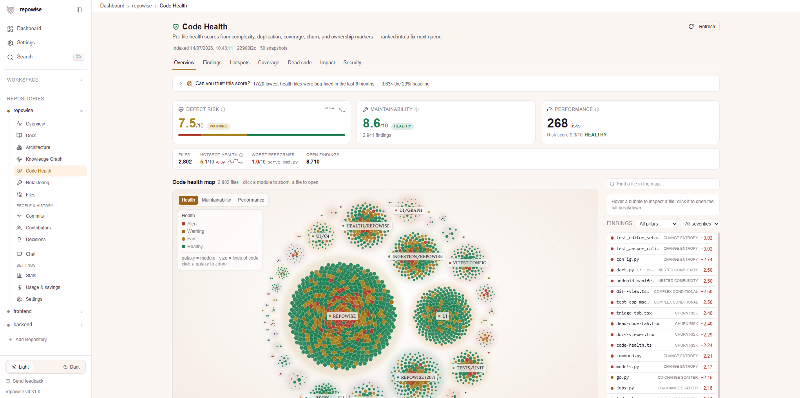

# The dashboard

`repowise serve` starts the API on `http://localhost:7337` and the local web
dashboard on `http://localhost:3000`. Both read the same `.repowise/wiki.db`
the CLI and MCP server read. Nothing leaves your machine, and no view calls an
LLM unless you click something that says it will (Chat, refactoring code
generation, doc regeneration).

```bash
repowise serve                       # API on :7337, dashboard on :3000
repowise serve --port 8080           # move the API
repowise serve --ui-port 3001        # move the dashboard
repowise serve --no-ui               # API only
```

The dashboard needs Node >= 20. Without it, `serve` falls back to API-only.

The URL shape is `/repos/<repo-id>/<view>`. Every view is directly linkable,
including tab state, so a link you paste in a PR lands on exactly what you were
looking at.

## Two modes, and what changes between them

Repowise can index a repo without generating a wiki (`repowise init
--index-only`, or the fast option in the setup wizard). Everything derived from
the AST, the dependency graph, and git history works in both modes. The views
that read generated pages are the difference:

| Needs a model or an embedder | Works on any indexed repo |
|---|---|
| Chat (needs a provider), semantic Search (needs an embedder) | Docs, Doc freshness, Present mode, Overview, Architecture, Knowledge Graph, Code Health, Refactoring, Files, Symbols, Commits, Contributors, Decisions, Stats, Usage, Settings, all Workspace views |

Every indexed repo has a wiki, including one indexed without a key, so the Docs
views are populated either way. What a keyless index lacks is model-written
prose and semantic search: the Docs view offers to upgrade pages with
`repowise generate`, and `repowise reindex` builds semantic search once an
embedder is configured. Either upgrade works in place, with no re-index from
scratch.

## Overview

`/repos/<id>/overview`

**Answers:** what is this repo, and what should I look at first?

The landing view. Repo KPIs (files, symbols, entry points, dead exports, health
averages), an attention panel that promotes whatever currently deserves it
(declining health, a stale doc set, an alert-band file), a decisions timeline,
quick actions, and a live banner while an index or generation job is running.
If a job is in flight, the progress and log stream here.

## Docs

`/repos/<id>/docs`

**Answers:** how does this system work, in prose someone can read?

<video src="https://raw.githubusercontent.com/repowise-dev/repowise/main/.github/assets/dashboard/docs-page.mp4" alt="Repowise docs reader: page tree on the left, generated wiki page with confidence and freshness badges in the center" autoplay loop muted playsinline width="100%"></video>

The generated wiki: a page tree on the left, the rendered page in the middle
with mermaid diagrams, code blocks that link into the file views, a confidence
badge, a freshness indicator, backlinks, and a regenerate action for a single
page. A command palette (`⌘K` / `Ctrl+K`) jumps between pages. Reader personas
re-filter prose for the audience you pick. You can attach human notes to a page,
and those notes survive regeneration.

The sidebar auto-collapses to icons here so the page gets the width, and
restores when you leave.

### Present mode (the hidden one)

Inside the docs header there is a **Present** button. It turns the wiki you
already generated into a full-screen, keyboard-driven presentation. Nothing is
generated for it: the deck is derived synchronously from the pages already
loaded, so there is no LLM call, no network round trip, and no extra cost. The
button only appears when the repo has a `repo_overview` page.

The state lives in the URL (`?present=deck` or `?present=walkthrough`), so a
particular mode is shareable.

**Deck** is a slide view assembled in a fixed order: a title slide from the
overview page, up to two architecture-diagram slides, up to five layer slides
(prose on the left and the layer's mermaid diagram on the right when it has
one), up to five module slides, a "where to start" slide built from the guided
tour metadata, and a closing slide. Each slide carries a freshness dot and an
"open in reader" link that drops you back into the docs view on that page.

**Walkthrough** is the guided-reading version of the same content: one step per
guided-tour stop, each with a "why this matters" callout, a longer excerpt from
the target page, and a reading-time estimate. A left rail tracks which steps
you have finished and shows the total estimate. If the index has no guided tour,
the walkthrough falls back to the deck's sections rather than showing an empty
pane.

Keys while the overlay is open: `→` / `Space` / `PageDown` next, `←` / `PageUp`
back, `Home` / `End` first and last, `Esc` to close. Deck and Walkthrough each
keep their own position, so toggling between them does not lose your place.

This is the fastest way to hand a repo to a new joiner: open Present, hit
Walkthrough, and let the guided tour do the talking.

### Doc freshness

`/repos/<id>/docs/coverage`

**Answers:** which docs still describe the code, and which have drifted?

A coverage donut, a drift banner when generated pages fall behind the commits
they describe, a per-page freshness table, and a confidence-by-freshness matrix
that separates "we were never sure about this page" from "we were sure and the
code has since moved". Use it to decide what to regenerate rather than
regenerating everything.

## Architecture

`/repos/<id>/architecture`

**Answers:** what talks to what?

<video src="https://raw.githubusercontent.com/repowise-dev/repowise/main/.github/assets/dashboard/architecture-page.mp4" alt="Repowise dependency graph: ELK-laid-out module graph with a context drawer showing a selected node's dependents" autoplay loop muted playsinline width="100%"></video>

Five views behind `?view=`:

- **map** (default): the layered architecture map.
- **explore**: the dependency-graph canvas with ELK layout, a context drawer
  per node, a centrality leaderboard, and detected communities.
- **deps**: the external dependency registry.
- **symbols**: the symbol index, covered below.
- **coupling**: change coupling, the files that keep changing together without
  an import edge between them. This is the view that catches the coupling
  static analysis cannot see.

Index-only safe: all of it is computed from the parse and git history.

## Knowledge Graph

`/repos/<id>/knowledge-graph`

**Answers:** where does this file or symbol sit in the whole system?

A continuous-zoom canvas over the full graph: repo at the top, then modules,
files, and symbols as you zoom, rendered by a custom camera and culling engine
so it stays smooth on large repos. Deep-link with `?focus=<node>` to land
zoomed on one node. The older `/c4` and `/zoom` URLs redirect here.

## Code Health

`/repos/<id>/code-health`

**Answers:** which files are likely to break next, and why?



Tabs behind `?tab=`:

- **triage** (default): the health ring, the band distribution, the three
  co-equal KPIs (defect risk, maintainability, performance), and the
  lowest-scoring files.
- **findings**: every marker finding, filterable by dimension and severity.
- **hotspots**: churn-versus-complexity and churn-versus-bus-factor scatters,
  with the refactor quadrant tinted.
- **coverage**: ingested test coverage joined against risk, so untested
  hotspots stand out.
- **dead-code**: unreachable files, unused exports, and zombie packages, tiered
  by confidence.
- **impact**: blast radius for a file or a set of changed files.
- **security**: the security findings table, by directory and by severity.

Clicking any file opens the health drawer: its markers, its file signals
(owners, churn, dependents), its score trend as a sparkline, and its **bug
history** section (see [BUG_HISTORY.md](../layers/BUG_HISTORY.md)).

The full scoring model is documented in
[docs/layers/CODE_HEALTH.md](../layers/CODE_HEALTH.md). Note that the per-file
score trend lives on the file's own Health tab and in the drawer rather than as
a separate top-level tab.

## Refactoring

`/repos/<id>/refactoring`

**Answers:** given that this file is in trouble, what exactly do I change?

A board of structured plans (Extract Class, Extract Helper, Move Method, Break
Cycle, Split File), each rendered as a card with its split groups, the evidence
that justifies it, its impact delta, an effort bucket, and the blast radius that
has to move with it. Filter by type with `?type=`. Two actions per card:
**copy-to-agent**, which produces a prompt you can hand to a coding agent, and
**Generate code**, an opt-in LLM expansion into code plus a unified diff.
Everything except that last button is deterministic.

Reference: [docs/layers/REFACTORING.md](../layers/REFACTORING.md).

## Files

`/repos/<id>/files`, `/repos/<id>/files/<path>`

**Answers:** what is in this file, and should I be careful with it?

A treemap of the repo sized by code volume and colored by health band, so where
the risk sits is one glance rather than a sorted table. Drill into a file for
its tabs: overview, its generated doc page, health, coverage, graph
neighborhood, and history. `/repos/<id>/modules/<path>` is the same idea one
level up.

## Symbols

`/repos/<id>/architecture?view=symbols`, `/repos/<id>/symbols/<symbolId>`

**Answers:** where is this function defined, who calls it, and how often has it
been broken?

The symbol index with filters for kind, hot files, and a **Bug-fixed** facet
that keeps only symbols with a counted bug fix inside the window. Each row
carries a fix chip when it has one. The symbol detail page and drawer show the
signature, the call graph around it, modification count, and a **Bug fixes**
tile next to it, which is the contrast worth reading: how often it changes
against how often it breaks.

## Search

`/repos/<id>/search`

Full-text, symbol, and semantic search over the index, scoped to one repo or
the whole workspace. Semantic results need generated pages; symbol and
full-text search work index-only. `⌘K` opens the same thing as a palette from
anywhere.

## Commits

`/repos/<id>/commits`

**Answers:** what has been happening in this repo, and how risky was it?

The commit table with a per-commit risk score, a risk distribution, a
code-evolution chart, commit-category breakdowns, and AI-agent provenance
badges plus their trend over time where the commits carry agent trailers. The
risk model is documented in
[docs/layers/CHANGE_RISK.md](../layers/CHANGE_RISK.md).

## Contributors

`/repos/<id>/owners`, `/repos/<id>/owners/<owner>`

**Answers:** who knows this code?

A contributor directory with ownership distribution, bus-factor views, and a
per-person profile showing what they own and where their knowledge is
concentrated. Useful before a reorg, and before assuming a file has an owner.

## Decisions

`/repos/<id>/decisions`, `/repos/<id>/decisions/<id>`

**Answers:** why is this code shaped this way?

Architectural decisions with their evidence drawer, supersession lineage, and a
decision graph. Decisions are mined from history and PR discussion and can be
confirmed, edited, or added by hand. This is the view that keeps a "we already
tried that" answer from being lost.

## Chat

`/repos/<id>/chat`

<video src="https://raw.githubusercontent.com/repowise-dev/repowise/main/.github/assets/dashboard/chat-page.mp4" alt="Repowise chat: a question answered against the index, with citations to the pages and files it came from and an artifacts panel" autoplay loop muted playsinline width="100%"></video>

Ask questions against the indexed repo. Answers cite the pages and files they
came from, an artifacts panel collects code the answer produced, and you can
pick the model. This is the one view that always costs LLM tokens, and it needs
generated pages to retrieve over.

## Stats

`/repos/<id>/stats`

Repo trivia that is more useful than it sounds: activity trend, a commit punch
card, size class against comparable repos, and superlatives (largest file,
most-changed file, oldest untouched file).

## Usage & savings

`/repos/<id>/costs`

**Answers:** what has indexing cost, and what has it saved?

Daily LLM spend, a cost heatmap, provider comparison, and the savings attributed
to `repowise distill` compressing command output before it reaches an agent's
context window.

## Settings

`/repos/<id>/settings` for the repo (exclusions, generation options, sync),
`/settings` globally (server connection, LLM provider and keys, webhook, MCP
server config and tool toggles, display preferences).

## Workspace views

These appear only when repowise is running over a multi-repo workspace. See
[docs/scale/WORKSPACES.md](../scale/WORKSPACES.md) for setup.

- `/workspace`: repo cards across the workspace with per-repo status.
- `/workspace/system-map`: the cross-repo dependency picture, including a
  design-structure matrix and package dependencies.
- `/workspace/conformance`: where repos diverge from the shared patterns.
- `/workspace/contracts`: API contracts extracted on the producer side matched
  against their consumers, so a breaking change is visible before it ships.
- `/workspace/co-changes`: files in different repos that keep changing in the
  same window.

## Keyboard

| Key | Does |
|---|---|
| `⌘K` / `Ctrl+K` | Command palette (jump to a page, file, or symbol) |
| `→` `Space` `PageDown` | Present mode: next slide or step |
| `←` `PageUp` | Present mode: previous |
| `Home` `End` | Present mode: first / last |
| `Esc` | Close Present mode or the open drawer |

## See also

- [QUICKSTART.md](QUICKSTART.md): getting to a first index.
- [USER_GUIDE.md](USER_GUIDE.md): the CLI-side workflow.
- [docs/agent/MCP_TOOLS.md](../agent/MCP_TOOLS.md): the same data, for agents.
- [docs/reference/CLI_REFERENCE.md](../reference/CLI_REFERENCE.md): every
  command, including `serve` flags.
